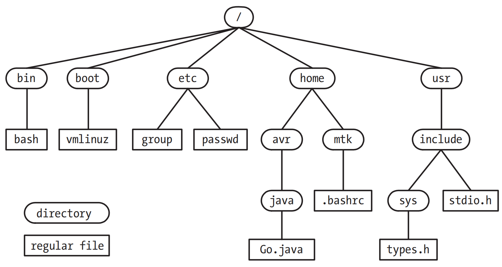

# FUNDAMENTAL CONCEPTS

## The Core Operating System: The Kernel
- "多任务"指的是多个进程(即运行中的程序)可以同时驻留在内存中，且每个进程都能获得对CPU的使用权
- "抢占"指的是一组规则，这组规则控制着那些进程获得对CPU的使用，以及每个进程能使用多长时间，这两者都由内核进程调度程序决定，而不是进程本身
- 用户态和和核心态，执行硬件指令可以使得CPU在两种状态来回切换，与之对应，虚拟内存也会被划分成为用户空间部分和内核空间部分。用户态下的CPU只能访问用户空间的内存，核心态的CPU既可以访问用户空间内存，也可以访问内核空间内存

## The Shell

## Users and Groups

## Single Directory Hierarchy, Directories, Links, and Files

## File I/O Model

## Programs

## Processes
- 在Unix系统上，特权进程指的是有效用户ID为0(超级用户)的进程
- soft limit限制了process可以消耗的资源总量，hard limit定义了软限制调整的上限，非特权process在针对特定资源调整soft limit时，调整空间是`0 - hard limit`，但是hard limit只能调低不能调高

## Memory Mappings
- `file mapping` 讲文件的部分区域映射入calling process的虚拟内存。映射一旦完成，对文件的映射内容的访问则转化为对相应内存区域的字节操作
- `anonymous mapping` 匿名映射不会有对应的文件，其映射的页面内容会被初始化为0

## Static and Shared Libraries

## Interprocess Communication and Synchronization

## Signals

## Threads
- 现代的Unix实现中,每个process都可以执行多个thread,可将thread想象为共享同一虚拟内存以及一干其他属性的proc
- 每个thread都会执行相同的程序代码,共享同一数据区域和堆.可是每个线程都拥有属于自己的stack,用来装在本地变量和函数调用的链接信息

## Process Groups and Shell Job Control

## Sessions, Controlling Terminals, and Controlling Processes

## Pseudoterminals

## Date and Time
- `Real time`
- `Process time`

## Client-Server Architecture

## Realtime

## The /proc File System

