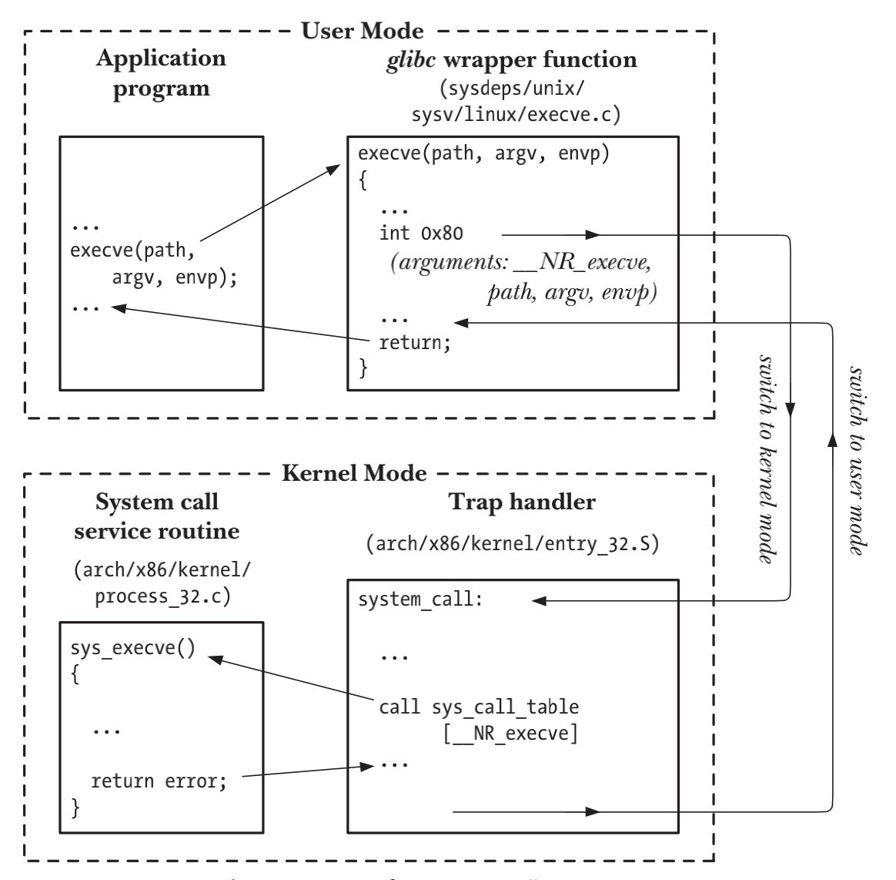

# SYSTEM PROGRAMMING CONCEPTS

## System Calls

- `system call`是受控的kernel入口，process可以请求kernel以自己的名义去执行某些动作
- `system call`将处理器从user mode切换到kernel mode，以便CPU访问受到保护的kernel内存
- `system call`集合是固定的，每个system call都有一个唯一的数字来标识
- 每个`system call`可以指定由user space(process的虚拟地址空间)到kernel space传递的一套参数集合

1. 应用程序通过调用C语言函数中的wrapper函数，来发起system call
2. wrapper函数必须保证所有的system call参数对于system call trap-handling
   routine可用。参数通过stack传入wrapper函数，但是kernel希望这些参数被放置于特定的寄存器中，因此wrapper函数会将上述的参数拷贝到寄存器中
3. 由于所有system call进入kernel的方式相同，所以内核需要能区分出每个system call。wrapper函数会将system call编号复制到一个特殊的CPU寄存器中(%eax)
4. wrapper函数执行一条trap机器指令`(int 0x80)`，引发处理器从user mode换到kernel mode，并执行`0x80(十进制的128)`所指向的系统trap向量代码
5. 为了响应0x80，kernel会调用`system_call()`（位于汇编文件arch/i386/enter.S中）来处理这次trap  
   a) 将寄存器值保存在kernel stack中  
   b) 检查system call编号的有效性  
   c) 通过system call编号去一个所有system call service routine记录表(内核变量sys_call_table)中找到对应的system call service
   routine并进行调用。如果system call service routine含有参数，则会优先验证参数的有效性  
   d) 从kernel stack中恢复各寄存器的值，并将system call返回值置于栈中  
   e) 返回至wrapper函数，并同时将处理器切换回user mode
6. 若system call service routine返回值表用此次调用出错，wrapper函数会使用该值来设置全局变量errno。然后wrapper函数会返回到调用程序，并同时返回一个整数值，以表明系统调用是否成功



## Library Functions

## The Standard C Library; The GNU C Library (glibc)

```c
#include <gnu/libc-version.h>

const char *gnu_get_libc_version(void);
```

## Handling Errors from System Calls and Library Functions

```c
#include <stdio.h>

void perror(const char *msg);
```

- `perror()`会打印出起msg指向的字符串，紧跟一条与当前errno值相对应的消息

```c
#include <string.h>

char *strerror(int errnum);
```

- `strerror()`会针对于errnum参数中给定的错误编号，返回相应的错误字符串

## Portability Issues

- `_POSIX_SOURCE`
- `_POSIX_C_SOURCE`
- `_XOPEN_SOURCE`
- `_BSD_SOURCE`
- `_SVID_SOURCE`
- `_GNU_SOURCE`