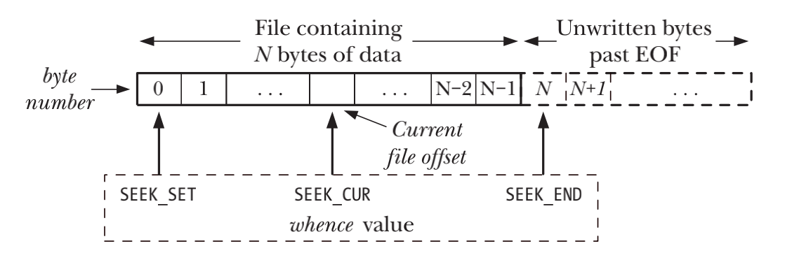

# FILE I/O: THE UNIVERSAL I/O MODEL

## Overview

- 所有执行I/O操作的system call都是以`file descriptor`来指代打开文件
- `file descriptor`可以被用作指代所有类型的打开文件，包括`pipes`、`FIFOs`、`sockets`、`terminals`、`devices`和`regular files`
- `file descriptor`是process级别的，也就意味着每个`process`都有自己的一套`file descriptor`

| File descriptor | Purpose         | POSIX name    | stdio stream |
|-----------------|-----------------|---------------|--------------|
| 0               | standard input  | STDIN_FILENO  | stdin        |
| 1               | standard output | STDOUT_FILENO | stdout       |
| 2               | standard error  | STDERR_FILENO | stderr       |

## Universality of I/O

- I/O操作是UNIX的通用模型，也就意味着`open()` `read()` `write()`和`close()`可以对任何类型的文件执行I/O操作

## Opening a File: open()

```c
#include <sys/stat.h>
#include <fcntl.h>

int open(const char *pathname, int flags, ... /* mode_t mode */);
```

- 如果`pathname`是一个符号链接，会对其进行解引的操作

| Access mode | Description                                |
|-------------|--------------------------------------------|
| O_RDONLY    | Open the file for reading only             |
| O_WRONLY    | Open the file for writing only             |
| O_RDWR      | Open the file for both reading and writing |

### The open() flags Argument

| Flag        | Purpose                                                          | SUSv |
|-------------|------------------------------------------------------------------|------|
| O_RDONLY    | Open for reading only                                            | v3   |
| O_WRONLY    | Open for writing only                                            | v3   |
| O_RDWR      | Open for reading and writing                                     | v3   |
| O_CLOEXEC   | Set the close-on-exec flag (since Linux 2.6.23)                  | v4   |
| O_CREAT     | Create file if it doesn’t already exist                          | v3   |
| O_DIRECT    | File I/O bypasses buffer cache                                   |      |
| O_DIRECTORY | Fail if pathname is not a directory                              | v4   |
| O_EXCL      | With O_CREAT: create file exclusively                            | v3   |
| O_LARGEFILE | Used on 32-bit systems to open large files                       |      |
| O_NOATIME   | Don’t update file last access time on read() (since Linux 2.6.8) |      |
| O_NOCTTY    | Don’t let pathname become the controlling terminal               | v3   |
| O_NOFOLLOW  | Don’t dereference symbolic links                                 | v4   |
| O_TRUNC     | Truncate existing file to zero length                            | v3   |
| O_APPEND    | Writes are always appended to end of file                        | v3   |
| O_ASYNC     | Generate a signal when I/O is possible                           |      |
| O_DSYNC     | Provide synchronized I/O data integrity (since Linux 2.6.33)     | v3   |
| O_NONBLOCK  | Open in nonblocking mode                                         | v3   |
| O_SYNC      | Make file writes synchronous                                     | v3   |

- `O_EXCL` 此标志和`O_CREAT`结合使用表示如果文件已经存在，则不会打开文件，且`open()`调用失败，设置errno为`EEXIST`

### Errors from open()

- `EACCES` 文件权限不允许calling process以flags参数指定的方式打开文件
- `EISDIR` 所指定的文件属于目录，而调用者企图打开该文件进行读写操作
- `EMFILE` process已经打开的fd数量达到了process资源限制所设定的上限，`RLIMIT_NOFILE`
- `ENFILE` 打开文件的数量已经达到了系统允许的上限
- `ENOENT` 文件不存在且未指定`O_CREAT`标志 或 指定了`O_CREAT`但是`pathname`指定的目录之一不存在 或 `pathname`为符号链接且链接指向的文件不存在
- `EROFS` 所指定的文件隶属于read-only文件系统，而调用者试图以写方式打开文件
- `ETXTBSY` 所指定的文件为可执行文件且正在运行

### The creat() System Call

```c
#include <fcntl.h>

int creat(const char *pathname, mode_t mode);
```

- `creat()`等同于`fd = open(pathname, O_WRONLY | O_CREAT | O_TRUNC, mode);`

## Reading from a File: read()

```c
#include <unistd.h>

ssize_t read(int fd, void *buffer, size_t count);
```

## Writing to a File: write()

```c
#include <unistd.h>

ssize_t write(int fd, void *buffer, size_t count);
```

## Closing a File: close()

```c
#include <unistd.h>

int close(int fd);
```

## Changing the File Offset: lseek()

```c
#include <unistd.h>

off_t lseek(int fd, off_t offset, int whence);
```

- `SEEK_SET` 将文件偏移量设置为从文件头部开始的offset字节，offset不能为负数
- `SEEK_CUR` 相对于当前的文件偏移量，并将偏移量调整offset和字节，offset可以为负数
- `SEEK_END` 将文件偏移量设置为从文件尾部的offset字节，offset可以为负数



- `lseek()`调用成功之后会返回新的文件offset，可以使用`curr = lseek(fd, 0, SEEK_CUR);`在不修改当前offset的情况下获取当前的offset

### File holes

- 如果程序的file offset已经超过了文件结尾，然后继续执行I/O操作，`write()`可以在文件结尾后的任意位置写入数据
- 从文件结尾后到新写入的数据间的这段空间被称为文件空洞(file holes)

## Operations Outside the Universal I/O Model: ioctl()

```c
#include <sys/ioctl.h>

int ioctl(int fd, int request, ... /* argp */);
```

