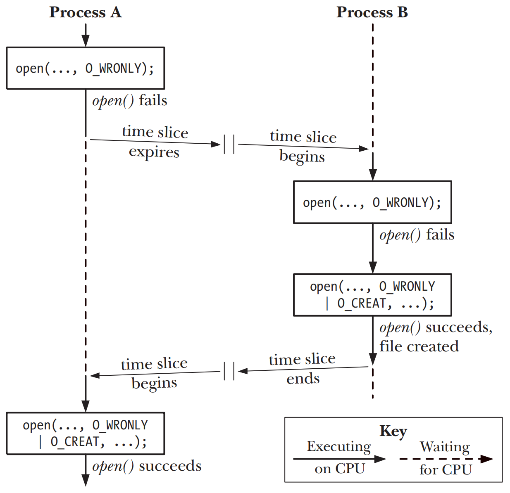
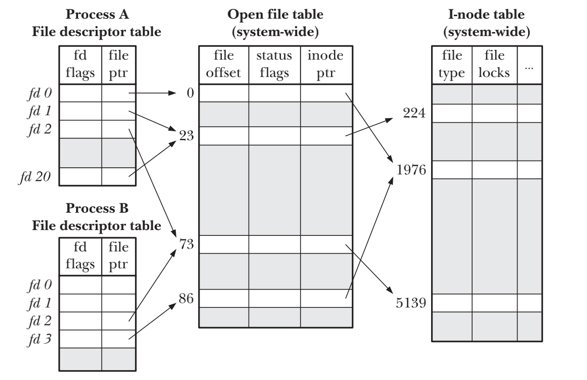
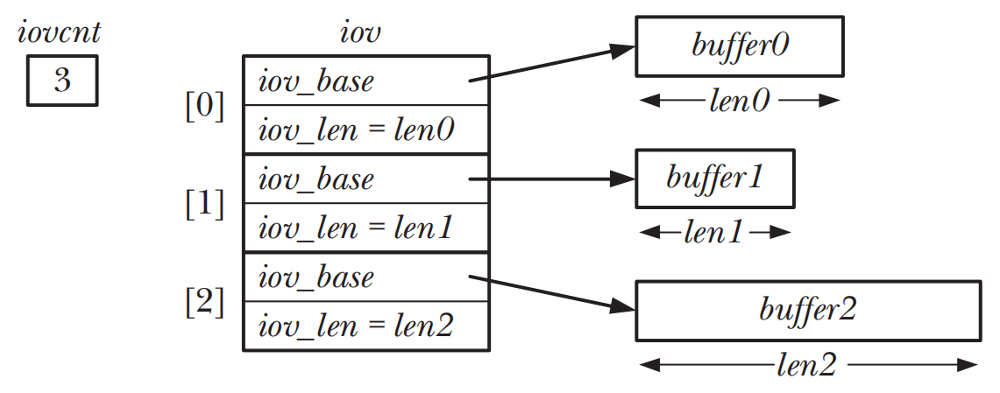

# FILE I/O: FURTHER DETAILS

## Atomicity and Race Conditions

### Creating a file exclusively

- 当同时传入`O_CREATE`和`O_EXCL`作为`open()`的标志位时，如果打开的文件已存在，则`open()`会返回错误，来保证open()检查和创建文件属于同一原则操作
  

### Appending data to a file

- 可以通过传入O_APPEND标志来保证数据写入操作和偏移量移动操作为同一原子操作

## File Control Operations: fcntl()

```c
#include <fcntl.h>

int fcntl(int fd, int cmd, ...);
```

## Open File Status Flags

- `fcntl()`获取一个打开的文件的`status flags`或修改打开文件的`access mode`
- `fcntl()`适用场景
	- 文件不是由调用程序打开的，因此程序无法使用`open()`来控制状态标志
	- fd的获取是通过`open()`之外的函数，比如pipe()或socket()

## Relationship Between File Descriptors and Open Files

- kernel维护的三个数据结构
	- 进程级别的打开文件描述表(open file descriptors table)
	- 系统级别的打开文件表(open file descriptions table)，有时也叫做打开文件表(open file table)，表中的条目叫做打开文件句柄(open file handle)
	- 文件系统的i-node表(i-nodes table)

**_open file descriptors table_**

- 控制file descriptor的一组flags，目前只有一个`close-on-exec`
- 对打开文件句柄(open file description)的引用

**_open file descriptions table_**

- 当前文件的offset，调用`read()`或`write()`时更新，或者通过`lseek()`修改
- 打开文件时候所使用的status flags，即`open()`的flags参数
- 文件的access mode，即`open()`指定的`read-only` `write-only`或`read-write`
- 与signal-driven I/O相关的设置
- 该文件对于`i-node`对象的引用

**_i-nodes table_**

- 文件类型和访问权限
- 指向该文件所持有所有的锁的列表的指针
- 文件的各种属性，包括文件大小和不同类型操作相关的时间戳



- `同一process` 可以通过`dup()`、`dup()2`和`fcntl()`实现同process内两个不同的fd指向一个打开文件句柄(open file description)
- `不同proc` 可以通过`fork()`实现不同process内的fd指向同一个打开文件句柄，或者一个process也可以通过`UNIX domain socket`传递一个fd给另一个process
- 不同process内各自对同一文件调用`open()`或者同一进程内多次调用`open()`, 实现进程内不同的fd指向不同的打开文件句柄但是指向同一i-node表中的条目

- 两个不同的fd，若指向同一个打开文件句柄，将共享同一个文件offset
- 要获取和修改打开文件的flags，可通过`fcntl()`的`F_GETFL`和`F_SETFL`操作来实现
- fd flags`close-on-exec`为process和fd私有属性

## Duplicating File Descriptors

```c
#include <unistd.h>

int dup(int oldfd);
```

- `dup()`复制一个oldfd并且返回一个新的fd，两者指向同一打开文件句柄

```c
#include <unistd.h>

int dup2(int oldfd, int newfd);
```

- `dup2()`复制一个oldfd并且返回指定的newfd，如果newfd之前已经被打开，`dup2()`则会先关闭newfd并且忽略关闭期间任何错误

```c
#define _GNU_SOURCE
#include <unistd.h>

int dup3(int oldfd, int newfd, int flags);
```

- `dup3()`和`dup2()`相同，只是可以额外指定flags，目前只支持`close-on-exec`

## File I/O at a Specified Offset: pread() and pwrite()

```c
#include <unistd.h>

ssize_t pread(int fd, void *buf, size_t count, off_t offset);
ssize_t pwrite(int fd, const void *buf, size_t count, off_t offset);
```

- `pread()`和`pwrite()`不会移动打开文件句柄的offset，相当于lseek，read/write、lseek操作同事纳入了同一原子性的操作

## Scatter-Gather I/O: readv() and writev()

```c
#include <sys/uio.h>

ssize_t readv(int fd, const struct iovec *iov, int iovcnt);
ssize_t writev(int fd, const struct iovec *iov, int iovcnt);
```



- `readv()`system call实现了分散输入的功能，从fd所指向的文件中读取一片连续的字节，然后散落放置在iov指定的缓冲区里
- `writev()`system call实现了集中输出，将iov所指定的所有缓冲区里的数据拼接起来，然后以连续字节的形式写入到fd所指向的文件当中

### Performing scatter-gather I/O at a specified offset

```c
#define _BSD_SOURCE
#include <sys/uio.h>

ssize_t preadv(int fd, const struct iovec *iov, int iovcnt, off_t offset);
ssize_t pwritev(int fd, const struct iovec *iov, int iovcnt, off_t offset);
```

- `preadv()`和`pwritev()`与`readv()`和`writev()`类似，只是可以指定执行I/O的offset

## Truncating a File: truncate() and ftruncate()

```c
#include <unistd.h>

int truncate(const char *pathname, off_t length);
int ftruncate(int fd, off_t length);
```

- `truncate()`和`ftruncate()`讲文件大小设置为`length`参数指定的值
- 若文件长度大于参数`length`，调动将丢弃超出部分；若是小于参数`length`，调用将在文件尾部添加一系列空字节或者文件空洞(file holes)

## Nonblocking I/O

- pipeline、socket和device都支持nonblocking mode，因为无法在`open()`函数传入`O_NONBLOCK`标志，所以必须要通过`fcntl()`的`F_SETFL`命令来设置

## I/O on Large Files

- 通过定义宏`#define _FILE_OFFSET_BITS 64`来打开LFS操作，必须在所有include头文件之前定义

## The /dev/fd Directory

- 对于每个process，kernel都提供了一个虚拟目录`/dev/fd/n`，n对应的是fd的编号

## Creating Temporary Files

```c
#include <stdlib.h>

int mkstemp(char *template);
```

- `mkstemp()`生成一个唯一文件名并打开文件，文件名的最后6个字符必须为`XXXXXX`

```c
#include <stdio.h>

FILE *tmpfile(void);
```

- `tmpfile()`会创建一个名称唯一的临时文件，并且以读写的方式将其打开
