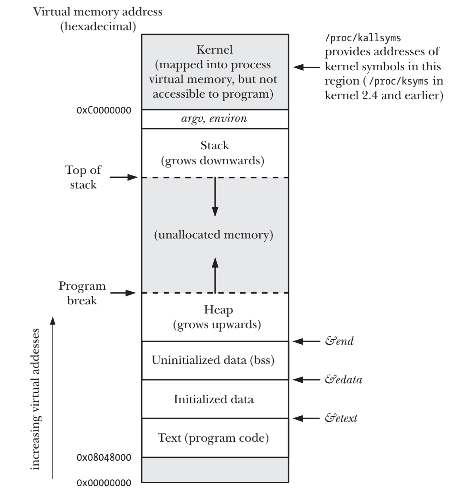
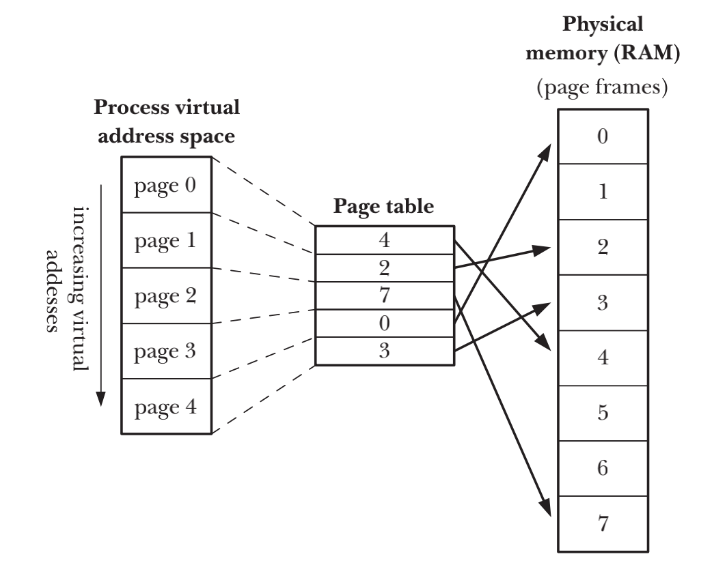
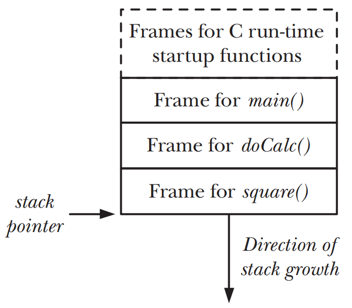

# PROCESSES

## Processes and Programs

- process是一个可执行的program的一个实例
- program是一个包含了如何在运行时创建process的信息的文件
	- `Binary format identification` 每个程序都包含的用于描述可执行文件格式的`metainformation`，kernel用此信息来解释文件中的其他信息
	- `Machine-language instructions` 对程序算法进行编码
	- `Program entry-point address` 标识程序开始执行时的起始指令位置
	- `Data` 程序文件包含的变量初始值和程序使用的字面常量值
	- `Symbol and relocation tables` 描述程序中函数和变量的位置以及名称
	- `Shared-library and dynamic-linking information` 程序运行时需要使用的`shared libraries`以及加载`shared libraries`的动态链接器的路径名
	- `Other information` 用于如何创建process的其他信息

- process是由kernel定义的抽象的实体，该实体负责分配程序运行的各项系统资源
- 从kernel角度看，process是由两部分组成
	- `user-space memory` 包含了程序代码和代码所使用的变量
	- `kernel data structures` 用于维护process的状态信息

## Process ID and Parent Process ID

```c
#include <unistd.h>

pid_t getpid(void);
```

- `getpid(void)`获取当前process id

```c
#include <unistd.h>

pid_t getppid(void);
```

- 每个process都有一个创建自己的parent process，使用`getppid(void)`获取当前parent process id

## Memory Layout of a Process

- `Text Segment` 文本段包含了process运行的程序的机器语言指令，具有只读属性以防止process通过错误指针意外修改自身的指令
- `Initialized Data Segment` 初始化数据段包含显示初始化的全局变量和静态变量，这些变量在程序被加载进内存时从可执行文件中读出
- `Uninitialized Data Segment` 未初始化数据段包含了未进行显示初始化的全局变量和静态变量，程序启动之前系统将本段的所有内存初始化为0
- `Stack` 一个动态增长的收缩的段，由栈帧组成，系统会为每一个当前调用的函数分配一个`stack frame`
- `Heap` 在运行时(为变量)动态进行内存分配的一块区域，堆的顶端称作为`program break`

```c
extern char etext, edata, end;
/* For example, &etext gives the address of the end of the program text / start of initialized data */
```

- `etext` 程序文本段结尾处的下一字节地址
- `edata` 初始化数据段结尾处的下一字节地址
- `end` 非初始化数据段结尾处的下一字节地址



## Virtual Memory Management

- `Spatial locality` 空间局部性是指程序倾向于访问最近访问过的内存地址附近的内存，由于指令是顺序执行的，且有时会按顺序处理数据结构
- `Temporal locality` 是指程序倾向于在不久的将来再次访问最近刚访问过的内存地址（比如循环）
- 虚拟内存的规划之一是将每个程序使用的内存切割成小型、固定大小的`page frames`，相应的也会将物理RAM划分成为与虚拟页尺寸大小的`page frames`
- kernel需要为每个进程维护一张`page table`，`page table`中每个条目要么指出一个虚拟页面在RAM中的所在位置，要么标明其当前驻留在磁盘上
- 若process试图访问的地址并无相应的`page-table entry`，那么process将会收到一个`SIGSEGV`signal
  

- process与process、process与kernel相互隔离，所以一个process不能读取或修改另一个process或kernel的内存
- 适当情况下，两个或者多个process可以共享内存
	- 多个process执行同一个program，可以共享同一份只读的程序代码副本
	- program可以使用`shmget()`和`mmap()`system calls显示的请求与其他process共享内存区
- 便于实现内存保护机制
- 程序员和编译器、连接器之类的工具无需关注程序在RAM中的物理布局
- 因为需要驻留在内存中的仅是程序的一部分，所以程序的加载和运行都很快

## The Stack and Stack Frames

- `kernel stack` 每个process保留在kernel内存中的区域，在执行system call过程中供kernel内部调用函数来使用
- `user stack` 驻留在不受保护的user memory中
	- `Function arguments`和`local variables` 这些变量是在调用函数时候自动创建的，所以在C语言当中被叫做`automatic`变量
	- `Call linkage information` 每个函数都会用到的一些CPU寄存器。一个函数调用另一个函数时，会在被调用的函数`stack frame`中保存这些寄存器的副本，以便函数返回时候能为调用者函数将寄存器恢复原状



## Command-Line Arguments (argc, argv)

## Environment List

- 每一个process都会有一个字符串数组叫做`environment list`或者`environment`
- 新process在创建之时，会继承其parent process的`environment list`
- child process只有在创建的时候才能获得其parent process的环境`environment list`，所以种传递是单向且一次性的

### Accessing the environment from a program

- 在C语言中，可以使用全局变量`char **environ`来访问`environment list`

```c
#include <stdlib.h>

char *getenv(const char *name);
```

### Modifying the environment

```c
#include <stdlib.h>

int putenv(char *string);
```

- `putenv()`向调用process的环境中添加或者修改一个变量，`string`是一个指向`name=value`形式字符串的指针

```c
#include <stdlib.h>

int setenv(const char *name, const char *value, int overwrite);
```

- `setenv()`函数可以代替`putenv()`向环境添加一个变量

```c
#include <stdlib.h>

int unsetenv(const char *name);
```

- `unsetenv()`从环境中移除由name参数标识的变量

```c
#define _BSD_SOURCE /* Or: #define _SVID_SOURCE */
#include <stdlib.h>

int clearenv(void)
```

- 某些情况下`setenv()`和`clearenv()`可能会导致程序内存泄露

## Performing a Nonlocal Goto: setjmp() and longjmp()

```c
#include <setjmp.h>

int setjmp(jmp_buf env);
void longjmp(jmp_buf env, int val);
```