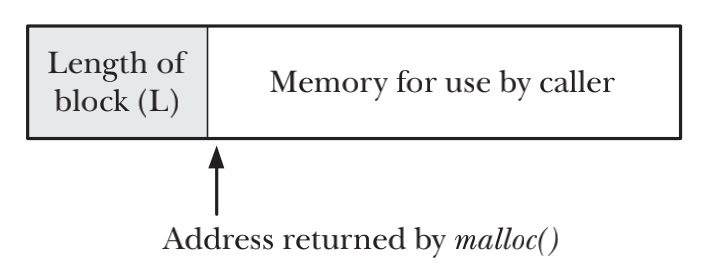
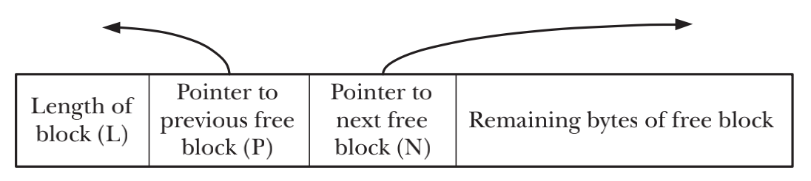
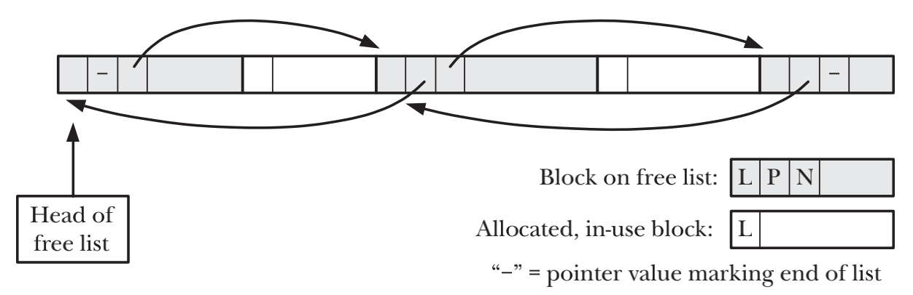

# MEMORY ALLOCATION

## Allocating Memory on the Heap
- 堆是一段长度可变的连续虚拟内存，始于进程的未初始化的数据段末尾，随着内存的分配和释放而增减

## Adjusting the Program Break: brk() and sbrk()
```c
#include <unistd.h>

int brk(void *end_data_segment);
void *sbrk(intptr_t increment);
```
- brk()会讲program break设置为参数end_data_segment所指定的位置。由于虚拟内存以页为单位进行分配，end_data_segment会四舍五入到下一个内存页边界处
- sbrk()将program break在原有地址上增加从参数increment传入的大小，sbrk()返回前一个program break的地址

## Allocating Memory on the Heap: malloc() and free()
```c
#include <stdlib.h>

void* malloc(size_t size);
```
- malloc()的返回类型是void*，因为可以将其赋值给任意类型的C指针
- free()并不降低program break的位置，而是将这块内存增加到空闲内存列表中，供后续的malloc()函数循环使用

## Implementation of malloc() and free()
- malloc()会扫表之前由free释放的空闲内存块链表，以求找到尺寸大于或者等于要求的一块空闲内存。如果在空闲内存列表中找不到足够大的空闲内存块，那么malloc()会调用sbrk()来移动program break以分配更多的内存


- free()将内存块重新置于空闲内存列表时，free()会使用内存块本身的空间来存储链表指针，并将自身添加到列表中


- 随着对内存的不断释放和重新分配，空闲列表中的空闲内存会和已经分配的内存混杂在一起


> 1. 将运算严格限制在已分配的内存之内
> 2. 不要多次释放同一块已经分配的内存
> 3. free只应当释放由malloc申请的内存
> 4. 长时间运行的内存，应确保正确且及时的释放已经使用的内存，否则会造成内存泄露

## Allocating Memory on the Stack: alloca()
```c
#include <alloca.h>

void *alloca(size_t size);
```
- alloca()是通过增加栈帧的大小从stack上分配，当前调用的函数的stack frame位于stack的顶部，所以顶部的栈帧上方是存在可扩展空间的，只需要修改stack的指针即可
- alloca()不能通过free()来释放，也不能通过realloc()来调整大小
- alloca()分配内存相对于malloc()速度要快且分配的内存会随着stack frame的移除被自动释放
