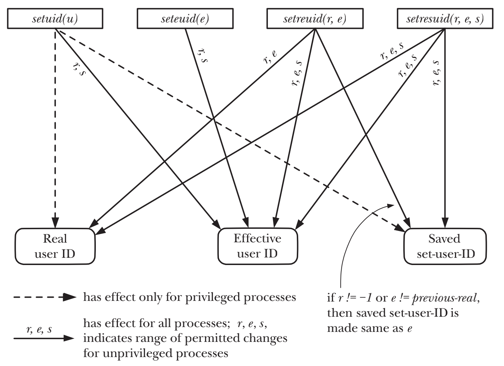
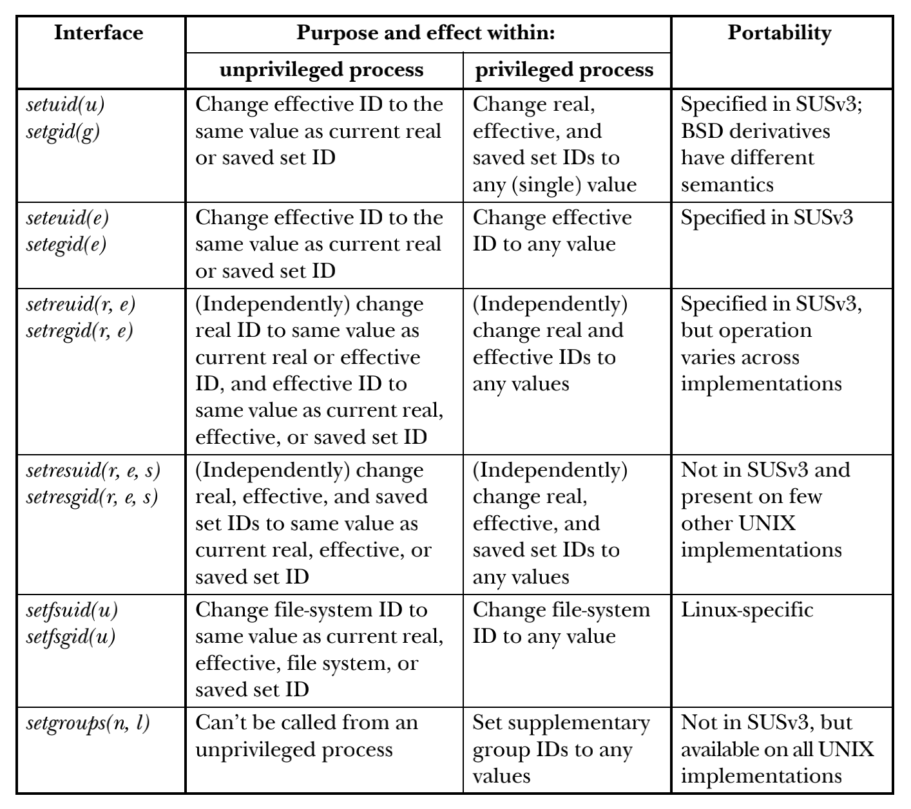

# PROCESS CREDENTIALS

## Real User ID and Real Group ID

- login shell在登录过程中从/etc/passwd读取第三和第四字段的值来设置Real User ID and Real Group ID
- Real User ID and Real Group ID确定了process所属的用户和组

## Effective User ID and Effective Group ID

- 当process试图执行一些操作的时候, 会结合Effective User ID and Effective Group ID加supplementary group IDs来确定process被授予什么样的权限
- The effective user and group IDs通常情况下和real IDs相等. system call和执行set-user-ID and set-group-ID可以使二者不相等

## Set-User-ID and Set-Group-ID Programs

- Set-user-ID program会将用户的Effective User ID置为可执行文件的拥有者的user ID
- Set-Group-ID program会将用户的Effective Group ID置为可执行文件的拥有者的group ID

```c
//Set-user-ID program
Effective User ID = user ID (owner) of the executable file

//Set-Group-ID program
Effective Group ID = group ID (owner) of the executable file
```

## Saved Set-User-ID and Saved Set-Group-ID

- Saved Set-User-ID and Saved Set-Group-ID的值是由相应的Effective User ID and Effective Group ID

```c
//set Saved Set-User-ID
Saved Set-User-ID = Effective User ID

//set Saved Set-Group-ID
Saved Set-Group-ID = Effective Group ID
```

## File-System User ID and File-System Group ID

- File-System User ID and File-System Group ID通常都和相对应的effective IDs相同
- Linux下两个特有的system call(setfsuid() 和 setfsgid())可以使得File-System IDs不等同于effective IDs

## Supplementary Group IDs

- Supplementary Group IDs可以标识process属于哪些额外的groups。
- 新的process从parent继承而来，登录的Shell从system group file获得Supplementary Group IDs

## Retrieving and Modifying Process Credentials

- CAP_SETUID允许进程任意修改其user IDs
- CAP_SETGID允许进程任意修改其group IDs

### Retrieving real and effective IDs

```c
#include <unistd.h>

uid_t getuid(void);  /* Returns real user ID of calling process */
uid_t geteuid(void); /* Returns effective user ID of calling process */
gid_t getgid(void);  /* Returns real group ID of calling process */
gid_t getegid(void); /* Returns effective group ID of calling process */
```

### Modifying effective IDs

```c
#include <unistd.h>

int setuid(uid_t uid);
int setgid(gid_t gid);
```

> 1. unprivileged process调用setuid()时只允许修改effective user ID，且修改的值只能是其real user ID or saved set-user-ID。相当于在执行set-use-ID program的时，setuid()才会起作用，因为在执行普通program时，进程的real user ID, effective user ID, and saved set-user-ID总是相等的
> 2. privileged process调用setuid()且参数非0时，process的the real user ID, effective user ID, and saved set-user-ID都被设置成为了参数指定的值。privileged process调用setuid()是一个单向操作，调用后会丢失所有privileges

```c
#include <unistd.h>

int seteuid(uid_t euid);
int setegid(gid_t egid);
```

> 1. unprivileged process调用seteuid()时只允许修改effective user ID，且修改的值只能是其real user ID or saved set-user-ID。在unprivileged process下调用seteuid()等效于setuid()
> 2. privileged process调用seteuid()可以修改effective ID为任意值。privileged process调用seteuid()且参数为非0时，调用后会丢失所有privileges，但是可以通过rule 1来还原

```c
euid = geteuid(); /* Save initial effective user ID (which is same as saved set-user-ID) */
if (seteuid(getuid()) == -1) /* Drop privileges */
    errExit("seteuid");
if (seteuid(euid) == -1) /* Regain privileges */
    errExit("seteuid");
```

### Modifying real and effective IDs

```c
#include <unistd.h>

int setreuid(uid_t ruid, uid_t euid);
int setregid(gid_t rgid, gid_t egid);
```

> 1. unprivileged process调用setreuid(), 只允许修改real user ID为当前real user ID或者effective user ID；修改effective user ID为real user ID或者当前的effective user ID或者saved set-user-ID
> 2. privileged process调用setreuid()，允许任意设置其real user ID和effective user ID
> 3. unprivileged/privileged process的saved set-user-ID的值会被设置成为(新的)effective user ID  
	 > a) ruid的值不为-1  
	 > b) effective user ID被设置成为和real user ID不一样的值

```c
// ruid != euid
setreuid(ruid, euid)
saved_uid = euid

//ruid == euid
setreuid(ruid, euid)
//saved_uid 不变，可再次通过setreuid还原
setreuid(ruid, saved_uid)
saved_uid = saved_uid
```

### Retrieving real, effective, and saved set IDs

```c
#define _GNU_SOURCE
#include <unistd.h>

int getresuid(uid_t *ruid, uid_t *euid, uid_t *suid);
int getresgid(gid_t *rgid, gid_t *egid, gid_t *sgid);
```

### Modifying real, effective, and saved set IDs

```c
#define _GNU_SOURCE
#include <unistd.h>

int setresuid(uid_t ruid, uid_t euid, uid_t suid);
int setresgid(gid_t rgid, gid_t egid, gid_t sgid);
```

> 1. unprivileged process可以将real user ID, effective user ID, and saved set-user-ID中的任意ID设置成为其三个中的任意值之一
> 2. privileged process能够对real user ID, effective user ID, and saved set-user-ID做任意设置
> 3. 不管调用是否对其他ID做出任何改动，file-system user ID总是被设置为与effective user ID相同
> 4. 对于不想修改的uid，可以设置为-1，比如setresuid(-1, x, -1)，等同于seteuid(x)
> 5. setresgid的调用是原子性的，设置的UIDs总是同时成功或者同时失败

### Retrieving and Modifying File-System IDs

```c
#include <sys/fsuid.h>

int setfsuid(uid_t fsuid);
int setfsgid(gid_t fsgid);
```

> 1. unprivileged process可以将file-system user ID设置为real user ID, effective user ID, file-system user ID, or saved set-user-ID其中的之一的值
> 2. privileged process可以将file-system user ID设置为任意值
> 3. 在程序中避免使用这两个调用

### Summary of Calls for Modifying Process Credentials





