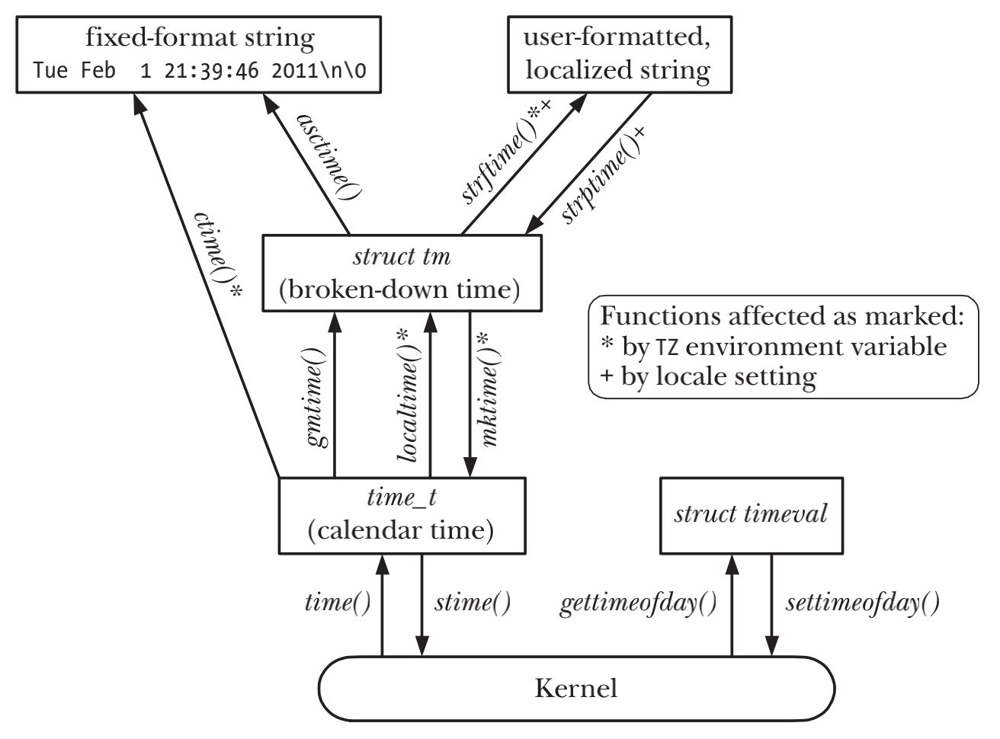

# TIME

## Calendar Time
```c
#include <sys/time.h>

int gettimeofday(struct timeval *tv, struct timezone *tz);

struct timeval {
    time_t tv_sec; /* Seconds since 00:00:00, 1 Jan 1970 UTC */
    suseconds_t tv_usec; /* Additional microseconds (long int) */
};
```
```c
#include <time.h>

time_t time(time_t *timep);
```

## Time-Conversion Functions


### Converting time_t to Printable Form
```c
#include <time.h>

//Wed Jun 8 14:22:34 2011
char *ctime(const time_t *timep);
```
- ctime()会自动把本地时区和DST加入到转换逻辑中
- ctime(), gmtime(), localtime(), asctime()函数共享同一返回字符数组和struct tm，也就是说调用任何一个函数都会修改这些共享值

### Converting Between time_t and Broken-Down Time
```c
#include <time.h>

struct tm *gmtime(const time_t *timep);

struct tm *localtime(const time_t *timep);

struct tm {
    int tm_sec; /* Seconds (0-60) */
    int tm_min; /* Minutes (0-59) */
    int tm_hour; /* Hours (0-23) */
    int tm_mday; /* Day of the month (1-31) */
    int tm_mon; /* Month (0-11) */
    int tm_year; /* Year since 1900 */
    int tm_wday; /* Day of the week (Sunday = 0)*/
    int tm_yday; /* Day in the year (0-365; 1 Jan = 0)*/
    int tm_isdst; /* Daylight saving time flag
                    > 0: DST is in effect;
                    = 0: DST is not effect;
                    < 0: DST information not available */
};
```
```c
#include <time.h>

time_t mktime(struct tm *timeptr);
```

### Converting Between Broken-Down Time and Printable Form
#### Converting from broken-down time to printable form
```c
#include <time.h>

char *asctime(const struct tm *timeptr);
```
- asctime()转换时，本地时区对转换没有影响，因为一个分解时间已经被localtime()或者gmtime()处理过

```c
#include <time.h>
size_t strftime(char *outstr, size_t maxsize, const char *format, const struct tm *timeptr);

#include "curr_time.h"
char *currTime(const char *format);
```

| Specifier | Description | Example |
| --- | --- | --- |
| %% | A % character | % |
| %a | Abbreviated weekday name | Tue |
| %A | Full weekday name | Tuesday |
| %b, %h | Abbreviated month name | Feb |
| %B | Full month name | February |
| %c | Date and time | Tue Feb 1 21:39:46 2011 |
| %d | Day of month (2 digits, 01 to 31) | 01 |
| %D | American date (same as %m/%d/%y) | 02/01/11 |
| %e | Day of month (2 characters) |  1 |
| %F | ISO date (same as %Y-%m-%d) | 2011-02-01 |
| %H | Hour (24-hour clock, 2 digits) | 21 |
| %I | Hour (12-hour clock, 2 digits) | 09 |
| %j | Day of year (3 digits, 001 to 366) | 032 |
| %m | Decimal month (2 digits, 01 to 12) | 02 |
| %M | Minute (2 digits) | 39 |
| %p | AM/PM | PM |
| %P | am/pm (GNU extension) | pm |
| %R | 24-hour time (same as %H:%M) | 21:39 |
| %S | Second (00 to 60) | 46 |
| %T | Time (same as %H:%M:%S) | 21:39:46 |
| %u | Weekday number (1 to 7, Monday = 1) | 2 |
| %U | Sunday week number (00 to 53) | 05 |
| %w | Weekday number (0 to 6, Sunday = 0) | 2 |
| %W | Monday week number (00 to 53) | 05 |
| %x | Date (localized) | 02/01/11 |
| %X | Time (localized) | 21:39:46 |
| %y | 2-digit year | 11 |
| %Y | 4-digit year | 2011 |
| %Z | Timezone name | CET |

#### Converting from printable form to broken-down time
```c
#define _XOPEN_SOURCE
#include <time.h>

char *strptime(const char *str, const char *format, struct tm *timeptr);
```
- 要保证这个函数的可移植性，要么str和format总所含输入信息足以设置tm的所有字段，要么在调用strptime()之前已经完成了适当的初始化，比如使用memset()函数