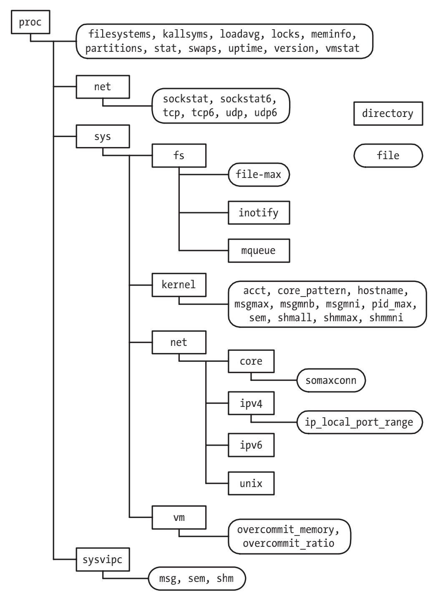

# SYSTEM AND PROCESS INFORMATION

## The /proc File System

### Obtaining Information About a Process: /proc/PID
| File | Description (process attribute) |
| --- | --- |
| cmdline | Command-line arguments delimited by \0 |
| cwd | Symbolic link to current working directory |
| environ | Environment list NAME=value pairs, delimited by \0 |
| exe | Symbolic link to file being executed |
| fd | Directory containing symbolic links to files opened by this process |
| maps | Memory mappings |
| mem | Process virtual memory (must lseek() to valid offset before I/O) |
| mounts | Mount points for this process |
| root | Symbolic link to root directory |
| status | Various information (e.g., process IDs, credentials, memory usage, signals) |
| task | Contains one subdirectory for each thread in process (Linux 2.6) |

### System Information Under /proc
| Directory | Information exposed by files in this directory |
| --- | --- |
| /proc | Various system information |
| /proc/net | Status information about networking and sockets |
| /proc/sys/fs | Settings related to file systems |
| /proc/sys/kernel | Various general kernel settings |
| /proc/sys/net | Networking and sockets settings |
| /proc/sys/vm | Memory-management settings |
| /proc/sysvipc | Information about System V IPC objects |

### Accessing /proc Files



## System Identification: uname()
```c
#include <sys/utsname.h>

int uname(struct utsname *utsbuf);
```
```c
#define _UTSNAME_LENGTH 65

struct utsname {
    char sysname[_UTSNAME_LENGTH]; /* Implementation name */
    char nodename[_UTSNAME_LENGTH]; /* Node name on network */
    char release[_UTSNAME_LENGTH]; /* Implementation release level */
    char version[_UTSNAME_LENGTH]; /* Release version level */
    char machine[_UTSNAME_LENGTH]; /* Hardware on which system is running */

    #ifdef _GNU_SOURCE /* Following is Linux-specific */ \
        char domainname[_UTSNAME_LENGTH]; /* NIS domain name of host */
    #endif
};
```