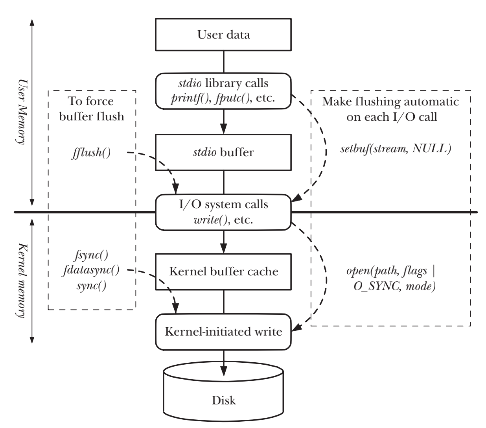

# FILE I/O BUFFERING

## Kernel Buffering of File I/O: The Buffer Cache
- `read()`和`write()`system call在操作磁盘文件时不会直接发起对磁盘的访问，而是在user-space缓存和kernel buffer cache的缓存之间复制数据
- `write()`被执行后，会立刻返回，在后续的某个时刻kernel会flush缓冲区内的数据到磁盘上
- `read()`调用会从缓冲区中读数据，直到把缓冲区中的数据读完，之后kernel会把文件的下一个segment读入至缓冲区缓存

### Effect of buffer size on I/O system call performance
- system call尽管比磁盘操作要快很多，但system call所花费的时间也是相当可观的。kernel必须捕获调用，检查system call参数有效性并且在user space和kernel space间传输数据
- 与文件发生大量数据传输的情况下，通过采用大块空间来缓存数据，并且执行尽可能少的system call，就可以极大的提升I/O的整体性能

## Buffering in the stdio Library
- 使用`stdio`函数库可以避免自行处理数据的缓冲，比如`write()`的输出或者`read()`的输入

### Setting the buffering mode of a stdio stream
```c
#include <stdio.h>

int setvbuf(FILE *stream, char *buf, int mode, size_t size);
```
- 在打开流之后，`setvbuf()`必须在调用stdio内任意方法之前被调用，`setvbuf()`会影响所有后续stdio内的所有方法
- 如果buf不为NULL，指向size大小的内存块将会作为stream的缓冲区，且内存是被静态或者动态分配在heap上的
- 如果buf为NULL，那么stdio library会自动分配一个缓冲区
- `setvbuf()`出错时返回非0值

**mode代表了缓冲类型**
- `_IONBF` 不对I/O进行缓冲，stdio library内的function将会立刻调用read() or write() system call.
- `_IOLBF` 行级别缓冲，在输入一个换行符前对数据进行缓冲，除非缓冲区已满。对于输入流，每次只读取一行数据。
- `_IOFBF` 采用全缓冲，单次的read()和write()的数据大小和缓冲区大小相同，磁盘文件默认采取这种方式进行缓冲。

```c
#include <stdio.h>

void setbuf(FILE *stream, char *buf);
```
- 等同于`setvbuf(fp, buf, (buf != NULL) ? _IOFBF: _IONBF, BUFSIZ)`

```c
#define _BSD_SOURCE
#include <stdio.h>

void setbuffer(FILE *stream, char *buf, size_t size);
```
- `setbuffer()`与允许调用者指定buf缓冲区，等同于`setvbuf(fp, buf, (buf != NULL) ? _IOFBF : _IONBF, size)`

### Flushing a stdio buffer
```c
#include <stdio.h>

int fflush(FILE *stream);
```
- 当stream为输出流时，fflush()将强制将stdio输出流内的数据通过write() system call写入到kernel buffer中
- 当stream为输入流时，fflush()将丢弃所有输入流已经缓冲的数据

## Controlling Kernel Buffering of File I/O
- `synchronized I/O completion` 一个I/O操作，要么数据已经成功的被传输到磁盘，要么被诊断为不成功的操作
> synchronized I/O completion to mean “an I/O operation that has either been successfully transferred [to the disk] or diagnosed as unsuccessful.”

**synchronized I/O data integrity completion**
- 对于读操作，意味着所有requested file data已经被（从磁盘）转移到了process当中。假如有任何的pending的写操作会影响requested data，那么写操作到磁盘会在读操作之前发生
- 对于写操作，意味着写请求所指定的数据已经被转移（到磁盘）并且将来检索这些数据的元数据也已经被转移

**synchronized I/O file integrity completion**
- 这个模式和data integrity completion的区别在于，该模式会把被更新文件的所有元数据都传输到磁盘，即便有些元数据对于后续的读操作来说不是必要的

### System calls for controlling kernel buffering of file I/O
```c
#include <unistd.h>

int fsync(int fd);
```
- 调用`fsync()`会使得缓冲数据和fd相关的元数据都flush到磁盘上，调用会强制使文件处于`synchronized I/O file integrity completion`状态
- `fsync()`为同步调用，也就是说所有数据都传输完成之后才会返回

```c
#include <unistd.h>

int fdatasync(int fd);
```
- 调用`fdatasync()`会强制使文件处于`synchronized I/O data integrity completion`状态
- `fdatasync()`相比`fsync()`，磁盘操作会从两次有可能变成了一次，因为`fsync()`总是会强制写入元数据到磁盘上

```c
#include <unistd.h>

void sync(void);
```
- `sync()`会使得包含更新文件信息的kernel buffer刷新到磁盘上

### Making all writes synchronous: O_SYNC
```c
fd = open(pathname, O_WRONLY | O_SYNC);
```
- 在open()时加入O_SYNC标志位，后续的每个write()调用会自动将文件数据和元数据刷新至磁盘
- 采用O_SYNC对性能的影响极大

## Summary of I/O Buffering


## Advising the Kernel About I/O Patterns
```c
#define _XOPEN_SOURCE 600
#include <fcntl.h>

int posix_fadvise(int fd, off_t offset, off_t len, int advice);
```
- `posix_fadvise()`system call允许process对于访问文件数据时可能使用的模式告知kernel

## Bypassing the Buffer Cache: Direct I/O
- Linux允许程序在执行磁盘I/O的时候跳过缓存，直接把数据从用户空间转移到文件或者磁盘设备上，这种方式称为`direct I/O`或者`raw I/O`
- 可以对于单个文件或者块设备执行直接I/O，需要在`open()`打开文件时候添加O_DIRECT标志位

## Mixing Library Functions and System Calls for File I/O
```c
#include <stdio.h>

int fileno(FILE *stream);

FILE *fdopen(int fd, const char *mode);
```
- I/O system calls会直接将数据转移到`kernel buffer cache`中
- `stdio`库中的函数会首先等`user-space buffer`填满，再调用`write()`把`user-space buffer`内的数据传输到`kernel buffer cache`中