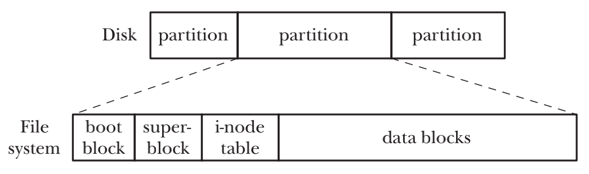
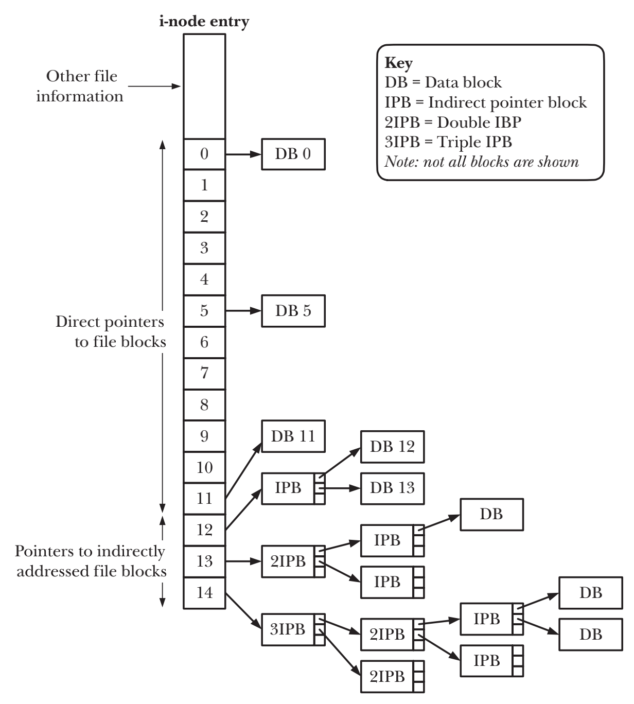
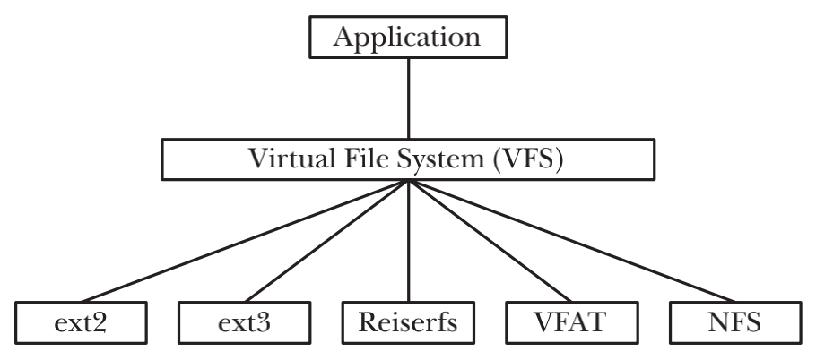

# FILE SYSTEMS

## Device Special Files (Devices)
- 一个设备的特定文件与系统的某个设备相对应。在内核中，每种设备类型都有对应的设备驱动，用来处理从设备来的所有I/O请求
- 每个设备文件都有一个major ID number和一个minor ID number。major ID指定设备的通用类型，内核使用major ID来为设备匹配合适的驱动，minor ID可以在同一通用类型的设备下标识出特定的设备
- `/dev`  devfs. The /dev directory contains the special device files for all the devices
- `/sys`  sysfs. The sys filesystem is the location where information about devices, drivers, and some kernel features is exposed. Its underlying structure is determined by the particular Linux kernel being used at the moment, and is otherwise unspecified.

## Disks and Partitions
- kernel把磁盘的每个分区都视为单独设备并且可以在/dev下找到，Linux的特有文件/proc/partitions记录了系统中每个磁盘分区的major和minor的ID、大小和名称
- 调用mkswap(8)来创建交换区，调用swapon() system call来通知kernel某一个磁盘分区要被用作为交换区，swapoff()为反向操作
- `/proc/swaps` Linux的专属文件，可以用来查看系统中当前已经激活的交换区的信息

## File Systems

- `引导块` 总是作为文件系统的首个块。 引导块不服务于操作系统，他内部的信息作为引导操作系统来使用。尽管操作系统只需要一个引导块，但所有文件系统都包含一个引导块，尽管绝大多数都未使用
- `超级块` 紧跟着引导块之后的一个单独的块，包含了文件系统的相关的参数信息，包括i-node table的大小，文件系统中逻辑块的大小、逻辑块中文件系统的大小
- `i-node表` 在文件系统中的每一个文件和目录在i-node表里都有一个唯一的相对应的实体，每个实体都记录了文件的相关信息
- `数据块` 文件系统中的绝大多数空间用于构成文件系统中驻留的文件和目录的数据块。

## i-nodes


## The Virtual File System (VFS)

- VFS提供的接口包括了对于文件目录常用的system calls。包括
```c
open()
read()
write()
lseek()
close()
truncate()
stat()
mount()
umount()
mmap()
mkdir()
link()
unlink()
symlink()
rename()
```

## Mounting and Unmounting File Systems
- `/proc/mounts` Linux的专属虚拟文件，包含当前挂载的文件系统的列表，/proc/mounts可以看做是kernel数据结构的接口，因此总是包含已挂在文件的系统的精确信息
- `mount(8) 和 umount(8)` 命令会自动维护`/etc/mtab`
- `/etc/fstab` 通常由系统管理员维护，包含系统上所有可用文件系统的描述，该文件可以供mount(8), umount(8) 和 fsck(8)所使用

`/dev/sda9 /boot ext3 rw 0 0`
- 已挂载的设备名
- 设备挂载点
- 文件系统类型
- 挂载标志
- dump(8)会使用该字段来控制文件的备份，该字段只在`/etc/fstab`有效
- 数字，系统引导时用于控制fsck(8)对文件系统的检查顺序

### Mounting a File System: mount()
```c
#include <sys/mount.h>

int mount(const char *source, const char *target, const char *fstype, unsigned long mountflags, const void *data);
``` 

### Unmounting a File System: umount() and umount2()
```c
#include <sys/mount.h>

int umount(const char *target);
```

```c
#include <sys/mount.h>

int umount2(const char *target, int flags);
```

## Obtaining Information About a File System: statvfs()
```c
#include <sys/statvfs.h>

int statvfs(const char *pathname, struct statvfs *statvfsbuf);
int fstatvfs(int fd, struct statvfs *statvfsbuf);
```
```c
struct statvfs {
    unsigned long f_bsize; /* File-system block size (in bytes) */
    unsigned long f_frsize; /* Fundamental file-system block size (in bytes) */
    fsblkcnt_t f_blocks; /* Total number of blocks in file system (in units of 'f_frsize') */
    fsblkcnt_t f_bfree; /* Total number of free blocks */
    fsblkcnt_t f_bavail; /* Number of free blocks available to unprivileged process */
    fsfilcnt_t f_files; /* Total number of i-nodes */
    fsfilcnt_t f_ffree; /* Total number of free i-nodes */
    fsfilcnt_t f_favail; /* Number of i-nodes available to unprivileged process (set to 'f_ffree' on Linux) */
    unsigned long f_fsid; /* File-system ID */
    unsigned long f_flag; /* Mount flags */
    unsigned long f_namemax; /* Maximum length of filenames on this file system */
};
```