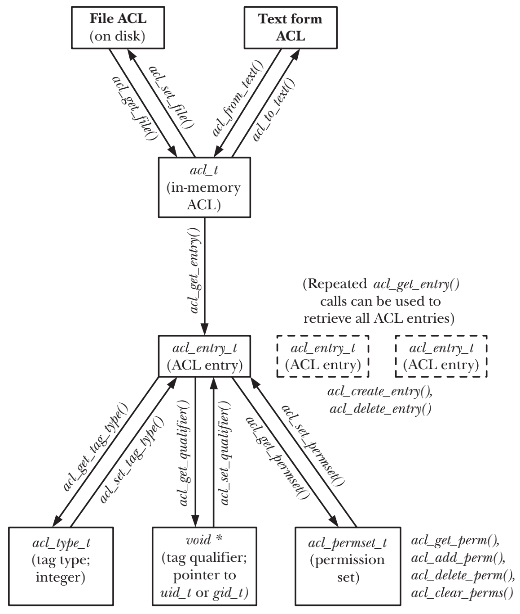

# ACCESS CONTROL LISTS

## Overview

每条ACL记录都由三部分组成

- `type` 表示该记录是一个用户、组还是其他类别的用户
- `qualifier` 这个标志位是可选的，用来标识特定的用户或者组
- `permission set` 具体的授权信息

### ACL entries

- `ACL_MASK`
  指定了ACL_USER、ACL_GROUP_OBJ和ACL_GROUP类型的ACE可授予的最大权限，一个ACL最多只能包含一个ACL_MASK的ACE。假如ACL包含ACL_USER或者ACL_GROUP的ACE，则必须包含ACL_MASK

### Minimal and extended ACLs

- `minimal ACL` 语义上等同于传统的文件权限集合， 由ACL_USER_OBJ、ACL_GROUP_OBJ和ACL_OTHER组成
- `extended ACL` 除了包含minimal ACL之外，还包含ACL_USER、ACL_GROUP和ACL_MASK

## ACL Permission-Checking Algorithm

## Long and Short Text Forms for ACLs

| Tag text forms | Tag qualifier present? | Corresponding tag type | Entry for            |
|----------------|------------------------|------------------------|----------------------|
| u, user        | N                      | ACL_USER_OBJ           | File owner (user)    |
| u, user        | Y                      | ACL_USER               | Specified user       |
| g, group       | N                      | ACL_GROUP_OBJ          | File group           |
| g, group       | Y                      | ACL_GROUP              | Specified group      |
| m, mask        | N                      | ACL_MASK               | Mask for group class |
| o, other       | N                      | ACL_OTHER              | Other users          |

## Default ACLs and File Creation

- `access ACL` 进程访问文件时，使用access ACL来判断进程对文件的访问权限
- `default ACL` 不参与判断权限授权，default ACL只能被赋予目录且决定了目录下所创建文件或者子目录ACL和权限
- 一旦目录拥有`default ACL`，那么对于该目录下的文件来说，进程的umask不参与判定access ACL的ACE

## The ACL API

### Overview



### Fetching a file’s ACL into memory

```c
acl_t acl;

acl = acl_get_file(pathname, type);
```

### Retrieving entries from an in-memory ACL

```c
acl_entry_t entry;

status = acl_get_entry(acl, entry_id, &entry);
```

### Retrieving and modifying attributes in an ACL entry

```c
acl_tag_t tag_type;

status = acl_get_tag_type(entry, &tag_type);
status = acl_set_tag_type(entry, tag_type);
```

```c
uid_t *qualp; /* Pointer to UID */

qualp = acl_get_qualifier(entry);
status = acl_set_qualifier(entry, qualp);
```

```c
acl_permset_t permset;

status = acl_get_permset(entry, &permset);
status = acl_set_permset(entry, permset);
```

```c
int is_set;

is_set = acl_get_perm(permset, perm);
status = acl_add_perm(permset, perm);
status = acl_delete_perm(permset, perm);
status = acl_clear_perms(permset);
```

### Creating and deleting ACL entries

```c
acl_entry_t entry;

status = acl_create_entry(&acl, &entry);
status = acl_delete_entry(acl, entry);
```

### Updating a file’s ACL

```c
int status;

status = acl_set_file(pathname, type, acl);
```

### Converting an ACL between in-memory and text form

```c
acl = acl_from_text(acl_string);

char *str;
ssize_t len;

str = acl_to_text(acl, &len);
```