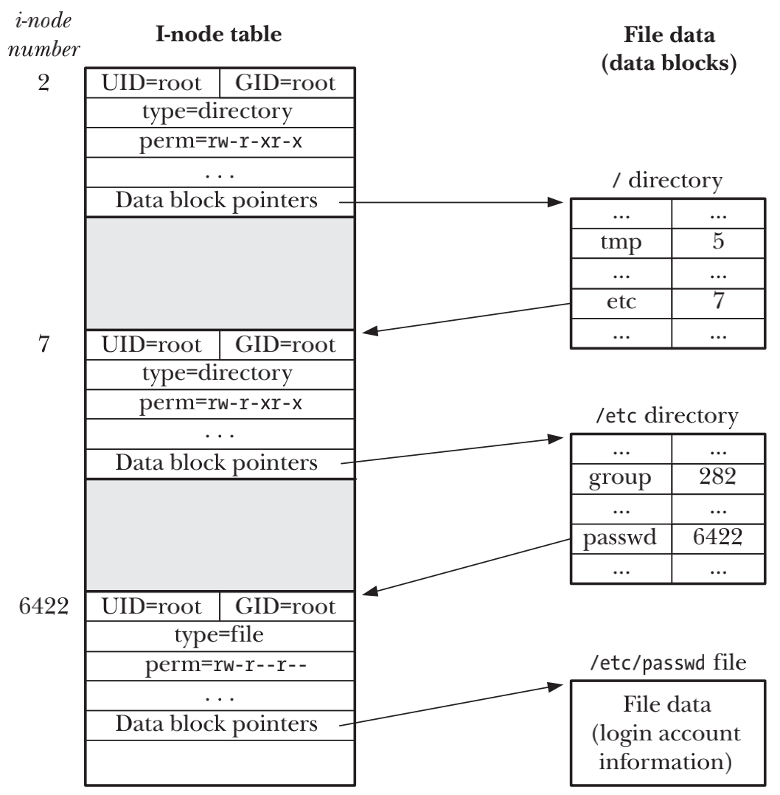
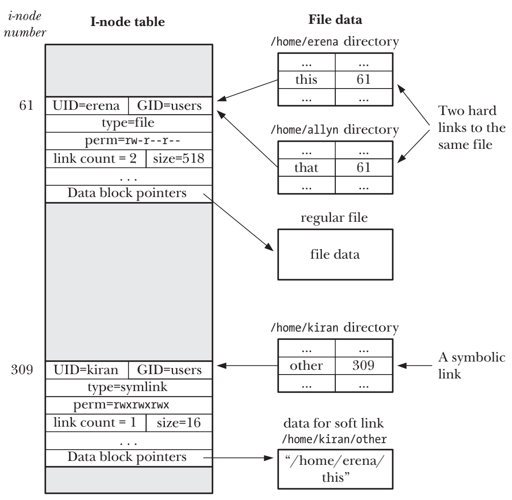

# DIRECTORIES AND LINKS

## Directories and (Hard) Links

- 硬连接的所有的文件均指向相同的i-node条目，硬连接的数据记录在i-node条目的连接计数器中
- `rm`命令从目录列表中删除文件名，并把i-node条目中的硬连接数量减1，如果计数器降为0，还会释放i-node和所引用的数据块

## Symbolic (Soft) Links
