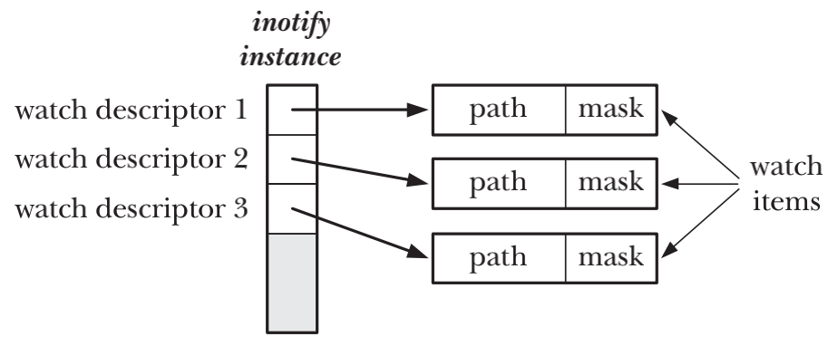
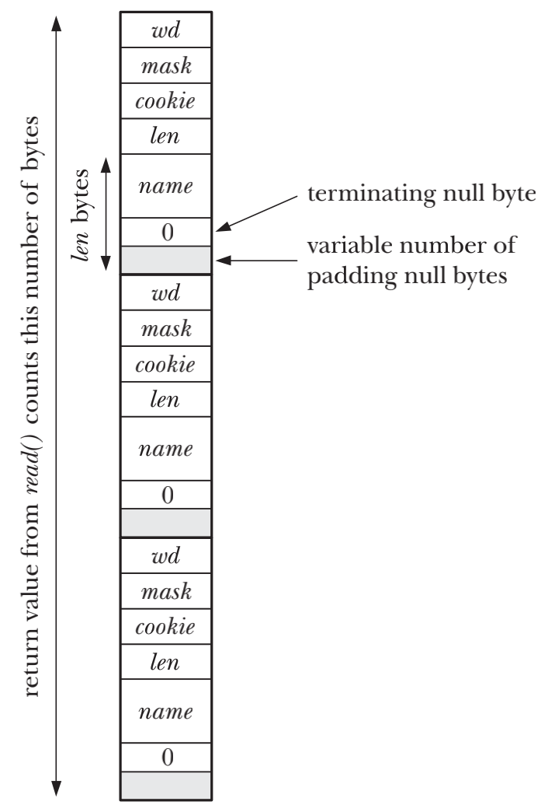

# MONITORING FILE EVENTS

## Overview
- application使用`inotify_init()`创建`inotify`实例，system call返回一个file descriptor来引用`inotify`的实例
- application使用`inotify_add_watch()`来向`inotify`实例的watch list里添加item
    - watch item = pathname + bit mask，`bit mask`是对pathname的指定的监控集合
    - `inotify_add_watch()`会返回一个watch descriptor，供后续操作使用
- application调用`inotify`实例的`read()`方法来获取通知，每次`read()`会返回一个或多个`inotify_event`结构，结构中记录了被监控的pathname上发生的一个event
- application结束监控时会关闭`inotify`的file descriptor，并会自动移除`inotify`实例所有的watch items
- inotify机制可用于监控文件或目录。当监控目录时，目录自身以及目录下文件的event会被通知给application
- inotify机制为非递归。如果需要监控目录下所有的子目录以及文件的event，则需要对目录树中的所有目录发起`inotify_add_watch()`调用 

## The inotify API
```c
#include <sys/inotify.h>

int inotify_init(void);
```

```c
#include <sys/inotify.h>

int inotify_add_watch(int fd, const char *pathname, uint32_t mask);
```


```c
#include <sys/inotify.h>

int inotify_rm_watch(int fd, uint32_t wd);
```

## inotify Events
| Bit value | In |  Out | Description |
| --- | --- | --- | --- |
| IN_ACCESS | ● | ● | File was accessed (read()) |
| IN_ATTRIB | ● | ● | File metadata changed |
| IN_CLOSE_WRITE | ● | ● | File opened for writing was closed |
| IN_CLOSE_NOWRITE | ● | ● | File opened read-only was closed |
| IN_CREATE | ● | ● | File/directory created inside watched directory |
| IN_DELETE | ● | ● | File/directory deleted from within watched directory |
| IN_DELETE_SELF | ● | ● | Watched file/directory was itself deleted |
| IN_MODIFY | ● | ● | File was modified |
| IN_MOVE_SELF | ● | ● | Watched file/directory was itself moved |
| IN_MOVED_FROM | ● | ● | File moved out of watched directory |
| IN_MOVED_TO | ● | ● | File moved into watched directory |
| IN_OPEN | ● | ● | File was opened |
| IN_ALL_EVENTS | ● | | Shorthand for all of the above input events |
| IN_MOVE | ● | | Shorthand for IN_MOVED_FROM \| IN_MOVED_TO |
| IN_CLOSE | ● | | Shorthand for IN_CLOSE_WRITE \| IN_CLOSE_NOWRITE |
| IN_DONT_FOLLOW | ● | | Don’t dereference symbolic link (since Linux 2.6.15) |
| IN_MASK_ADD | ● | | Add events to current watch mask for pathname |
| IN_ONESHOT | ● | | Monitor pathname for just one event |
| IN_ONLYDIR | ● | | Fail if pathname is not a directory (since Linux 2.6.15) |
| IN_IGNORED | | ● | Watch was removed by application or by kernel |
| IN_ISDIR | | ● | Filename returned in name is a directory |
| IN_Q_OVERFLOW | | ● | Overflow on event queue |
| IN_UNMOUNT | | ● | File system containing object was unmounted |

## Reading inotify Events
- application调用`read()`方法从`inotify`file descriptor中获取events
- 同步调用情况下，当没有event发生时，`read()`会被阻塞
- 异步调用情况下(对`inotify`file descriptor设置了O_NONBLOCK状态标志)，如果没有任何event可被读取，`read()`会立即失败，并且返回EAGAIN错误码
```c
int flags = fcntl(fd, F_GETFL, 0);
fcntl(fd, F_SETFL, flags | O_NONBLOCK);
```

```c
struct inotify_event {
    int wd; /* Watch descriptor on which event occurred */
    uint32_t mask; /* Bits describing event that occurred */
    uint32_t cookie; /* Cookie for related events (for rename()) */
    uint32_t len; /* Size of 'name' field */
    char name[]; /* Optional null-terminated filename */
};
```


## Queue Limits and /proc Files
`/proc/sys/fs/inotify`下会存在三个文件来供超级用户配置`inotify`相关的参数

- `max_queued_events` application调用`inotify_init()`生成的inotify实例内的event队列的event数量上限
- `max_user_instances` 每个real user ID可创建的inotify实例的数量上限
- `max_user_watches` 每个real user ID可创建的watch item的数量上限