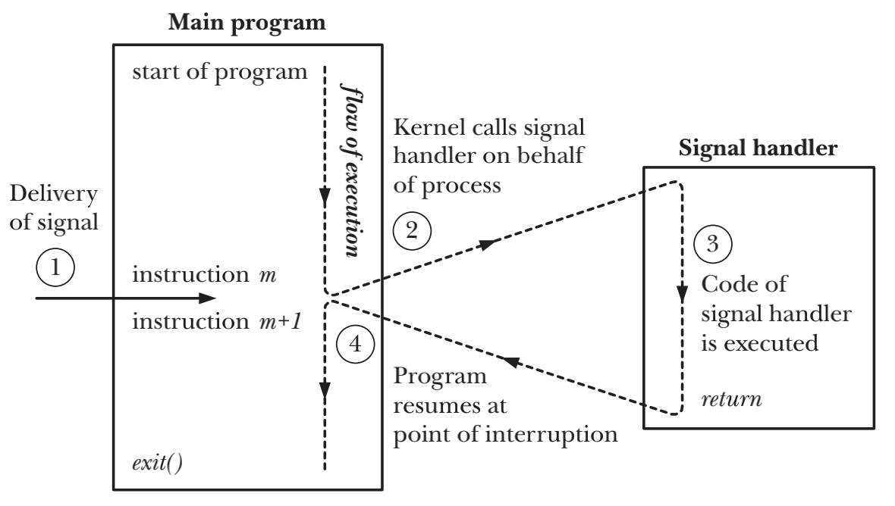

# SIGNALS: FUNDAMENTAL CONCEPTS

## Concepts and Overview
- 信号是事件发生时对进程的一种通知机制
- 一个有合适权限的进程可以向另外一个进程发送信号 
- 进程也可以向自身发送信号
- kernel也可以向进程发送信号，大多数进程收到的信号来源都是kernel
    - 硬件发生异常
    - 用户键入了能够产生信号的终端特殊字符(Control-C or Control-D)
    - 发生了软件事件
- 信号通过某些事件来产生。一旦信号被产生，会稍后被传递给进程，

## Changing Signal Dispositions: signal()
- `signal()`在不同的Unix间存在实现上的差异，所以如果考虑程序的可移植性则绝不能使用此函数，应当使用`sigaction()`
```c
#include <signal.h>

void ( *signal(int sig, void (*handler)(int)) ) (int);
```
```c
typedef void (*sighandler_t)(int);

sighandler_t signal(int sig, sighandler_t handler);
```

## Introduction to Signal Handlers
- 调用信号处理程序，可能会随时打断主程序流程。内核会代表process来调用handler，当handler返回时，主程序会在handler打断的位置恢复执行
- 当kernel在调用信号handler时，他会把信号的整数编号作为参数传递给handler方法。如果handler只捕获一种类型的信号，那这个参数几乎就无用；如果需要处理多种信号，那么可以通过这个参数来判断信号类型



## Sending Signals: kill()
```c
#include <signal.h>
 
int kill(pid_t pid, int sig);
```

## Other Ways of Sending Signals: raise() and killpg()
```c
#include <signal.h>

int raise(int sig);
```
```c
#include <signal.h>

int killpg(pid_t pgrp, int sig);
```