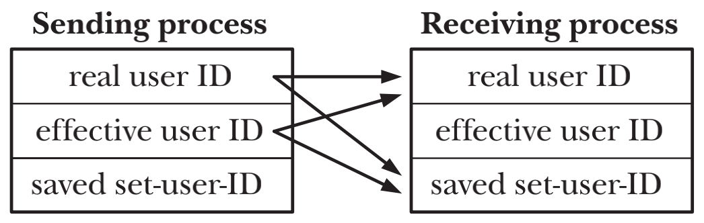

# SIGNALS: FUNDAMENTAL CONCEPTS

## Concepts and Overview
- 信号是事件发生时对进程的一种通知机制，有时也被成为软件中断，所谓中断就是会打断程序执行的正常流程，大多情况下，无法预测信号到达的精确时间
- 一个有合适权限的进程可以向另外一个进程发送信号，进程也可以向自身发送信号
- kernel也可以向进程发送信号，大多数进程收到的信号来源都是kernel
  - 硬件发生异常
  - 用户键入了能够产生信号的终端特殊字符(Control-C or Control-D)
  - 发生了软件事件
---
- 信号通过某些事件来产生。一旦信号被产生，会稍后被传递给进程，而进程也会做出一些动作来相应信号。在产生和到达期间，信号处于pending状态
- 信号到达之后，进程根据信号执行如下默认操作之一
  - `ignored` 忽略信号
  - `terminated` 终止（杀死）进程
  - `core dump file` 产生一个core dump文件
  - `stopped` 停止进程：暂停进程的执行
  - `resumed` 恢复一个之前被暂停进程的执行
- `disposition` 改变针对于特定信号的默认相应行为，程序可以为信号设置如下的`disposition`
  - `default action` 继续采取默认行为
  - `ignored` 忽略信号
  - `signal handler` 执行信号处理器signal handler
---  
- 通知kernel去调用一个`signal handler`的行为可以被称之为`installing`或者`establishing`一个signal handler
- `signal handler`被调用之后，我们可以成为知信号已经被`handled`或`caught`

## Signal Types and Default Actions
| Name | Signal number | Description | SUSv3 | Default |
| --- | --- | --- | --- | --- |
| SIGABRT | 6 | Abort process | ● | core |
| SIGALRM | 14 | Real-time timer expired | ● | term |
| SIGBUS | 7 (SAMP=10) | Memory access error | ● | core |
| SIGCHLD | 17 (SA=20, MP=18) | Child terminated or stopped | ● | ignore |
| SIGCONT | 18 (SA=19, M=25, P=26) | Continue if stopped | ● | cont |
| SIGEMT | undef (SAMP=7) | Hardware fault | | term |
| SIGFPE | 8 | Arithmetic exception | ● | core |
| SIGHUP | 1 | Hangup | ● | term |
| SIGILL | 4 | Illegal instruction | ● | core |
| SIGINT | 2 | Terminal interrupt | ● | term |
| SIGIO / SIGPOLL | 29 (SA=23, MP=22) | I/O possible | ● | term |
| SIGKILL | 9 | Sure kill | ● | term |
| SIGPIPE | 13 | Broken pipe | ● | term |
| SIGPROF | 27 (M=29, P=21) | Profiling timer expired | ● | term |
| SIGPWR | 30 (SA=29, MP=19) | Power about to fail | | term |
| SIGQUIT | 3 | Terminal quit | ● | core
| SIGSEGV | 11 | Invalid memory reference | ● | core
| SIGSTKFLT | 16 (SAM=undef, P=36) | Stack fault on coprocessor | | term |
| SIGSTOP | 19 (SA=17, M=23, P=24) | Sure stop | ● | stop |
| SIGSYS | 31 (SAMP=12) | Invalid system call | ● | core |
| SIGTERM | 15 | Terminate process | ● | term |
| SIGTRAP | 5 | Trace/breakpoint trap | ● | core |
| SIGTSTP | 20 (SA=18, M=24, P=25) | Terminal stop | ● | stop |
| SIGTTIN | 21 (M=26, P=27) | Terminal read from BG | ● | stop |
| SIGTTOU | 22 (M=27, P=28) | Terminal write from BG | ● | stop |
| SIGURG | 23 (SA=16, M=21, P=29) | Urgent data on socket | ● | ignore |
| SIGUSR1 | 10 (SA=30, MP=16) | User-defined signal 1 | ● | term |
| SIGUSR2 | 12 (SA=31, MP=17) | User-defined signal 2 | ● | term |
| SIGVTALRM | 26 (M=28, P=20) | Virtual timer expired | ● | term |
| SIGWINCH | 28 (M=20, P=23) | Terminal window size change | | ignore |
| SIGXCPU | 24 (M=30, P=33) | CPU time limit exceeded | ● | core |
| SIGXFSZ | 25 (M=31, P=34) | File size limit exceeded | ● | core |

## Changing Signal Dispositions: signal()
- `signal()`在不同的Unix间存在实现上的差异，所以如果考虑程序的可移植性则绝不能使用此函数，应当使用`sigaction()`
- `singal()`的返回值是上一个signal的`disposition`，返回的是一个函数指针

```c
#include <signal.h>

void ( *signal(int sig, void (*handler)(int)) ) (int);
```
```c
typedef void (*sighandler_t)(int);

sighandler_t signal(int sig, sighandler_t handler);
```

## Introduction to Signal Handlers
- 调用信号处理程序，可能会随时打断主程序流程。内核会代表process来调用handler，当handler返回时，主程序会在handler打断的位置恢复执行
- 当kernel在调用信号handler时，他会把信号的整数编号作为参数传递给handler方法。如果handler只捕获一种类型的信号，那这个参数几乎就无用；如果需要处理多种信号，那么可以通过这个参数来判断信号类型


## Sending Signals: kill()
```c
#include <signal.h>
 
int kill(pid_t pid, int sig);
```
- `pid > 0` 信号会被发给pid指定的进程，接收信号的进程取决于参数pid。
- `pid = 0` 信号会被发送给进程组(process group ID == process group id of calling process)内的所有进程，也包括调用进程本身，接收信号的进程取决于调用进程的process group id。
- `pid < -1` 信号会被发送给进程组(process group ID == ABS(pid))内的所有进程，也就是向一个指定的进程组内的所有进程发信号。
- `pid = -1` 信号会被发送给所有调用进程有权给其发送信号的进程，除去调用进程本身和init(pid=1)，如果`privileged process`是调用进程，除了调用进程和init(pid=1)的进程之外的所有进程将会收到信号，这种调用方式也被称之为广播信号
- `pid无法找到指定匹配的进程` kill()调用失败，并将errno置为ESRCH

> 一个进程需要适当的权限才能向另一个进程发送信号。
- `privileged (CAP_KILL) process` 可以向任何进程发送信号
- `和root用户和root组一起运行的init(pid=1) process` 只能接收他内置的single handler可以处理的信号，以防止init进程被意外杀死
- `unprivileged process`  
  
- `SIGCONT signal` unprivileged process可以给同session下的所有进程发送这个信号

## Checking for the Existence of a Process
`int kill(pid, 0)` sig为0表示空信号，无信号会被发送。这时只会执行错误检查，看看是否可以向目标进程发送信号。通过这种方式可以验证指定的进程ID是否存在

## Other Ways of Sending Signals: raise() and killpg()
进程需要向自身发送信号

```c
#include <signal.h>

int raise(int sig);
```
- 单线程程序，`raise(sig)`等同于`kill(getpid(), sig);`
- 多线程程序，`raise(sig)`等同于`kill((pthread_self(), sig);`
- 进程使用`raise()`或者`kill()`给自己发信号，信号会被立刻传递，比如在raise()返回给调用者之前

进程向某一个进程组的所有成员发送信号
```c
#include <signal.h>

int killpg(pid_t pgrp, int sig);
```
- `killpg(pgrp, sig)` 等等同于 `kill(-pgrp, sig)`

## Displaying Signal Descriptions
```c
#define _BSD_SOURCE
#include <signal.h>
extern const char *const sys_siglist[];

#define _GNU_SOURCE
#include <string.h>
char *strsignal(int sig);
```
- 相比直接使用sys_siglist[]数组，更倾向于使用strsignal()函数

```c
#include <signal.h>
void psignal(int sig, const char *msg);
```

## Signal Sets
```c
#include <signal.h>

int sigemptyset(sigset_t *set);
int sigfillset(sigset_t *set);
```
- `sigemptyset()` 用来初始化一个包含空signal的signal set
- `sigfillset()` 用来初始化一个包含所有signals，也包括realtime signal的signal set
- 必须使用`sigemptyset()`或者`sigfillset()`来初始化一个signal set来确保对变量正确的初始化和保证更好的可移植性

```c
#include <signal.h>

int sigaddset(sigset_t *set, int sig);
int sigdelset(sigset_t *set, int sig);
```

```c
#include <signal.h>

int sigismember(const sigset_t *set, int sig);
```
- `sigismember()`来验证`sig`是否是signal set`set`的成员
- 可以使用定义在`<signal.h>`中的常量`NSIG`，表示最大的signal number + 1。当测试所有signal时，可以将`NSIG`作为上限

```c
#define _GNU_SOURCE
#include <signal.h>

int sigandset(sigset_t *set, sigset_t *left, sigset_t *right);
int sigorset(sigset_t *dest, sigset_t *left, sigset_t *right);

int sigisemptyset(const sigset_t *set);
```

## The Signal Mask (Blocking Signal Delivery)
```c
#include <signal.h>

int sigprocmask(int how, const sigset_t *set, sigset_t *oldset);
```
- kernel会对每一个process维护一个`singal mask`，即一组被阻塞传递给该process的信号
- 一个在`singal mask`内的signal将会被延迟传递给process，直到把signal从`signal mask`中移除来取消阻止
- `signal mask`实际上是属于线程级别属性， 每个线程都可以使用`pthread_sigmask()`来独立的操作当前线程的sigmask
- `SIGKILL`和`SIGSTOP`两种signal无法被`signal mask`处理，kernel将会忽略对这两种signal的试图阻塞请求

- `SIG_BLOCK` 将set所指向的signal set添加到现有的signal mask中
- `SIG_UNBLOCK` 将set所指向的signal set从现有的signal mask中移除
- `SIG_SETMASK` 将set所指向的signal set设置为现有的signal mask

```c
sigset_t blockSet, prevMask;
/* Initialize a signal set to contain SIGINT */

sigemptyset(&blockSet);
sigaddset(&blockSet, SIGINT);

/* Block SiGINT, save previous signal mask */
if (sigprocmask(SIG_BLOCK, &blockSet, &prevMask) == -1)
    errExit("sigprocmask");

/* ... Code that should not be interrupted by SIGINT ... */

/* Restore previous signal mask, unblocking SIGINT */
if (sigprocmask(SIG_SETMASK, &preMask, NULL) == -1)
    errExit("sigprocmask");
```

## Pending Signals
```c
#include <signal.h>

int sigpending(sigset_t *set);
```
- 假如process收到一个当前被blocked的signal，这个signal会被添加至当前process的pending signal set
- `sigpending()`调用获取当前process的pending signal set

## Signals Are Not Queued
- `pending signals set`只是一个mask，只能表明一个被mask的signal是否发生过，而不能记录发生次数。
- 同一信号在被阻塞的状态下产生多次，会被记录在`pending signals set`中，并在解除阻塞之后只传递一次
- `pending signals set`不是一个queue，不会对signal排队处理

## Changing Signal Dispositions: sigaction()
```c
#include <signal.h>

int sigaction(int sig, const struct sigaction *act, struct sigaction *oldact);
```
```c
struct sigaction {
    void (*sa_handler)(int); /* Address of handler */
    sigset_t sa_mask; /* Signals blocked during handler invocation */
    int sa_flags; /* Flags controlling handler invocation */
    void (*sa_restorer)(void); /* Not for application use */
};
```
- act是一个指向新的disposition结构的指针，oldact为指向之前的disposition结构的指针。`act=NULL`用来获取当前的disposition，`oldact=NULL`表示只设置新的disposition而不关心之前的disposition
- `sa_handler`不为`SIG_IGN`或者`SIG_DFL`时`sa_mask`和`sa_flags`才会生效
- `sa_mask`定义了一个signal set，所有在signal set但是不在signal mask的信号会在`sa_handler`被调用之前自动加入process的`signal mask`，直到`sa_handler`返回之后之前自动添加的signal会再被自动移除
- 唤醒`sa_handler`的signal会被自动的加入到process的`signal mask`中

## Waiting for a Signal: pause()
```c
#include <unistd.h>

int pause(void);
```
- `pause()`会暂时暂停执行进程的运行，并等待signal handler调用并返回之后再恢复执行进程的运行