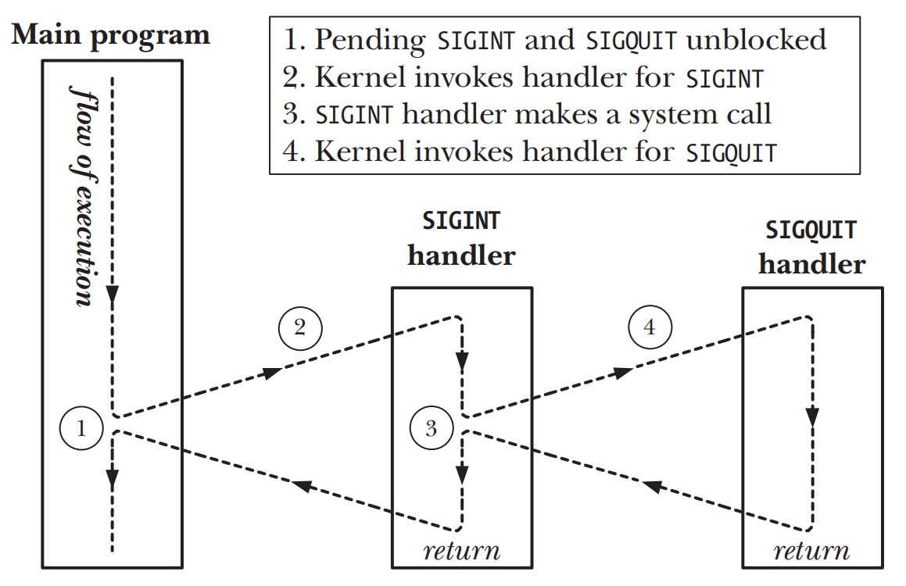

# SIGNALS: ADVANCED FEATURES

## Core Dump Files
```shell
#set the maximum size of core files created to unlimited
ulimit -c unlimited
```

### Naming the core dump file: /proc/sys/kernel/core_pattern
| Specifier | Replaced by |
| --- | --- |
| %c | Core file size soft resource limit (bytes; since Linux 2.6.24) |
| %e | Executable filename (without path prefix) |
| %g | Real group ID of dumped process |
| %h | Name of host system |
| %p | Process ID of dumped process |
| %s | Number of signal that terminated process |
| %t | Time of dump, in seconds since the Epoch |
| %u | Real user ID of dumped process |
| %% | A single % character |

## Special Cases for Delivery, Disposition, and Handling
- `SIGKILL` `SIGSTOP`信号总是执行默认的disposition，并且进程无法blocking这两种signals
- `SIGCONT`可以使得被`SIGSTOP` `SIGTSTP` `SIGTTIN` `SIGTTOU`停止的process恢复运行
- 一个处于停止状态下的process总是会被`SIGCONT`唤醒，无论process当下是否blocking或是ignoring了`SIGCONT`的信号
- `SIGCONT`和触发停止状态的signals是互斥的，也就是说process收到了`SIGCONT`signal之后会丢弃所有处于pending状态下会触发停止的signals，反之亦然。  
- 如果一个signal被传递给一个处于停止状态process，那么在process被`SIGCONT`恢复执行之前，signal实际上并未真正被传递给process，`SIGKILL`除外

## Interruptible and Uninterruptible Process Sleep States
- `TASK_INTERRUPTIBLE` process正在等待某些event，process处在这种状态下的时长是不定的，如果此时为process产生一个signal，操作将会被中断，signal的传递也会将process唤醒。`ps(1)`命令下STAT字段标记为`S`
- `TASK_UNINTERRUPTIBLE` process正在等待特定类型的event，如果此时为process产生一个signal，在process解除这种状态之前，signal不会被传递给process。`ps(1)`命令下STAT字段标记为`D`
- `TASK_KILLABLE` 该状态和`TASK_UNINTERRUPTIBLE`类似，但是会在收到一个`fatal signal`时讲process唤醒，从而避免因为各种原因导致一个因为process挂起而必须重启系统的场景

## Hardware-Generated Signals
- `SIGBUS` `SIGFPE` `SIGILL` `SIGSEGV`通常是由硬件异常所产生，较少通过kill()的方式来发送此类的signals
- 在硬件异常的情况下，如果process从此类的signal handler返回，或是blocking或ignoring此类的信号，SUSv3没有定义process在此情况下应有的行为
- 正确处理硬件的产生的信号方法
  - 接受默认行为，终止进程
  - 要么实现一个不会正常返回的signal handler，要么通过_exit()终止进程，或者调用siglongjmp()跳出signal handler并把程序的控制权交到主程序内产生信号之外的某一个位置

## Synchronous and Asynchronous Signal Generation
signal可以被同步方式产生或异步方式产生。同步方式产生的signal会被立刻传递，异步方式产生的signal，在signal的产生和实际传递之间仍可能会有一个短暂的延迟

- 硬件异常导致的signals`SIGBUS` `SIGFPE` `SIGILL` `SIGSEGV` `SIGEMT`
- process使用`raise()` `kill()` `killpg()`来给自身发送的signals

## Timing and Order of Signal Delivery

### When is a signal delivered?
- 异步方式产生的signal，在产生和传递之间的延迟期间，signal处于pendi状态。因为kernel会在下运行process下次的从kernel mode到user mode的切换时，才会发送pending状态的signal
  - process在之前的超时之后被重新调度
  - system call完成时

### Order of delivery of multiple unblocked signals  
- 使用`sigprocmask()`来解除对多个pending signals的block之后，这些信号会被立刻传递给process
- 当多个unblocked signals在等待被传递时，如果在signal handler的执行过程中发kernel mode和user mode的转换，那么这个发生转换的signal handler被会接下来第二个signal的signal handler所中断


## Implementation and Portability of signal()
- `sigaction()`是建立signal handler首选的API

## Realtime Signals
- `realtime signal`的范围相比`standard signal`有所扩大，可以用于application自定义signal
- `realtime signal`是队列化管理，相比`standard signal`的非队列化管理，`realtime signal`可以保证对同一个signal的多次发送的多次发送
- `realtime signal`在发送时，可以制定一些数据，并可以被接收process的signal handler获取
- 不同`realtime signal`的发送顺序是可以保证的。如果存在多种不同的signals，编号越小的signal发送的优先级会越高。如果是相同编号的signal，则会按照传递过来的顺序进行发送
- `SIGRTMIN`和`SIGRTMAX`分别对应realtime signal信号的编号的最大值和最小值
- 为了确保平台兼容性，应当使用`SIGRTMIN + x`的方式来定义signal的编号

Using realtime signals
- 发送方的process使用`sigqueue()`来发送realtime signal和其所携带的数据
- 接收方的process使用`sigaction()`并且指定`SA_SIGINFO`标志位来建立一个signal handler

### Sending Realtime Signals
```c
#define _POSIX_C_SOURCE 199309

#include <signal.h>
int sigqueue(pid_t pid, int sig, const union sigval value);

union sigval {
    int sival_int; /* Integer value for accompanying data */
    void *sival_ptr; /* Pointer value for accompanying data */
};
```
- `sigqueue()`中很少使用`sival_ptr`字段，因为指针的的作用域在process内部，对于另外process几乎没有任何作用

### Handling Realtime Signals
```c
struct sigaction act;

sigemptyset(&act.sa_mask);
act.sa_sigaction = handler;
act.sa_flags = SA_RESTART | SA_SIGINFO;

if (sigaction(SIGRTMIN + 5, &act, NULL) == -1)
    errExit("sigaction");
```
- 一旦我们为sigaction引入了`SA_SIGINFO`flag，那么signal handler的第二个argument将会是`siginfo_t`的struct，内含realtime signal的附加信息
  - `si_signo` 和signal handler中的第一个argument一致
  - `si_code` 表示signal来源，对于使用`sigqueue()`的realtime signal来说，总是`SI_QUEUE`
  - `si_value` process使用`sigqueue()`来发送signal是的第三个参数`union sigval value`，表示了伴随的数据
  - `si_pid`和`si_uid` 发送进程的`process id`和`real user ID`

## Waiting for a Signal Using a Mask: sigsuspend()
```c
#include <signal.h>

int sigsuspend(const sigset_t *mask);
```
- `sigsuspend()`使用mask来替代process的signal mask，然后挂起执行process直到下一次的signal被捕获并且从signal handler返回后为止
- 一旦从signal handler返回，`sigsuspend()`会将process的signal mask还原会调用之前的值
```c
sigprocmask(SIG_SETMASK, &mask, &prevMask); /* Assign new mask */
pause();
sigprocmask(SIG_SETMASK, &prevMask, NULL); /* Restore old mask */
```

## Synchronously Waiting for a Signal
```c
#define _POSIX_C_SOURCE 199309
#include <signal.h>

int sigwaitinfo(const sigset_t *set, siginfo_t *info);
```
- `sigwaitinfo()`会挂起process的执行，直到set指向的signal set中的某一个signal被传递为止
- 如果在调用`sigwaitinfo()`前，set中的某一种signal已经处于pending状态，则`sigwaitinfo()`会立刻返回，signal的编号会作为方法的返回值被返回，同时signal也会从process的pending列表中被移除

```c
#define _POSIX_C_SOURCE 199309
#include <signal.h>

int sigtimedwait(const sigset_t *set, siginfo_t *info, const struct timespec *timeout);

struct timespec {
    time_t tv_sec; /* Seconds ('time_t' is an integer type) */
    long tv_nsec; /* Nanoseconds */
};
```
- `timeout`指定了`sigtimedwait()`可以等待signal的最大时间

## Fetching Signals via a File Descriptor
```c
#include <sys/signalfd.h>

int signalfd(int fd, const sigset_t *mask, int flags);
```
- `mask`是一个signal set，指定了接下来通过`read()`来读取signal的file descriptor
- 如果指定fd为-1， `signalfd()`会创建一个新的file descriptor，否则，将修改现有fd相关的mask的值，且该fd一定是通过之前的`signalfd()`创建而成
- 通过`read()`来读取signal时，提供给`read()`的缓冲区一定要足够能容纳至少一个`signalfd_siginfo`结构
- 如果调用`read()`时，fd内并无pending signals，则`read()`将会阻塞直到有signal为止

```c
struct signalfd_siginfo {
    uint32_t ssi_signo; /* Signal number */
    int32_t ssi_errno; /* Error number (generally unused) */
    int32_t ssi_code; /* Signal code */
    uint32_t ssi_pid; /* Process ID of sending process */
    uint32_t ssi_uid; /* Real user ID of sender */
    int32_t ssi_fd; /* File descriptor (SIGPOLL/SIGIO) */
    uint32_t ssi_tid; /* Kernel timer ID (POSIX timers) */
    uint32_t ssi_band; /* Band event (SIGPOLL/SIGIO) */
    uint32_t ssi_tid; /* (Kernel-internal) timer ID (POSIX timers) */
    uint32_t ssi_overrun; /* Overrun count (POSIX timers) */
    uint32_t ssi_trapno; /* Trap number */
    int32_t ssi_status; /* Exit status or signal (SIGCHLD) */
    int32_t ssi_int; /* Integer sent by sigqueue() */
    uint64_t ssi_ptr; /* Pointer sent by sigqueue() */
    uint64_t ssi_utime; /* User CPU time (SIGCHLD) */
    uint64_t ssi_stime; /* System CPU time (SIGCHLD) */
    uint64_t ssi_addr; /* Address that generated signal (hardware-generated signals only) */
};
```
## Interprocess Communication with Signals