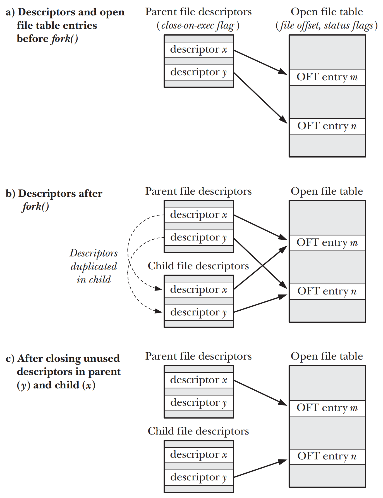

# PROCESS CREATION

## Overview of fork(), exit(), wait(), and execve()
- `fork()` 允许一个process(parent process)创建一个新的process(child process)。child process会复制parent process的`stack` `data` `heap`和`text segments`。可以将其看做是把parent process一分为二的，`fork()`方法也因此得名
- `exit(status)` 终止一个process，将process占用的所有资源(memory, open file descriptors等)归还给kernel以便后续的再分配。`status`表示process退出时的状态，parent process可以使用`wait()`来获取`status`的状态
- `wait(&status)` 如果child process尚未调用`exit(status)`，那么`wait()`会挂起parent process直到child process终止。child process终止时的状态通过`wait()`的`status`参数返回
- `execve(pathname, argv, envp)` 会加载一个新的程序(`程序路径名pathname`，`参数列表argv`， `环境变量列表envp`)到process的内存当中，现有的`program text`则会被丢弃，`stack` `data`和`heap`则会被刷新以便创建新程序，这一操作通常被称为执行一个新程序


- 图中的`execve()`system call是可选的
- 图中的`wait()`system call也是可选的，parent process可以对忽略child process
- 但是`wait()`通常来说也是不可或缺的，当其中之一的child process终止时，kernel会发`SIGCHLD`signal给parent process，因此经常在处理`SIGCHLD`的signal handler中使用。`SIGCHLD`默认的disposition是ignore

## Creating a New Process: fork()
```c
#include <unistd.h>

pid_t fork(void);
```
- 完成对`fork()`的调用后将存在两个process，而且每个process都会从`fork()`的返回处继续执行
- `fork()`返回之后的两个process将执行相同`program text`，但是会有独立`stack` `data`和`heap segments`的拷贝，每个process都可以修改各自`stack` `data`和`heap segments`中的变量而不会影响其他process
- child process会从parent process继承`environment list`

```c
pid_t childPid; /* Used in parent after successful fork() to record PID of child */

switch (childPid = fork()) {
    case -1: /* fork() failed */
        /* Handle error */
    case 0: /* Child of successful fork() comes here */
        /* Perform actions specific to child */
    default: /* Parent comes here after successful fork() */
        /* Perform actions specific to parent */
}
```
- 可以通过`fork()`的返回值来区别parent process和child process
    - parent process中将返回创建的child process的`pid`
    - 对于child process，`fork()`方法将返回`0`
    - 如果无法创建child process，`fork()`则会返回`-1`
- 调用`fork()`之后，无法确定系统会优先调度哪个process来使用CPU

### File Sharing Between Parent and Child
- `fork()`执行后，child process会获得parent process内所有的fd的副本，副本的创建类似于`dup()`，也就是parent/child均指向相同的`open file description`
- 如果不需要parent和child process共享fd，在调用`fork()`后的程序需要设计
    - parent和child process使用不同的fd
    - 各自立刻关闭不在使用的fd，如果某一个process执行了`exec()`可以添加`close-on-exec`flag



### Memory Semantics of fork()
- 从概念上来说，可以将`fork()`认定为是对parent process的`text` `data` `heap`和`stack segments`的拷贝。
- `fork()`之后通常会调用`exec()`来替换program text并且重新初始化child process的`data` `heap`和`stack segments`，因此现代的Unix/Linux通常会使用两种技术来避免内存的浪费  
    - kernel将每一个process的`text segment`设置为只读，从而使得process无法修改自身的代码，意味着`fork()`之后的child process的`text segment`的`page-table entries`自动指向的是parent process的虚拟内存page frames
    - 对于parent process的`data` `heap`和`stack segments`内的内存页，kernel采用的是`copy-on-write`技术来处理
    


## The vfork() System Call
```c
#include <unistd.h>

pid_t vfork(void);
```
- `vfork()`无需为child process复制虚拟内存页或者页表，相反child process会共享parent process的内存，直至成功执行了`exec()`或者调用`_exit()`退出
- 在child process调用`exec()`或者`_exit()`之前会先暂停parent process的执行，因此`vfork()`在语义上会保证系统优先child process来调度CPU
- 除非速度绝对重要的场合，新的程序不应当使用`vfork()`而应当使用`fork()`

## Race Conditions After fork()
- 调用`fork()`之后，无法确定parent还是child process谁先获得CPU的访问权。如果在多处理器的系统中，也可能同时各自访问一个CPU

## Avoiding Race Conditions by Synchronizing with Signals