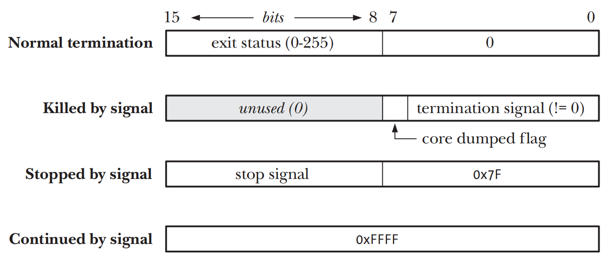

# MONITORING CHILD PROCESSES

## Waiting on a Child Process

### The wait() System Call
```c
#include <sys/wait.h>

pid_t wait(int *status)
```
- 如果没有任何一个calling process的child processes终止，且这些child process之前也并未被等待过，那么`wait()`调用将被阻塞，假如之后某个child process终止，那么`wait()`则会立刻返回
- 如果`status`非空，child process终止后的返回值会通过`status`指向的整数型变量返回
- kernel会为parent process下的所有child process添加process的CPU时间和资源使用情况统计信息
- 将终止的child process的pid作为`wait()`结果返回
- `wait()`返回-1的一个原因是calling process已经无child process可等待，这时errno会被设置为`ECHILD`

### The waitpid() System Call
```c
#include <sys/wait.h>

pid_t waitpid(pid_t pid, int *status, int options);
```
- `waitpid()`和`wait()`的返回值以及参数`status`含义相同，`pid`来表示需要等待的具体子进程
    - `pid > 0` 等待的child process的`process id`等于`pid`
    - `pid = 0` 等待的child process的`process group id`等于同parent process的`process group id`
    - `pid < -1` 等待的child process的`process group id`等于同`abs(pid)`
    - `pid = -1` 等待任意的child process。`wait(&status)`等同于`waitpid(–1, &status, 0)`
- `options`是一个`bit mask`，可以包含0或者多个flags
    - `WUNTRACED` 除了返回`terminated`的child processes信息之外，也返回因为signal而`stop`的child process的信息
    - `WCONTINUED` 返回因为之前已经停止但是又收到`SIGCONT`而恢复执行的child process信息
    - `WNOHANG` 如果参数pid所指定的child process并未发生状态改变，类似于`poll`会立刻返回，而且不会阻塞

### The Wait Status Value
- `wait()`和`waitpid()`的返回值可以区别child process不同的event
    - child process通过`_exit()`或`exit())`被终止并且指定了一个整数型的`exit status`
    - child process收到了一个未处理的信号之后被终止
    - child process被一个signal而变成停止状态，并且`waitpid()`被调用时的`options`设置为`WUNTRACED`
    - child process收到`SIGCONT`的signal而恢复运行，并且`waitpid()`被调用时的`options`设置为`WCONTINUED`



- `<sys/wait.h>`头文件中对定了一些标准macros来对等待状态的值来进行解析，只有一个会返回`true`
    - `WIFEXITED(status)` 如果child process正常结束时返回`true`，`WEXITSTATUS(status)`会返回child process的`exit status`
    - `WIFSIGNALED(status)` 如果child process被一个signal杀掉时返回`true`，`WTERMSIG(status)`返回导致child process终止的signal的编号，如果产生core dump，`WCOREDUMP(status)`则返回`true`
    - `WIFSTOPPED(status)` 如果child process被一个signal停止时返回`true`，`WSTOPSIG(status)`返回停止child process的signal的编号
    - `WIFCONTINUED(status)` 如果child process收到`SIGCONT`signal恢复运行时返回`true`

### Process Termination from a Signal Handler
- 一些signals的默认disposition会终止process，如果想在process被结束之前做一些比如cleanup的工作，则可以注册对应的signal handler在handler中处理完成之后再结束process
- signal handler中对child process的结束，parent process仍然可以通过`wait()`或`waitpid()`获取child process的终止状态

```c
void handler(int sig) {
    /* Perform cleanup steps */
    signal(sig, SIG_DFL); /* Disestablish handler */
    raise(sig); /* Raise signal again */
}
```
- child process通知parent process自己因为何种signal而终止，需要先disable当前的handler并且再给自己发同样的signal

### The waitid() System Call
```c
#include <sys/wait.h>

int waitid(idtype_t idtype, id_t id, siginfo_t *infop, int options);
```
- `idtype`和`id`指定了那些child process需要等待
    - `idtype=P_ALL` 等待任何的child process，忽略`id`
    - `idtype=P_PID` 等待pid为`id`的child process
    - `idtype=P_PGID` 等待process group id为`id`的child process
- `options`可以指定的的字段
    - `WEXITED` 等待无论正常还是不正常终止的child process
    - `WSTOPPED` 等待通过signal而停止的child process
    - `WCONTINUED` 等待通过`SIGCONT`signal恢复运行的child process
    - `WNOHANG` 如果pid为`id`的child process无返回信息，`waitid()`返回`0`即poll方式。如果没有pid为`id`的child process相匹配，则errno为`ECHILD`
    - `WNOWAIT` child process会返回status但是仍然会继续处于一个可被等待的状态，也就意味着稍后可以继续使用`waitid()`来获取相同的信息

### The wait3() and wait4() System Calls
```c
#define _BSD_SOURCE /* Or #define _XOPEN_SOURCE 500 for wait3() */
#include <sys/resource.h>
#include <sys/wait.h>

pid_t wait3(int *status, int options, struct rusage *rusage);
pid_t wait4(pid_t pid, int *status, int options, struct rusage *rusage);
```
- `wait3()`和`wait4()`system calls和`waitpid()`功能类似，只是会通过`rusage`返回被终止的`child process`的`resource usage`信息，包括process对CPU的使用时间和内存管理统计数据
- `wait3()`等同于`waitpid(-1, &status, options)`，`wait3()`等待的是任意child process
- `wait4()`等同于`waitpid(pid, &status, options)`，`wait4()`等待的是选定的一个或者多个child processes

## Orphans and Zombies
- `orphan process` pid为`1`的`init`process会接管`orphan process`，如果一个child process的parent process被终止，可以通过`getppid()`是否为`1`来判断
- `zombie process` parent process在执行`wait()`之前child process已经被终止，child process会被kernel转化成`zombie process`(在kernel的`process table`记录一条数据)，并会释放其大部分资源
    - parent process仍然可以对`zombie process`调用`wait()`以确定`zombie process`是被如何终止
    - `zombie process`并不是一个真正的`process`，因此无法通过signal杀死甚至是`SIGKILL`
    - 如果parent process调用了`wait()`，kernel会移除`zombie process`，如果parent process在终止之前都没有调用`wait()`，`init`会接管`zombie process`并调用`wait()`来通知kernel移除`zombie process`
    - 如果parent process无法执行`wait()`，则`zombie process`会一直驻留在kernel的`process table`当中（如果`process table`被写满则kernel无法创建新的process），直到parent process被杀死或者退出才会释放`zombie process`，因为此时`zombie proces`被`init`接管
    - 如果parent process是一个长期存活并且创建了很多child process，parent process的需要同/异步调用`wait()`或者通过`SIGCHLD`signal来确保`dead process`被转化成为长时间存活的`zombie process`
  
## The SIGCHLD Signal

### Establishing a Handler for SIGCHLD
- 无论一个child process何时终止，一个`SIGCHLD`的signal都会被发送给parent process，而parent process对`SIGCHLD`的默认的disposition是忽略
- 如果对`SIGCHLD`实现了signal handler，由于`sigaction()`默认会临时block唤醒他的signal(除非`SA_NODEFER`被指定)，并且signal也没有被队列化处理(多个`SIGCHLD`只会被捕获一次)，因此需要以poll的方式来调用`waitpid()`
```c
while (waitpid(-1, NULL, WNOHANG) > 0)
    continue;
```

#### Design issues for SIGCHLD handlers
- 一个保证可移植应用程序应当在创建child process之前就先注册好`SIGCHLD`的signal handler
- `waitpid()`有可能会改变`errno`，因此需要在signal handler中需要考虑是否应当handler返回前恢复`errno`的值

### Delivery of SIGCHLD for Stopped Children
- 如果signal导致child process**停止**，parent process也有可能收到`SIGCHLD`signal
- 通过`sigaction()`注册signal handler时，如果添加`SA_NOCLDSTOP`标志位，那么parent process不会在child process被停止的时发送`SIGCHLD`signal。

### Ignoring Dead Child Processes
- 对`SIGCHLD`的disposition显式的设置为`SIG_IGN`，child process会在后续被终止后立刻从系统中移除而不是转化为zombie process
- `SIGCHLD`的默认disposition为ignore，但是显式的设置`SIG_IGN`会和默认的ignore有行为上的差异
- 对`SIGCHLD`显式设置`SIG_IGN`并不会影响已经存在的zombie process，因此唯一完全保证可移植性的方案就是在`SIGCHLD`的signal handler内部通过`wait()`或者`waitpid()`产生zombie process

#### The sigaction() SA_NOCLDWAIT flag
- 使用`sigaction()`来处理`SIGCHLD`并且指定`SA_NOCLDWAIT`标志和对`SIGCHLD`显式的设置`SIG_IGN`功能类似