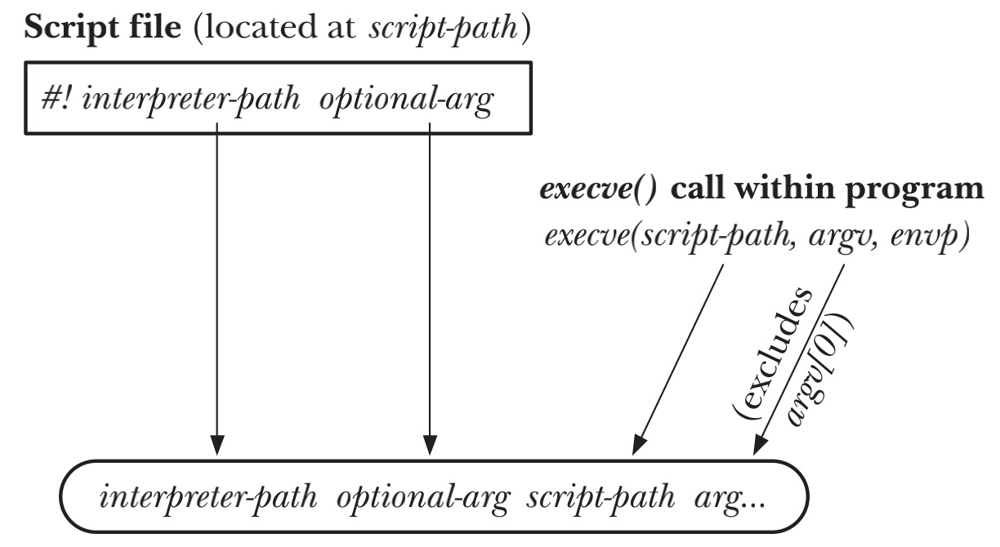
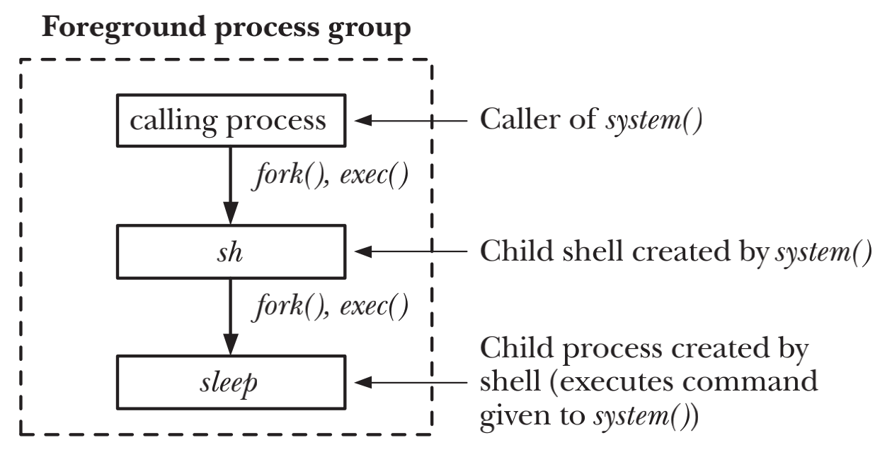

# PROGRAM EXECUTION

## Executing a New Program: execve()
```c
#include <unistd.h>

int execve(const char *pathname, char *const argv[], char *const envp[]);
```
- `execve()`system call可以将新程序加载到process的的内存，旧的程序则会被丢弃，process原有的`stack` `data`和`heap`也会被新程序替换
- `pathname`是加载到process内存内新的program的路径名，既可以是绝对路径也可以是相对于calling process工作目录的相对路径
- `argv`指定了传递给新program命令行参数，并作为新程序C语言main函数的第二个`char *argv[]`参数
- `envp`指定了新program的环境列表，指向的字符串格式为`name=value`
- 调用`execve()`之后，因为同一process依然存在，因此process ID保持不变  
- 由于`execve()`会加载新的program，因此一旦成功调用则永远不会有返回值，也不需要检查返回值。一旦有返回值，则意味着调用失败，会返回-1，并可通过`errno`来判断错误原因

## The exec() Library Functions
```c
#include <unistd.h>

int execle(const char *pathname, const char *arg, ... /* , (char *) NULL, char *const envp[] */);
int execlp(const char *filename, const char *arg, ... /* , (char *) NULL */);
int execvp(const char *filename, char *const argv[]);
int execv(const char *pathname, char *const argv[]);
int execl(const char *pathname, const char *arg, ... /* , (char *) NULL */);
```

| Function | Specification of program file (–, p) | Specification of arguments (v, l) | Source of environment (e, –) |
| :---: | :---: | :---: | :---: |
| `execve()` | pathname |  array | envp argument |
| `execle()` | pathname | list | envp argument |
| `execlp()` | filename + PATH | list | caller’s environ |
| `execvp()` | filename + PATH |  array | caller’s environ |
| `execv()` | pathname |  array | caller’s environ |
| `execl()` | pathname | list | caller’s environ |

- `exec`后的单个字母代表着function提供的不同的功能
    - `p`代表是`filename + PATH`模式，否则则为`pathname`模式
    - `v`代表的是参数是以`array`的方式，`l`代表参数是以`list`的方式，两种方式都需要以`NULL`指针来结尾
    - `e`代表的是环境列表以`array`的方式显式的传递，否则则会复用calling process的环境列表

### The PATH Environment Variable
- child process会在被创建时从parent process处继承一份环境变量的副本
- 避免对于`set-user-ID`或`set-group-ID`的程序使用`execvp()`和`execlp()`，以防止执行恶意程序。实际操作中，应当使用已知安全的路径来替换之前定义好的`PATH`

### Specifying Program Arguments as a List
- 如果在使用`exec()`时已知参数的个数，可以使用`execle()` `execlp()` `execl()`来代替`exec()`

### Passing the Caller’s Environment to the New Program
- `execlp()` `execvp()` `execl()` `execv()`不允许显式的指定环境变量

### Executing a File Referred to by a Descriptor: fexecve()
```c
#define _GNU_SOURCE
#include <unistd.h>

int fexecve(int fd, char *const argv[], char *const envp[]);
```
- 可以使用`open()`打开并且验证文件内容之后再使用`fexecve()`执行，`open()`和`fexecve()`之间的时间内，文件有可能被替换，持有fd并不能阻止同名新文件被创建

## Interpreter Scripts
- `interpreter` 可以阅读文本命令并且执行这些命令的程序
- UNIX kernels运行interpreter scripts有两点要求
    - script文件必须具有可执行权限
    - script文件的起始行必须制定interpreter的路径名，并且有固定的格式
```shell
#! interpreter-path [ optional-arg ]
```

### Execution of interpreter scripts
- `execve()`如果检测到传入的文件以`#!`开头，就会解析该行的剩余部分，然后按照固定格式来执行`interpreter`程序
```shell
interpreter-path [ optional-arg ] script-path arg...
```


## File Descriptors and exec()
- 默认情况下，一个老程序在调用`exec()`加载新程序前打开的所有fd，会通过`exec()`传递给新程序并且此时fd依然是有效并且是打开状态，新程序无需了解文件名或者是重新打开文件便可以直接使用fd

### The close-on-exec flag (FD_CLOEXEC)
- 某些fd有可能是通过第三方的library打开，但是作为第三方的library无法强制program在调用`execve()`之前关闭fd
- 如果`execve()`因为某些原因调用失败，可能还需要继续保证fd的打开状态，但是如果有些类型的fd一旦关闭，再次打开的难度极大

```c
int flags;
flags = fcntl(fd, F_GETFD);
if (flags == -1)
errExit("fcntl");
flags |= FD_CLOEXEC;
if (fcntl(fd, F_SETFD, flags) == -1)
errExit("fcntl");
```
- kernel为每一个fd提供了`close-on-exec`标志，如果`exec()`执行成功，会自动关闭该fd，如果调用失败则fd会继续保持打开状态

## Signals and exec()
- `exec()`执行时会替换原有的program text，但是text中可能包含calling program的signal handlers，kernel会把所有已处理的signal的dispositions设置成为`SIG_DFL`
- 为了保证最大的可移植性，应当在调用`exec()`之前执行`signal(SIGCHLD, SIG_DFL)`，当然程序也不能假设`SIGCHLD`默认的disposition就是`SIG_DFL`
- 在`exec()`调用阶段，process`signal mask`和`pending signals`都会被保存，新的程序可以继续对signal进行block和queue，因此在`exec()`前不应当`blocked`或者`ignored`任何的signals

## Executing a Shell Command: system()
```c
#include <stdlib.h>

int system(const char *command);
```
- `system()`允许calling program执行任意的shell命令，`system()`会创建一个新的child process来运行shell，并且用shell来执行shell命令
- `system()`的运行效率低下，使用`system()`运行shell命令至少要创建两个processes， 一个用于运行shell，剩余的一个或多个用来执行shell所执行的命令
- `system()`的返回值
    - 假如`command`为NULL，`system()`在shell可用返回非0，若不可用则返回0
    - 如果无法创建child process或者获取其终止状态，则`system()`返回-1
    - 如果child process无法执行shell，`system()`的返回值和shell调用`_exit(127)`终止时一样
    - 如果所有system calls都成功，`system()`会返回shell command的终止状态，也就是最后一条命令时退出的状态，如果command被signal所杀，大多数shell返回`128+n`，n为signal number

### Avoid using system() in set-user-ID and set-group-ID programs
- `Set-user-ID`和`set-group-ID`的程序在特权模式下运行，不能使用`system()`，以免造成安全隐患

## Implementing system()

- 执行`system("sleep 20")`时会有三个processes，`calling process` `shell process`和`shell command process`
- `SIGINT`和`SIGQUIT`在`shell command process`执行期间被`calling process`忽略
- `SIGINT`和`SIGQUIT`在child process中，应当是已处理的signal的disposition设置成默认值，其他signal的disposition保持不变