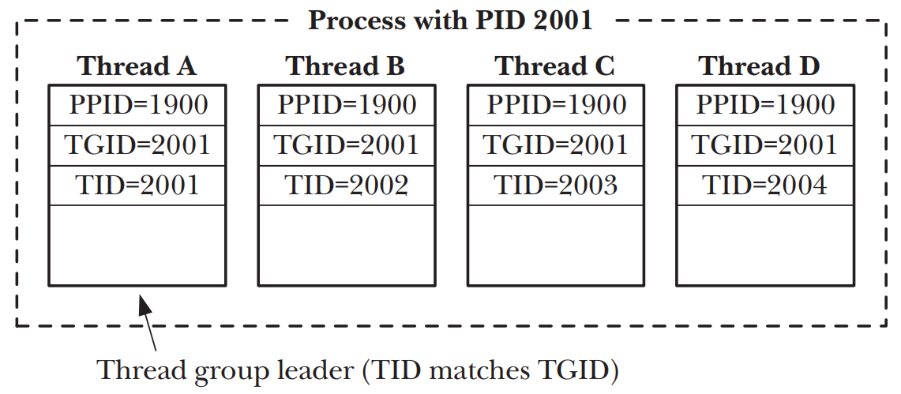

# PROCESS CREATION AND PROGRAM EXECUTION IN MORE DETAIL

## Process Accounting
- `process accounting` kernel会在每个process终止时写入一条`accounting`记录到系统级别的`process accounting file`
- `accounting record` kernel为相应的process维护的多种信息，包括终止状态、CPU时间等

### Enabling and disabling process accounting
```c
#define _BSD_SOURCE
#include <unistd.h>

int acct(const char *acctfile);
```

### Process accounting records
- 一旦`process accounting`被打开，每当一个process被终止，就会有一条`acct`的记录被写入`process accounting file`中
- `acct` 结构定义在`<sys/acct.h>`中

```c
typedef u_int16_t comp_t; /* See text */
struct acct {
    char ac_flag; /* Accounting flags (see text) */
    u_int16_t ac_uid; /* User ID of process */
    u_int16_t ac_gid; /* Group ID of process */
    u_int16_t ac_tty; /* Controlling terminal for process (may be 0 if none, e.g., for a daemon) */
    u_int32_t ac_btime; /* Start time (time_t; seconds since the Epoch) */
    comp_t ac_utime; /* User CPU time (clock ticks) */
    comp_t ac_stime; /* System CPU time (clock ticks) */
    comp_t ac_etime; /* Elapsed (real) time (clock ticks) */
    comp_t ac_mem; /* Average memory usage (kilobytes) */
    comp_t ac_io; /* Bytes transferred by read(2) and write(2) (unused) */
    comp_t ac_rw; /* Blocks read/written (unused) */
    comp_t ac_minflt; /* Minor page faults (Linux-specific) */
    comp_t ac_majflt; /* Major page faults (Linux-specific) */
    comp_t ac_swaps; /* Number of swaps (unused; Linux-specific) */
    u_int32_t ac_exitcode; /* Process termination status */
#define ACCT_COMM 16
    char ac_comm[ACCT_COMM+1]; /* (Null-terminated) command name (basename of last execed file) */
    char ac_pad[10]; /* Padding (reserved for future use) */
};
```

### Process accounting Version 3 file format
-  kernel 2.6.8之后引入了`acct_v3`结构，需要在编译kernel前启用kernel配置选项`CONFIG_BSD_PROCESS_ACCT_V3`
```c
struct acct_v3 {
    char ac_flag; /* Accounting flags */
    char ac_version; /* Accounting version (3) */
    u_int16_t ac_tty; /* Controlling terminal for process */
    u_int32_t ac_exitcode; /* Process termination status */
    u_int32_t ac_uid; /* 32-bit user ID of process */
    u_int32_t ac_gid; /* 32-bit group ID of process */
    u_int32_t ac_pid; /* Process ID */
    u_int32_t ac_ppid; /* Parent process ID */
    u_int32_t ac_btime; /* Start time (time_t) */
    float ac_etime; /* Elapsed (real) time (clock ticks) */
    comp_t ac_utime; /* User CPU time (clock ticks) */
    comp_t ac_stime; /* System CPU time (clock ticks) */
    comp_t ac_mem; /* Average memory usage (kilobytes) */
    comp_t ac_io; /* Bytes read/written (unused) */
    comp_t ac_rw; /* Blocks read/written (unused) */
    comp_t ac_minflt; /* Minor page faults */
    comp_t ac_majflt; /* Major page faults */
    comp_t ac_swaps; /* Number of swaps (unused; Linux-specific) */
#define ACCT_COMM 16
    char ac_comm[ACCT_COMM]; /* Command name */
};
```

## The clone() System Call
```c
#define _GNU_SOURCE
#include <sched.h>

int clone(int (*func) (void *), void *child_stack, int flags, void *func_arg, ... /* pid_t *ptid, struct user_desc *tls, pid_t *ctid */ );
```
- `clone()`是Linux的特有system call，基于threading库来实现，因此会有损程序的可移植性
- `clone()`生成的child process会去执行`func`指定的函数，因此`func`又被成为`child function`，调用参数由`func_arg`指定
- `func`返回或者调用`exit()`或`_exit()`之后，`clone()`system call产生的child process则会被终止，`func`的返回值为process的退出状态，parent process可以使用`wait()`系列函数来等待child process
- `child_stack`指向child process需要使用的stack空间，因为大多数硬件架构中，stack是向下增长的，所以`child_stack`指针应该指向内存块的高位
- `clone()`如果成功创建child process，返回值为child pid，如果创建失败则返回-1
- `flags`的低字节指定了child process的`termination signal`，这个signal会在child process被终止时传递给parent process，如果`clone()`产生的child process被signal**停止**，`parent process`则仍然会收到`SIGCHLD`signal

| Flag | Effect if present |
| --- | --- |
| CLONE_CHILD_CLEARTID | Clear ctid when child calls exec() or _exit() (2.6 onward) |
| CLONE_CHILD_SETTID | Write thread ID of child into ctid (2.6 onward) |
| CLONE_FILES | Parent and child share table of open file descriptors |
| CLONE_FS | Parent and child share attributes related to file system |
| CLONE_IO | Child shares parent’s I/O context (2.6.25 onward) |
| CLONE_NEWIPC | Child gets new System V IPC namespace (2.6.19 onward) |
| CLONE_NEWNET | Child gets new network namespace (2.4.24 onward) |
| CLONE_NEWNS | Child gets copy of parent’s mount namespace (2.4.19 onward) |
| CLONE_NEWPID | Child gets new process-ID namespace (2.6.19 onward) |
| CLONE_NEWUSER | Child gets new user-ID namespace (2.6.23 onward) |
| CLONE_NEWUTS | Child gets new UTS (utsname()) namespace (2.6.19 onward) |
| CLONE_PARENT | Make child’s parent same as caller’s parent (2.4 onward) |
| CLONE_PARENT_SETTID | Write thread ID of child into ptid (2.6 onward) |
| CLONE_PID | Obsolete flag used only by system boot process (up to 2.4) |
| CLONE_PTRACE | If parent is being traced, then trace child also |
| CLONE_SETTLS | tls describes thread-local storage for child (2.6 onward) |
| CLONE_SIGHAND | Parent and child share signal dispositions |
| CLONE_SYSVSEM | Parent and child share semaphore undo values (2.6 onward) |
| CLONE_THREAD | Place child in same thread group as parent (2.4 onward) |
| CLONE_UNTRACED | Can’t force CLONE_PTRACE on child (2.6 onward) |
| CLONE_VFORK | Parent is suspended until child calls exec() or _exit() |
| CLONE_VM | Parent and child share virtual memory |

### The clone() flags Argument
- `thread`和`process`属于KSE`kernel scheduling entity`，只是对比其他SKEs提供了或多或少属性共享上的不同

#### Sharing file descriptor tables: CLONE_FILES
- 如果设置`CLONE_FILES`，parent process和child process会共享同一个`open file descriptors table`，因此对一个process的fd的分配和释放，比如`open()` `close()` `dup()` `pipe()` `socket()`，都会对其他process可见
- 如果不设置`CLONE_FILES`，child process只是获取了parent process的`open file descriptors table`的副本
- `POSIX threads`规范要求process中的所有thread共享相同的`open file descriptors table`

#### Sharing file system–related information: CLONE_FS
- 如果设置`CLONE_FS`，parent process和child process会共享同文件系统相关信息，因此对一个process的`umask()` `chdir()` `chroot()`会影响其他process
- `POSIX threads`规范要求实现`CLONE_FS`提供的属性共享

#### Sharing signal dispositions: CLONE_SIGHAND
- 如果设置`CLONE_SIGHAND`，parent process和child process会共享相同的`signal dispositions table`，无论在哪个process调用`sigaction()`或`signal()`修改signal的disposition，都会影响其他process
- 如果不设置`CLONE_SIGHAND`，child process只是获取了parent process的`signal dispositions table`的副本
- `CLONE_SIGHAND`不会影响parent和child process之间的`signal mask`和`pending signals set`，parent和child process之间是彼此独立的  
- `POSIX threads`规范要求共享`signal dispositions`

#### Sharing the parent’s virtual memory: CLONE_VM
- 如果设置`CLONE_VM`，parent process和child process会共享同一份`virtual memory pages`，无论在哪个process调用`mmap()`或`munmap()`，都会影响其他process
- 如果不设置`CLONE_VM`，child process只是获取了parent process的`virtual memory pages`的拷贝  
- `POSIX threads`规范也对thread之间共享`virtual memory pages`有要求

#### Thread groups: CLONE_THREAD
- 如果设置`CLONE_THREAD`，child会被置于parent的thread group中
- 如果不设置`CLONE_THREAD`，child会被置于新的thread group中
- POSIX规定process所有的thread共享同一个pid，`thread group`就是共享同一个`thread group identifier (TGID)`的一组KSE


- 一个`thread group`内每个thread都有一个唯一的`thread identifier(TID)`
- `thread group`内的首个`thread`即为`thread group leader`，其`TID`等于`TGID`
- `thread group`内的所有thread都有一个相同的parent process id(PPID)， 即为`thread group leader`的的PPID，`thread group`内的所有thread都终止以后，parent process才会收到`SIGCHLD`signal
- 如果一个通过`CLONE_THREAD`标志创建的thread被终止，需要通过`pthread_join()`而不是`wait()`来检测
- 如果`thread group`内的任意thread调用了`exec()`，那么除了`thread group leader`之外的threads将会被终止，新的program将会在`thread group leader`中执行
- 如果`thread group`内的任意thread调用了`fork()`或`vfork()`来创建child process，则组内任何的thread都可以使用`wait()`来监控其child process

#### Threading library support: CLONE_PARENT_SETTID, CLONE_CHILD_SETTID, and CLONE_CHILD_CLEARTID
- 如果设置`CLONE_PARENT_SETTID`，kernel会将child thread id写入`pitd`指向的位置，在对parent process复制之前，就会把CTID写入`ptid`所指向的内存，可以保证在`clone()`返回之前就将新的tid赋值给`ptid`指针，从来避免race conditions
- 如果设置`CLONE_CHILD_SETTID`，`clone()`会将child thread id写入`ctid`指向的位置，对`ctid`的设置只会存在于child内存当中，如果设置了`CLONE_VM`，还是会影响到parent
- 如果设置`CLONE_CHILD_CLEARTID`，那么`clone()`会将child process终止时将`ctid`所指向的内容清零

#### Thread-local storage: CLONE_SETTLS
- 如果设置`CLONE_SETTLS`，参数`tls`所指向thead级别使用的`thread-local`存储缓冲区的结构`user_desc`

#### Sharing System V semaphore undo values: CLONE_SYSVSEM
- 如果设置`CLONE_SYSVSEM`，parent process和child process共享同一个`System V semaphore undo values list`
- 如果不设置`CLONE_SYSVSEM`，parent process和child process各自有自己的`undo list`，且child process的列表为空

#### Per-process mount namespaces: CLONE_NEWNS
- 默认情况下，parent process和child process共享同一个mount namespace，所以只要有一个process调用了`mount()`和`umount()`，改变也会为其他process所见

#### Making the child’s parent the same as the caller’s: CLONE_PARENT
- 如果设置`CLONE_PARENT`，那么`child process.PPID = calling clone() process.PPID`
- 如果不设置`CLONE_PARENT`，那么`child process.PPID = calling clone() process.PID`
- child process的终止，会向`child process.PPID`所指向的parent process发出signal

#### Making the child’s PID the same as the parent’s PID: CLONE_PID (obsolete)
- 如果设置`CLONE_PID`，child pid则会等于他的parent的pid

#### Process tracing: CLONE_PTRACE and CLONE_UNTRACED
- 如果设置`CLONE_PTRACE`并且在在trace calling process，那么child process也会被traced

#### Suspending the parent until the child exits or execs: CLONE_VFORK
- 如果设置`CLONE_VFORK`，parent process将一直被挂起直到child process调用了`exec()`或`_exit()`来释放虚拟内存资源位置

#### New clone() flags to support containers
- 对于容器提供支持的flags `CLONE_IO` `CLONE_NEWIPC` `CLONE_NEWNET` `CLONE_NEWPID` `CLONE_NEWUSER` `CLONE_NEWUTS`

#### Use of clone() flags
- `fork()` 约等于flags指定为`SIGCHLD`的`clone()`调用
- `vfork()` 等于flags指定为`CLONE_VM | CLONE_VFORK | SIGCHLD`的`clone()`调用
- `LinuxThreads threading`的实现使用flags指定为`CLONE_VM | CLONE_FILES | CLONE_FS | CLONE_SIGHAND`的`clone()`调用
- `NPTL threading`的实现使用flags指定为`CLONE_VM | CLONE_FILES | CLONE_FS | CLONE_SIGHAND | CLONE_THREAD | CLONE_SETTLS | CLONE_PARENT_SETTID | CLONE_CHILD_CLEARTID | CLONE_SYSVSEM`的`clone()`调用

### Extensions to waitpid() for Cloned Children
- 通过`clone()`产生的child process，可以通过`waitpid()` `wait3()` `wait4()`的掩码参数`options`附加如下值
    - `__WCLONE` 如果设置只会等待`clone()`产生的child process，不设置则张炯会等待**非**`clone()`产生的child process
    - `__WALL` 等待所有的child process，不区分是否通过`clone()`产生
    - `__WNOTHREAD` 只等待calling process自己的child process，`waitpid()`不能使用此标志

## Speed of Process Creation
- `fork()` process所占的内存越大，`fork()`所需的时间也就越长，因为要复制页表，以及将`data` `heap` `stack segment page entries`标记为只读
- `vfork()` process的的内存大小不会影响`vfork()`的时间，因为`vfork()`不会拷页表和页，因此calling process的虚拟内存大小不会对其有影响

## Effect of exec() and fork() on Process Attributes