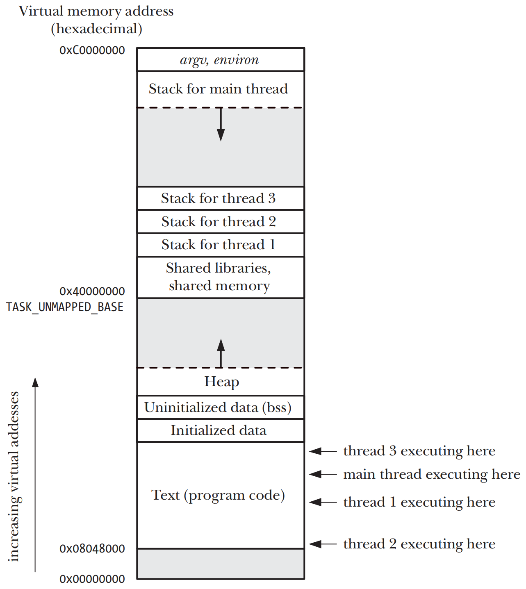

# THREADS: INTRODUCTION

## Overview
- 一个process可以包含多个thread，同一个程序中所有的thread都会执行相同的program，并且共享同一份全局内存区域，包括`initialized data` `uninitialized data`和`heap segments`
- 传统意义上的Unix的process只不过是一个multithreaded process的特例，即该process只包含一个thread



- multiple process的一些限制
    - process之间的信息难以共享，parent和child process只会共享只读的`text segment`，必须采用IPC的方式来在process间交换信息
    - 调用`fork()`创建process代价相对比较昂贵
- multiple thread的优点
    - thread之间可以方便、快速的共享信息，只需要将数据复制到共享的全局或者heap变量中即可
    - 创建thread比创建process通常要快10倍，Linux上通过`clone()`system call来实现thread

## Background Details of the Pthreads API

### Pthreads data types
| Data type | Description |
| --- | --- |
| pthread_t | Thread identifier |
| pthread_mutex_t | Mutex |
| pthread_mutexattr_t | Mutex attributes object |
| pthread_cond_t | Condition variable |
| pthread_condattr_t | Condition variable attributes object |
| pthread_key_t | Key for thread-specific data |
| pthread_once_t | One-time initialization control context |
| pthread_attr_t | Thread attributes object |

### Threads and errno
- 在multithreaded程序中，每个thread都有属于自己的errno
- Pthreads API的所有Pthreads functions均返回`0`表示成功，返回positive error number表示失败

## Thread Creation
```c
#include <pthread.h>

int pthread_create(pthread_t *thread, const pthread_attr_t *attr, void *(*start)(void *), void *arg);
```
- 新thread通过调用带有`arg`参数的`start()`开始执行，`arg`参数为`void *`类型，可以指向任何对象类型的指针并传递给`start()`函数，一般情况下`arg`指针指向一个global或heap变量，如果需要向`start()`传递多个参数，可以将`arg`指向一个struct
- 参数`thread`指向`pthread_t`类型的buffer，在`pthread_create()`函数`return`之前会把一个thread的唯一标识符拷贝进buffer中。SUSv3明确规定在新thread开始执行之前，不需要初始化`thread`所指向的buffer，新`thread`可能在`pthread_create()`函数return之前就开始执行，因此只能使用`pthread_self()`来获取自己的ID 
- 参数`attr`是指向`pthread_attr_t`对象的指针，如果设置为NULL，将使用默认属性    

## Thread Termination
- thread终止的方法
    - thread的`start`函数执行了`return`语句并返回指定值
    - thread调用了`pthread_exit()`
    - 使用`pthread_cancel()`取消了thread    
    - 任意thread调用了`exit()`或者main thread执行了`return`语句，所有process中的threads都会立刻终止
```c
include <pthread.h>

void pthread_exit(void *retval);
```
- 调用`pthread_exit()`相当于在thread中执行了`return`语句
- 参数`retval`指定了thread的返回值，`retval`所指向的值不应分配在`thread stack`上，`thread stack`上的内容在thread终止的时候失效
- 如果main thread调用了`pthread_exit()`，不会影响其他thread的继续执行

## Thread IDs
```c
include <pthread.h>

pthread_t pthread_self(void);
```
- `Thread ID(TID)` process内的每一个thread的唯一标识符，每个thread可以通过`pthread_self()`来获取自己的TID

```c
include <pthread.h>

int pthread_equal(pthread_t t1, pthread_t t2);
```
- `pthread_equal()`函数用来检查两个thread的ID是否相同，在Linux的threading实现中，TID在所有的process中都是唯一的
- `pthread_t`在不同的实现中定义是不一致的，因此必须使用`pthread_equal()`来判断是否相等，以满足最大的可移植性

## Joining with a Terminated Thread
```c
include <pthread.h>

int pthread_join(pthread_t thread, void **retval);
```
- `pthread_join()`会等待`thread`指定的thread终止，一旦thread终止，`pthread_join()`会解除阻塞立刻返回，这种操作被称之为`joining`(连接)
- `retval`如果为一个非NULL的指针，将会收到一个thread终止时候返回值的拷贝，这个返回值是thread调用`return`或者`pthread_exit()`指定的值
- 如果thread并未`detached`，则必须使用`pthread_join()`来进行连接，如果连接失败则thread终止之后会转变成为`zombie thread`，从而浪费系统资源
- `thread`之间是平等的，process的任何thread可以通过`pthread_join()`来连接process中的其他threads，这点和process就有区别，当parent process通过`fork()`创建child process，parent是唯一可以对child进行`wait()`调用的process
- 无法连接任意的thread，因为参数`thread`必须指向一个thread，也无法执行一个`nonblocking`的连接

## Detaching a Thread
```c
#include <pthread.h>

int pthread_detach(pthread_t thread);
```
- 默认情况下的thread是`joinable`的状态，如果不关心返回状态并且希望系统自动清理终止的thread，可以通过`pthread_detach()`来使得thread变成`detached`状态
- `joinable`到`detached`的状态转换是不可逆的，且处于`detached`状态的thread是无法被连接的
- `pthread_detach()`只是关心thread终止之后会发生什么，并不关心thread是如何被终止的，其他thread调用了`exit()`或者main thread调用了`return`，`detached`状态的thread也会被立刻终止

## Thread Attributes
- 通过`pthread_create()`的参数`attr`来控制，`attr`的类型为`pthread_attr_t`，可以在创建new thread时候指定一些属性

## Threads Versus Processes
- multithread的优点
    - thread共享数据很简单，process则需要更多的开销，比如共享内存段或者使用pipe
    - thread的创建要快于process的创建，thread级context-switch时间要比process要短
- multithread的缺点
    - 需要考虑函数的thread-safe或者以thread-safe方式来调用函数
    - thread之间共享相同的地址空间和其他属性，一个thread的问题会影响到其他thread
    - 每个thread都在争夺宿主process中有限的virtual address space
- 在multithread程序中需要小心处理signal，建议在multithread程序中避免使用signal 
- multithread程序中的所有thread必须执行相同的program text
- 要多thread间共享的信息视应用来判断优劣
    