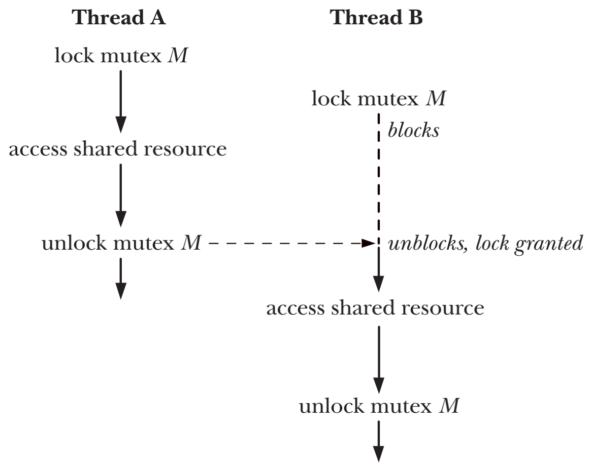
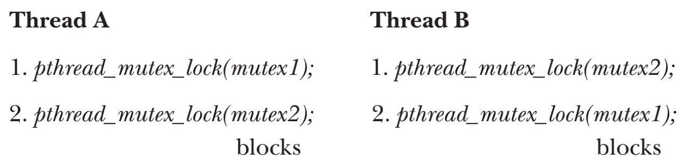

# THREADS: THREAD SYNCHRONIZATION

## Protecting Accesses to Shared Variables: Mutexes
- `critical section` 是指访问某一共享资源并且应当以`atomic`来执行的代码片段
- 为了避免thread之间试图更新共享变量时所出的问题，必须使用`mutex(mutual exclusion)`来确保在同一时间只有一个thread可以访问某个共享资源，`mutex`可以确保对共享资源的原子访问
- 一个`mutex`会有两种状态`locked`和`unlocked`，在任何时刻至多只能有一个thread可以获取一个`mutex`上的锁，试图对一个`locked`状态的`mutex`上锁，讲可能引起阻塞或者失败报错
- 一旦`thread`对一个`mutex`锁定，随即就变成了`mutex`的所有者，也只有所有者才能对`mutex`进行解锁



### Statically Allocated Mutexes
- 一个`mutex`既可以被被分配成为一个静态变量，也可以在运行时动态创建，比如通过`malloc()`
```c
pthread_mutex_t mtx = PTHREAD_MUTEX_INITIALIZER;
```

### Locking and Unlocking a Mutex
- 初始化之后的`mutex`处于`unlocked`状态，`pthread_mutex_lock()`和`pthread_mutex_unlock()`可以lock或者unlock一个`mutex`

```c
#include <pthread.h>

int pthread_mutex_lock(pthread_mutex_t *mutex);
int pthread_mutex_unlock(pthread_mutex_t *mutex);
```
- `pthread_mutex_lock()`参数`mutex`指定了需要锁定的mutex
    - 如果此时的mutex处于`unlocked`状态，则会锁定mutex并且立刻返回
    - 如果此时的mutex处于`locked`状态，也就是被另一thread锁定，则`pthread_mutex_lock()`会一直阻塞直至mutex被解锁为止
    - 如果一个thread已经持有一个mutex的锁，并且再次调用`pthread_mutex_lock()`，则根据mutex的默认类型会有两种结果：deadlock或者调用失败并把errno设置为`EDEADLK`，Linux默认使用deadlock策略
- 如果有多个thread试图锁定一个刚刚通过`pthread_mutex_unlock()`解锁的mutex，无法预测哪个thread可以获取锁

#### pthread_mutex_trylock() and pthread_mutex_timedlock()
```c
#include <pthread.h>

int pthread_mutex_trylock(pthread_mutex_t *mutex);
int pthread_mutex_unlock(pthread_mutex_t *mutex);
```
- 如果`mutex`当前是`locked`状态，对其使用`pthread_mutex_trylock()`则会失败并设置errno为`EBUSY`
- 对于mutex的良好设计应该是一个thread持有mutex的时间应当尽量的短，以避免妨碍其他thread并发执行，这也保证了因为`mutex`被blocked的thread可以立刻获取mutex

### Performance of Mutexes
- `file locks`和`semaphores`总是需要system call来执行lock和unlock的操作，每个system call虽然开销小但是仍是一个可感知的开销
- `mutexes`通过原子的机器语言级别的操作来实现，并且仅在需要锁征用的情况下才会发生system call
- Linux中，`mutexes`通过`futexes(fast user space mutexes)`机制来实现，锁的征用需要通过`futex()`system call

### Mutex Deadlocks
- 当多个thread试图锁定同一组`mutex`时，就有可能发生deadlock



- 解决deadlock可能的方案
    - `mutex hierarchy` 定义一套`mutex`的层级关系，当多个thread对一组`mutex`操作时，应该总是以相同的顺序对这个`mutex`组进行锁定
    - `try, and then back off` thread先使用`pthread_mutex_lock()`锁定第一个mutex，然后使用`pthread_mutex_trylock()`锁定剩余的`mutexes`，如果任意的`pthread_mutex_trylock()`调用失败，则该thread释放所有属于自己的`mutex`

### Dynamically Initializing a Mutex
```c
#include <pthread.h>

int pthread_mutex_init(pthread_mutex_t *mutex, const pthread_mutexattr_t *attr);
```
- `PTHREAD_MUTEX_INITIALIZER`只能用于对`mutex`进行静态默认属性的初始化，其他的场景需要使用`pthread_mutex_init()`来对`mutex`进行初始化
- 参数`mutex`指定了将要初始化的mutex
- `attr`是指向`pthread_mutexattr_t`类型对象的指针，该对象在函数调用之前已经经过了初始化，用于定义`mutex`的属性
- 如下情况下应当使用`pthread_mutex_init()`而不是使用静态分配的`mutex`
    - 动态分配于heap中的`mutex`
    - `mutex`是在stack中分配的自动变量
    - 静态分配且不使用默认属性的`mutex`  

```c
#include <pthread.h>

int pthread_mutex_destroy(pthread_mutex_t *mutex);
```
- 如果一个自动或者动态分配的`mutex`不再被需要，应当使用`pthread_mutex_destroy()`将其销毁
- 只有一个`locked`状态的`mutex`，且后续没有thread试图锁定`mutex`，才能安全的把`mutex`销毁

### Mutex Attributes

### Mutex Types
- `PTHREAD_MUTEX_NORMAL` 不具有deadlock自检功能类型的`mutex`，如果thread试图对自己锁定的mutex加锁，则发生死锁
- `PTHREAD_MUTEX_ERRORCHECK` 对`mutex`所有的操作都会执行错误检查，此种`mutex`相比普通`mutex`慢，一般用于调试使用
- `PTHREAD_MUTEX_RECURSIVE` 

## Signaling Changes of State: Condition Variables

### Statically Allocated Condition Variables

### Signaling and Waiting on Condition Variables
```c
#include <pthread.h>

int pthread_cond_signal(pthread_cond_t *cond);
int pthread_cond_broadcast(pthread_cond_t *cond);
int pthread_cond_wait(pthread_cond_t *cond, pthread_mutex_t *mutex);
```

```c
#include <pthread.h>
int pthread_cond_timedwait(pthread_cond_t *cond, pthread_mutex_t *mutex, const struct timespec *abstime);
```

### Testing a Condition Variable’s Predicate

### Example Program: Joining Any Terminated Thread

### Dynamically Allocated Condition Variables
```c
#include <pthread.h>

int pthread_cond_init(pthread_cond_t *cond, const pthread_condattr_t *attr);
```

```c
#include <pthread.h>

int pthread_cond_destroy(pthread_cond_t *cond);
```