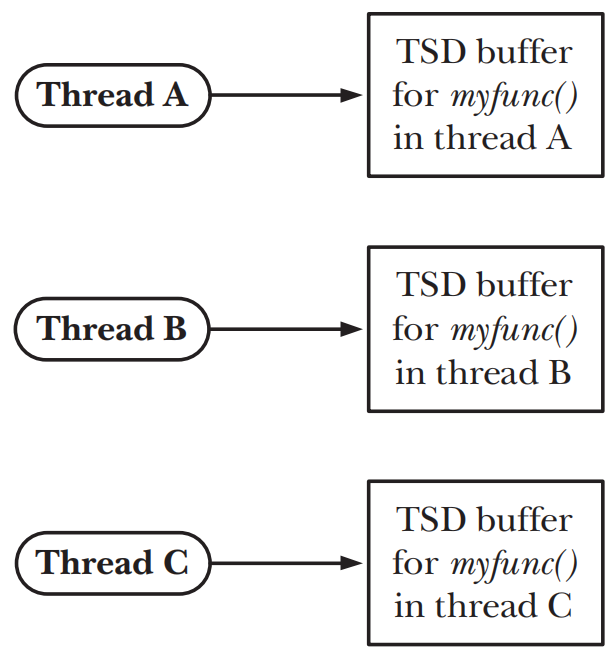
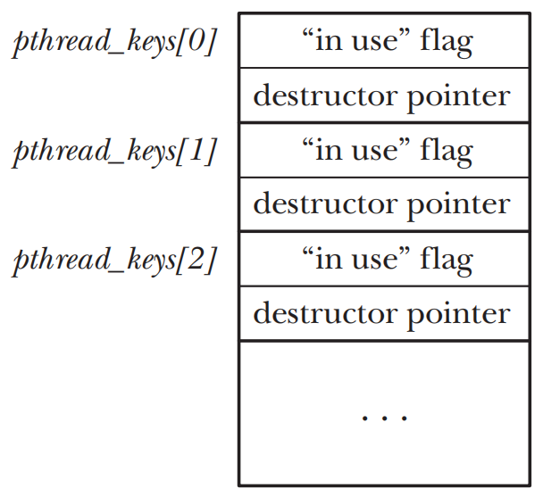
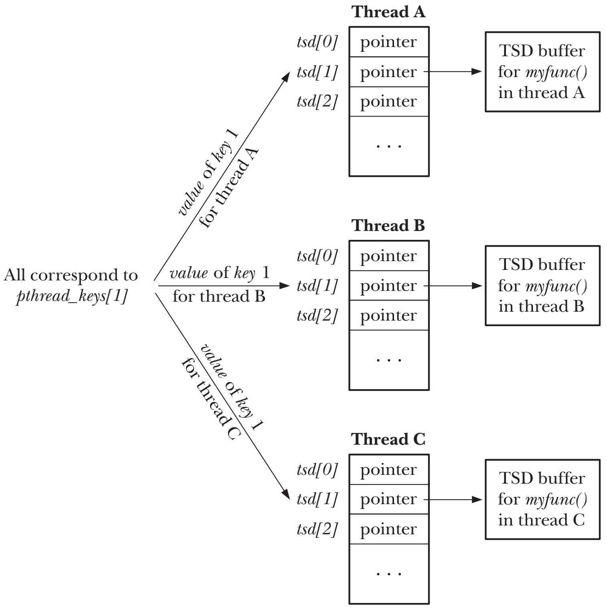

# THREADS: THREAD SAFETY AND PER-THREAD STORAGE

## Thread Safety (and Reentrancy Revisited)
- `thread-safe` 一个函数同时可供多个thread安全调用
- 实现`thread-safe`函数的方式
    - 将函数和`mutex`关联使用，在调用时候锁定`mutex`，在返回时解锁`mutex`，同时只有一个thread可以访问此函数，因此这个函数的调用是`serialized`
    - 将一个`shared variable`和`mutex`关联使用，首先需要识别出函数内访问`shared variable`的`critical sections`，并且只在执行`critical sections`代码时才获取和释放`mutex`

## One-Time Initialization
```c
#include <pthread.h>

int pthread_once(pthread_once_t *once_control, void (*init)(void));
```
- `pthread_once()` 使用参数`once_control`的状态来保证，无论有多少不同的thread调用了多次`pthread_once()`，`init`所指向的函数仅会被执行一次
- `once_control`参数必须是指针，指向一个静态初始化值为`PTHREAD_ONCE_INIT`的变量
```c
pthread_once_t once_var = PTHREAD_ONCE_INIT;
```

## Thread-Specific Data

- `thread-specific`数据允许函数为不同的thread分别维护一个变量的副本

### Thread-Specific Data from the Library Function’s Perspective
- 函数必须给每个调用他的thread单独分配一个存储块，存储块且只能函数被thread第一次调用时候被分配一次
- 后续相同thread对此函数的调用，函数都应当返回第一次为thread分配的存储块，函数不能把存储数据的指针指向一个自动变量，因为自动变量在函数退出时会自动消失，也不能分配成为一个静态变量，每个静态变量在单个process中只有一个实例
- 不同的函数都需要不同的`thread-specific`数据，每个函数也需要方法能标识出自己的`thread-specific`，以便能和其他的`thread-specific`数据区分开
- 因为函数无法控制当`thread`终止时发生的情况，因此需要一种机制能够自动的回收thread的存储块，以避免造成内存泄露

### Overview of the Thread-Specific Data API
- 一个函数创建`key`，用以区分他自己和其他函数所使用`thread-specific`数据。`key`可以通过`pthread_key_create()`来创建，`key`仅需在首个thread在访问函数的时候生成，且后续多少个thread访问这个函数，`key`也能被生成一次，因此可通过`pthread_once()`来控制在multi-thread环境下``pthread_key_create()`只被执行一次
- `pthread_key_create()`可以自定义`destructor`解构函数，拥有`thread-specific`的thread终止时Pthreads AP会自动调用`destructor`解构函数，并将指向存储块的指针作为参数传入解构函数
- 函数给每个调用他的thread分配一个`thread-specific`数据块，这个分配通过`malloc()`或者类似函数来实现，且也只会在每个thread第一次调用函数时分配一次
- `pthread_setspecific()`通过和之前的`key`结合使用，可以做到将指针存入`thread-specific`数据块，`pthread_getspecific()`则返回`key`相关联的数据块指针，如果调用`pthread_getspecific()`时没有指针和`key`关联，函数会返回NULL

### Details of the Thread-Specific Data API
```c
#include <pthread.h>

int pthread_key_create(pthread_key_t *key, void (*destructor)(void *));
```
- `pthread_key_create()`给calling thread创建一个新的`thread-specific`数据键，并且通过`key`指向的buffer返回给calling thread
- `key`可以被process内的所有thread使用，因此`key`应当指向一个全局变量，以便所有的thread都可以访问
- 只要thread终止时`key`关联的值为非NULL，`destructor`指向的函数就会被自动执行，并将与`key`关联的值作为参数传入`destructor`函数中，如果无需解构函数，则可将`destructor`设置为NULL
- 如果一个thread有多个`thread-specific`数据块，无法确定解构函数调用的顺序，因此每个解构函数的设计应当相互独立



- 一个全局的数组，存放`thread-specific`数据key的信息
- 每个thread包含一个数组，存有为每个thread分配的`thread-specific`数据块的指针
- `pthread_key_t`类型的key通过`pthread_key_create()`来创建，并作为数组`pthread_keys`的index

```c
#include <pthread.h>

int pthread_setspecific(pthread_key_t key, const void *value);
void *pthread_getspecific(pthread_key_t key);
```
- `pthread_setspecific()`要求Pthreads API将`value`的拷贝在一个数据结构中，并且与calling thread和`key`相关联
- `pthread_getspecific()`会返回和当前thread之前相关联的`key`的`value`


- 当`thread`被创建时，他所有的`thread-specific`数据指针都会被初始化为NULL，所以当一个函数被一个`thread`第一次调用时，必须使用`pthread_getspecific()`来检查`key`所关联的value是否存在

### Employing the Thread-Specific Data API

### Thread-Specific Data Implementation Limits

## Thread-Local Storage