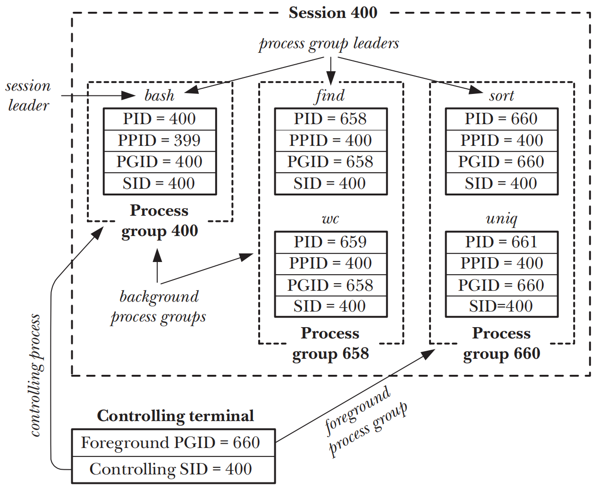
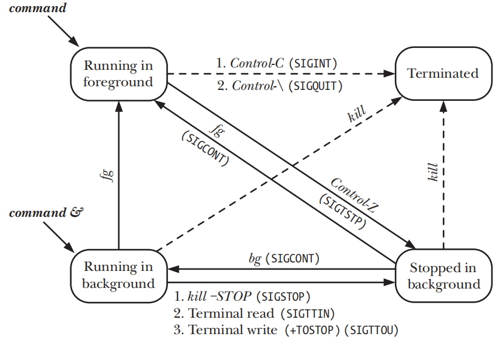

# PROCESS GROUPS, SESSIONS, AND JOB CONTROL

## Overview
- `process group` 由一个或多个共享同一个`process group identifier(PGID)`的process组成
- `PGID`和`PID`的类型都是`pid_t`，每一个`process group`都会有一个leader，也就是创建该`process group`的process，leader的`PID`会成为`process group`的`PGID`，新process会继承parent process的`PGID`
- `process group lifetime` 起始于leader process创建group，终止于最后一个process退出group，且leader process无需是group中最后的process
- `session` 是一组`process group`的集合，process是哪个session的成员是由`session identifier(SID)`来决定的，且`SID`和`PID`的类型都是`pid_t`，第一个创建`session`的process为`session leader`，leader的`PID`会成为`session`的`SID`，新process会继承parent process的`SID`
- `session`中的所有process共享一个单独的`controlling terminal`
- 在任何时候，`session`中其中一个`process group`会成为`foreground process group`，其他的groups则会成为`background process groups`，且只有`foreground process group`才能从`controlling terminal`中读取输入
- 当用户在`controlling terminal`输入一个会产生字符的signal时，该signal会被发送给`foreground process group`的所有成员
- 当和`controlling terminal`建立连接之后，session leader则会成为该terminal的`controlling process`，当断开与terminal连接时，kernel会向session leader发送一个`SIGHUP`类型的signal
- 对于交互式登录，用户需要通过`controlling terminal`来进行登录，而登录shell是`session leader`和`controlling process`，对于窗口化环境中，`controlling terminal`是一个伪终端，每一个`terminal window`都会有一个独立的`session`

```shell
#Display the PID of the shell
$ echo $$ 
400

#Creates 2 processes in background group
$ find / 2> /dev/null | wc -l & 
[1] 659

#Creates 2 processes in foreground group
$ sort < longlist | uniq -c 
```



## Process Groups
```c
#include <unistd.h>

pid_t getpgrp(void);
```
-`getpgrp()` 如果返回值和calling process的PID相等的话，则说明calling process为process group中的leader

```c
#include <unistd.h>

int setpgid(pid_t pid, pid_t pgid);
```
- `setpgid()`由`pid`指定的process的PGID被设置成为`pgid`
- 如果`pid`为0，则calling process的PGID会被设置成为`pgid`
- 如果`pgid`为0，由`pid`指定的process的PGID被设置成为`pid`
- 如果`pid`和`pgid`指向同一process，则会创建一个新的`process group`且该process会成为leader
- 如果`pid`和`pgid`的值不同，则会将`pid`指定的process移动到`pgid`所指定的`process group`中

## Sessions
```c
#define _XOPEN_SOURCE 500
#include <unistd.h>

pid_t getsid(pid_t pid);
```
- `getsid()`返回由`pid`指定的process的SID
- 如果`pid`为0，会返回calling process的SID

```c
#include <unistd.h>

pid_t setsid(void);
```
- `setsid()`会创建一个新的session，且calling process会成为新session的leader，也会成为新的session里新process group的leader，因此calling process的`PGID`和`SID`会被设置成为和`PID`一样的值
-  calling process没有controlling terminal，之前的连接也会被断开

## Controlling Terminals and Controlling Processes
- session被创建之后默认没有`controlling terminal`，且当session leader第一次打开一个还没有成为任何session终端的controlling terminal时，此时才会建立controlling terminal，除非在调用`open()`时指定了`O_NOCTTY`标记
- `fork()`创建的child process会继承parent process的controlling terminal，且在`exec()`调用中被保留
- 当session leader打开一个controlling terminal时，他也同时成为了terminal的controlling process。如果之后和terminal断开连接，kernel会发送一个`SIGHUP`类型的signal给controlling process
- 如果一个process拥有一个controlling terminal，此时`open()`一个特殊的文件`/dev/tty`则可以获得这个terminal的fd，如果process没有controlling terminal，则打开`/dev/tty`时会收到`ENXIO`错误
- 使用`ioctl(fd, TIOCNOTTY)`能够删除process和`fd`指定的controlling terminal之间的关联关系

```c
#include <stdio.h> /* Defines L_ctermid constant */

char *ctermid(char *ttyname);
```
- `ctermid()`返回一个指向controlling terminal的路径名，且路径名也可以被返回在`ttyname`指向的buffer中

## Foreground and Background Process Groups
```c
#include <unistd.h>

pid_t tcgetpgrp(int fd);
```
- `tcgetpgrp()`返回`fd`所指定的terminal的foreground process group的PGID，而且必须是calling process的controlling terminal

```c
#include <unistd.h>

int tcsetpgrp(int fd, pid_t pgid);
```
- `tcsetpgrp()` 找到`fd`指定的calling process的controlling terminal，并且把他的foreground process group ID设置成为`pgid`，而且`pgid`必须和calling process的session下的某一个PGID能够匹配的上

## The SIGHUP Signal
- 当一个controlling process失去了和他的terminal之间的连接，kernel会发送一个`SIGHUP`signal给controlling process来通知连接已经断开
- `SIGHUP`signal的默认disposition是终止process

### Handling of SIGHUP by the Shell
-  在一个`login session`中，shell通常是terminal的controlling process，shell会为`SIGHUP`建立signal handler，handler会终止shell，在终止shell之前会把`SIGHUP`signal发送给通过shell来创建的各个process groups
- `nohup(1)`可以使得一个command对`SIGHUP`signal免疫，通过将command将`SIGHUP`的disposition设置成为`SIG_IGN`来实现

### SIGHUP and Termination of the Controlling Process
- terminal的`controlling process`和terminal终止后，kernel会首先将session中的所有processes与controlling terminal分离，之后再将session与controlling terminal分离，最后会给与terminal对应的`foreground process group`里的所有process发送`SIGHUP`signal来通知controlling terminal断连
- 如果由于terminal断开而导致的向`controlling process`发送`SIGHUP`signal而导致的`controlling process`的终止，`SIGHUP`会被发送给terminal的`foreground process group`里的所有process

## Job Control
- `job control` 允许一个shell用户同时执行多个命令，一个前台和多个后台命令

### Using Job Control Within the Shell
- 当输入命令以&结束时，则该命令会作为`background job`运行
- 当有一个`foreground job`运行时，可以使用`suspend`字符(Control-Z)来发送`SIGTSTP`的signal给terminal的`foreground process group`，来挂起`foreground job`在`background`
- 一个在挂起在`background`的job，可以通过`fg`命令来恢复job在`foreground`运行，也可以通过`bg`命令在`background`恢复运行，这情况都是shell通过发送一个`SIGCONT`signal来resume停止的jobs
- 只有在`foreground job`里的process才能读取controlling terminal



### Implementing Job Control
- signal一般只有在**sending process**的`real user ID`或`effective user ID`等于**receiving process**的`real user ID`或`saved set-user-ID`时才会被发送
- `SIGCONT`signal是一个例外，kernel允许一个process(比如shell)向同一个session下的任意process发送`SIGCONT`signal

### Handling Job-Control Signals

### Orphaned Process Groups (and SIGHUP Revisited)