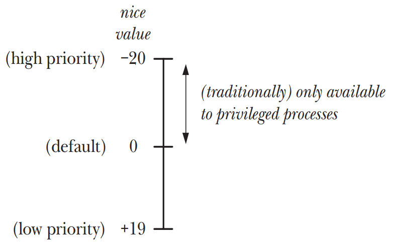

# PROCESS PRIORITIES AND SCHEDULING

## Process Priorities (Nice Values)
- `round-robin time-sharing model` Linux和大多数Unix下，process scheduling使用CPU的默认模型。此模型下，每个process会轮流的使用CPU一段时间，这段时间被称为`time slice`或`quantum`
    - `Fairness` 公平性，即每个process都有机会获取到`time slice`
    - `Responsiveness` 响应度，一个process在接收CPU的使用权之前无需等待太长的时间
- 在`round-robin time-sharing`算法中，process无法直接控制还何时使用CPU以及使用CPU的时间，默认情况下，每个process轮流使用CPU直到`time slice`被用光或者process自己自动放弃CPU的使用权
- `nice value` process的属性，允许process间接影响kernel的调度算法，每个process都有一个nice value，取值范围为`-20 ～ +19`，其中`-20`为高优先级，`+19`为低优先级，默认值为`0`



- 在传统的Unix实现中，只有`privileged processes`才能给自己赋予一个更高的优先级，`unprivileged processes`只能降低自己的优先级
- 使用`fork()`创建child process会继承`nice value`值，并且该值会在`exec()`调用中得到保持

### Effect of the nice value
- 给一个process赋低优先级(即高nice value)并不会导致process完全无法使用CPU，但是导致process使用CPU的时间变少

### Retrieving and modifying priorities
```c
#include <sys/resource.h>

int getpriority(int which, id_t who);
int setpriority(int which, id_t who, int prio);
```
- `PRIO_PROCESS` 操作PID等于`who`的process，如果`who`等于0，将会使用calling process的PID
- `PRIO_PGRP` 操作PGID等于`who`的process group内的所有成员，如果`who`等于0，将会使用calling process的process group
- `PRIO_USER` 操作process的`real user ID`等于`who`的process，如果`who`等于0，将会使用calling process的`real user ID`
- `getpriority()`system call返回由`which`和`who`所指定的nice value，如果有多个process符合标准(`which=PRIO_PGRP` or `which=PRIO_USER`)，那么会返回优先级最高的nice value
- `setpriority()`system call会将`which`和`who`所指定的nice value设置为`prio`，如果`prio`超过`–20 ～ +19`的范围，则会将nice value设置为边界值
- privileged process`CAP_SYS_NICE`能够修改任意process的优先级
- Linux Kernel 2.6.12之后，提供了`RLIMIT_NICE`资源限制，允许unprivileged process可以把自己的nice value提升到`20 ～ RLIMIT_NICE`范围内的值
- unprivileged process可以使用`setpriority()`来修改target process的nice value，条件是calling process的`effective user ID`必须要和target process的`real user ID`或`effective user ID`相等

## Overview of Realtime Process Scheduling
- SUSv3为realtime的应用提供了一套realtime process scheduling API，并在这套API中定了两个实时调度策略`SCHED_RR`和`SCHED_FIFO`
- realtime process scheduling API中用`SCHED_OTHER`来标识标准的`round-robin time sharing`策略
- Linux提供了99个实时优先级，`1(最低) ～ 99(最高)`，并且这个取值范围适用于`SCHED_RR`和`SCHED_FIFO`这两个实时的调度策略，每一个优先级的级别都有一个对应的可运行process的队列，下一个被选中的而运行的process会从最高优先级的非空队列的队头选取出来

### The SCHED_RR Policy
- `SCHED_RR(round-robin)`策略，优先级相同的process会以`round-robin time-sharing`的策略来执行
- 一个process会收到一个固定长度的对CPU使用的time slice，一旦被调度执行之后，使用`SCHED_RR`策略的process会保持对CPU的控制直至以下任意一个条件得到满足
    - time slice已经耗尽
    - process自愿放弃CPU的使用，可以通过执行一个阻塞的system call或者调用`sched_yield()`system call来达到目的
    - process被终止了
    - 被一个优先级更高的process抢占了CPU的使用权
- 条件1和条件2满足之后，丢掉CPU使用权的process会被放在process优先级对应的队列的队尾
- 条件4满足之后，丢掉CPU使用权的process会被放在放在process优先级对应的队列的队头，并且当优先级更高的process停止执行之后，被抢占的process会继续执行直至其time slice的剩余部分被消耗完毕
- 在`SCHED_RR`和`SCHED_FIFO`两种策略中，当前运行的process会因为下面的原因被抢占
    - 之前被阻塞的高优先级的process被解除阻塞了，比如process所等待的I/O操作完成了
    - 另一个process的优先级被提升， 且提升后的优先级比当前正在运行的process的优先级更高
    - 当前运行的process的优先级被降低，且降低后的优先级低于其他可运行的process的优先级
- `SCHED_RR`和`SCHED_OTHER`算法类似，允许相同优先级的process共享CPU的时间。主要差别是`SCHED_RR`存在严格的优先级级别，且高优先级process总是优于低优先级的process，进而也可以精确的控制process被调度的顺序。而`SCHED_RR`下的高优先级的process不会独占CPU，一个较低优先级的process也会被分配到一定的time slice

### The SCHED_FIFO Policy
- `SCHED_FIFO`和`SCHED_RR`类似，主要差别是`SCHED_FIFO`下没有time slice的概念，一旦某个process在`SCHED_FIFO`策略下获取到CPU的使用权，他将一直执行直至以下任意一个条件得到满足
    - process自愿放弃CPU的使用
    - process被终止了
    - 被一个优先级更高的process抢占了CPU的使用权
- 条件1满足之后，丢掉CPU使用权的process会被放在process优先级对应的队列的队尾
- 条件3满足之后，丢掉CPU使用权的process会被放在放在process优先级对应的队列的队头，并且当优先级更高的process停止执行（被阻塞或被终止）之后，被抢占的process会继续执行直至其time slice的剩余部分被消耗完毕

### The SCHED_BATCH and SCHED_IDLE Policies
- `SCHED_BATCH`和`SCHED_IDLE`尽管可以通过POSIX realtime scheduling API来设置，但是他们不属于实时策略
- `SCHED_BATCH`用于process的批量执行，调度器会考虑nice value，但是如果是一个不需要低延迟来响应唤醒事件的CPU密集型的任务，，则此策略会稍有缺陷
- `SCHED_IDLE`和`SCHED_OTHER`类似，但是会以一个非常低优先级来调度process（甚至低于+19的nice value），这个策略下nice value毫无意义。此策略被用于运行低优先级的任务，这些任务在其他任务对CPU无需求时候大量使用CPU

## Realtime Process Scheduling API

### Realtime Priority Ranges
- 不同Unix实现中的实时策略取值范围是不同的，因此不能按照Linux的标准`(1 ~ 99)`来硬编码优先级，需要通过`sched_get_priority_min()`和`sched_get_priority_max()`system calls来获取

```c
#include <sched.h>

int sched_get_priority_min(int policy);
```
- `sched_get_priority_min()`system call返回了指定策略的最小优先级

```c
#include <sched.h>

int sched_get_priority_max(int policy);
```
- `sched_get_priority_max()`system call返回了指定策略的最大优先级

### Modifying and Retrieving Policies and Priorities

#### Modifying scheduling policies and priorities
```c
#include <sched.h>

int sched_setscheduler(pid_t pid, int policy, const struct sched_param *param);

struct sched_param {
    int sched_priority; /* Scheduling priority */
};
```

| Policy | Description | SUSv3 |
| --- | --- | --- |
| SCHED_FIFO | Realtime first-in first-out | • |
| SCHED_RR | Realtime round-robin | • |
| SCHED_OTHER | Standard round-robin time-sharing | • |
| SCHED_BATCH | Similar to SCHED_OTHER, but intended for batch execution (since Linux 2.6.16) |  |
| SCHED_IDLE | Similar to SCHED_OTHER, but with priority even lower than nice value +19 (since Linux 2.6.23) |  |

```c
#include <sched.h>

int sched_setparam(pid_t pid, const struct sched_param *param);
```

#### Privileges and resource limits affecting changes to scheduling parameters

#### Retrieving scheduling policies and priorities
```c
#include <sched.h>

int sched_getscheduler(pid_t pid);
int sched_getparam(pid_t pid, struct sched_param *param);
```

#### Preventing realtime processes from locking up the system

#### Preventing child processes from inheriting privileged scheduling policies

### Relinquishing the CPU
```c
#include <sched.h>

int sched_yield(void);
```

### The SCHED_RR Time Slice
```c
#include <sched.h>

int sched_rr_get_interval(pid_t pid, struct timespec *tp);

struct timespec {
    time_t tv_sec; /* Seconds */
    long tv_nsec; /* Nanoseconds */
};
```

## CPU Affinity
```c
#define _GNU_SOURCE
#include <sched.h>

int sched_setaffinity(pid_t pid, size_t len, cpu_set_t *set);
```

```c
#define _GNU_SOURCE
#include <sched.h>

void CPU_ZERO(cpu_set_t *set);
void CPU_SET(int cpu, cpu_set_t *set);
void CPU_CLR(int cpu, cpu_set_t *set);
int CPU_ISSET(int cpu, cpu_set_t *set);
```

```c
#define _GNU_SOURCE
#include <sched.h>

int sched_getaffinity(pid_t pid, size_t len, cpu_set_t *set);
```