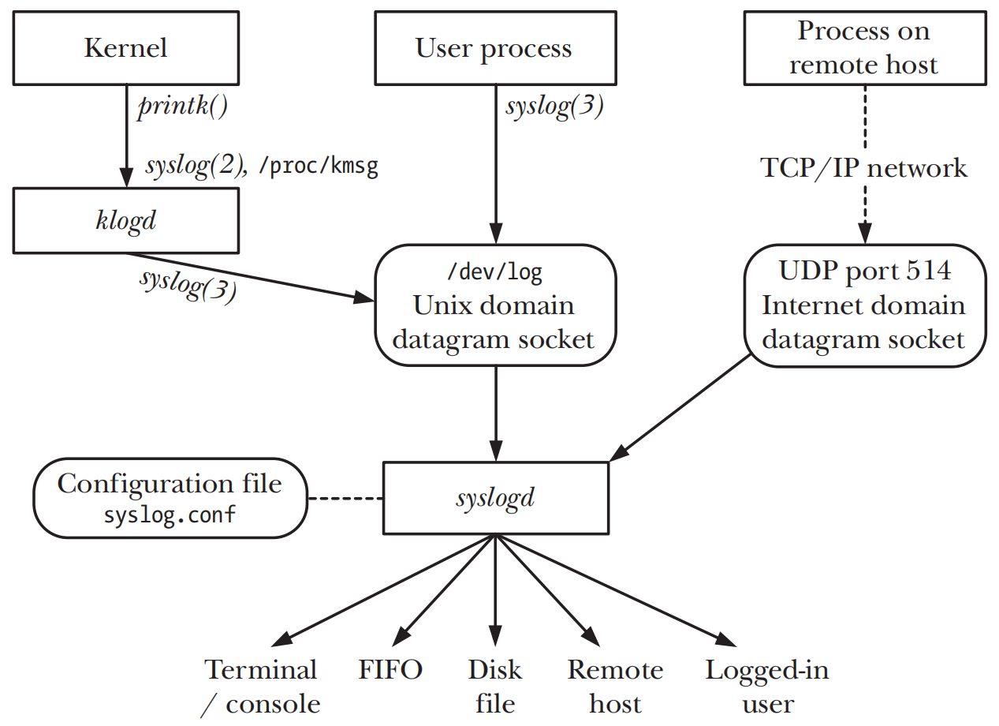

# DAEMONS

## Overview

- `daemon process` 存活时间很长，通常在系统启动时被创建直到运行系统被关。在后台运行且不拥有`controlling terminal`，这样可以确保kernel永远不会为`daemon process`
  生成job-control和terminal-related的signal(`SIGINT` `SIGTSTP` `SIGHUP`)

## Creating a Daemon

- 执行`fork()`，之后parent process退出，child process会变成`init` process的child process，child process继续执行
	- 假如`daemon`是通过命令行启动的，shell则会通知parent process已经终止，之后会显示出另一个shell的提示符并且让child process继续在后台运行
	- child process被确保不会成为process group的leader，因为process group的leader一旦退出，就不再要求有一个succeeding leader，因此此时的child
	  process的PGID和PID是不同的，这样才能通过`setsid()`来开启一个新session
- child process调用`setsid()`来启动一个新session并且释放之前所有其关联的`controlling terminal`
	- 此时child process会成为新session的leader并且成为session内新process group的leader，也就是此时PID和PGID和SID是相等的
	- 此时的session是没有任何的controlling terminal，而且也会和之前的controlling terminal断连
- 如果此后child process不会打开任何的terminal device，则无需要担心child process会获得controlling terminal。如果有后续要打开terminal
  devices的需要，则需要采取一些措施来确保device不会成为controlling terminal
	- 对所有有可能应用到一个terminal device的`open()`调用添加`O_NOCTTY`标志，此时的daemon process是child process
	- 或者在`setsid()`之后执行第二次的`fork()`，此时child process会创建出grandchild process，然后让child process退出，这样确保grandchild
	  process永远不会成为session的leader，因为不是session leader则不会请求到一个controlling terminal，此时的daemon process是grandchild process
- 使用`umask()`来清除process umask，以确保daemon process在创建文件和目录时候拥有所需的权限，
- 使用`chdir()`来修改daemon process的工作目录，通常会改为根目录`/`
- 使用`close()`来关闭所有daemon process从parent process继承的open file descriptors，因为file descriptor是一种有限的资源
	- 这一步不是必须的，取决于daemon process是否需要从parent process继承而来的open file descriptor
	- 执行这一步的主要原因是daemon作为一个在后台运行且失去controlling terminal的process，保留open fd`0` `1` `2`
	  无意义，因为他们通常指向一个terminal，而且由于长时间保留着打开文件导致无法卸载这个被打开文件的文件系统
- 在关闭了open fd`0` `1` `2`之后，daemon process会打开`/dev/null`，并使用`dup2()`或者相似的函数来使得这些fd重新指向这个device
	- 保证daemon process在后续调用I/O库，且这些I/O库也会使用到fd`0` `1` `2`，时不会导致不可预期的错误
	- 防止daemon process在后续使用fd `1` `2`来打开文件的可能性，因为一个函数库的方法会使用这两个fd来处理stdout和stderr

## Guidelines for Writing Daemons

- 很多标准daemon会在系统关闭时通过特定脚本来终止
- 如果没有提供特定脚本，系统在关闭时，init会向所有的daemon发送一个`SIGTERM`signal，`SIGTERM`
  默认的disposition是终止一个process。如果daemon需要执行一些清理工作，那么需要为此signal建立一个handler，`init`在发完`SIGTERM`signal之后5秒会发送一个`SIGKILL`signal

## Using SIGHUP to Reinitialize a Daemon

- 当controlling process和一个controlling terminal之后就会生成一个`SIGHUP`signal，但是尤其daemon process没有controlling
  terminal，因此kernel永远不会发送`SIGHUP`给daemon process
- 可以通过为`SIGHUP`创建一个handler来重新初始化一个daemon process，比如重新加载配置文件或者关闭日志文件并且重新打开一个新的日志文件

## Logging Messages and Errors Using syslog

### Overview

- `syslog`工具主要有两个主要组件 `syslogd`和`syslog(3)`函数库



- `syslogd` System Log daemon，有两个不同的日志消息源
	- `UNIX domain socket` /dev/log，用来保存本地产生的日志消息，
	- `Internet domain socket` UDP的端口514，用来保存通过TCP/IP网络产生的日志消息
- `klogd` Kernel Log daemon，会收集kernel的日志消息并且也写入到`/dev/log`中

### The syslog API

#### Establishing a connection to the system log

```c
#include <syslog.h>

void openlog(const char *ident, int log_options, int facility);
```

- `openlog()`和系统的日志工具建立一个连接，并且为后续的`syslog()`设置的默认设置，此调用是可选的

| Facility     | Description                                              | SUSv3 |
|--------------|----------------------------------------------------------|-------|
| LOG_AUTH     | Security and authorization messages (e.g., su)           | •     |
| LOG_AUTHPRIV | Private security and authorization messages              |       |
| LOG_CRON     | Messages from the cron and at daemons                    | •     |
| LOG_DAEMON   | Messages from other system daemons                       | •     |
| LOG_FTP      | Messages from the ftp daemon (ftpd)                      |       |
| LOG_KERN     | Kernel messages (can’t be generated from a user process) | •     |
| LOG_LOCAL0   | Reserved for local use (also LOG_LOCAL1 to LOG_LOCAL7)   | •     |
| LOG_LPR      | Messages from the line printer system (lpr, lpd, lpc)    | •     |
| LOG_MAIL     | Messages from the mail system                            | •     |
| LOG_NEWS     | Messages related to Usenet network news                  | •     |
| LOG_SYSLOG   | Internal messages from the syslogd daemon                |       |
| LOG_USER     | Messages generated by user processes (default)           | •     |
| LOG_UUCP     | Messages from the UUCP system                            | •     |

#### Logging a message

```c
#include <syslog.h>

void syslog(int priority, const char *format, ...);
```

- `syslog()`写入一条日志消息，`priority`是`facility`和`level`的OR值

| Level       | Description                                                          |
|-------------|----------------------------------------------------------------------|
| LOG_EMERG   | Emergency or panic condition (system is unusable)                    |
| LOG_ALERT   | Condition requiring immediate action (e.g., corrupt system database) |
| LOG_CRIT    | Critical condition (e.g., error on disk device)                      |
| LOG_ERR     | General error condition                                              |
| LOG_WARNING | Warning message                                                      |
| LOG_NOTICE  | Normal condition that may require special handling                   |
| LOG_INFO    | Informational message                                                |
| LOG_DEBUG   | Debugging message                                                    |

#### Closing the log

```c
#include <syslog.h>

void closelog(void);
```

- `closelog()` 释放给/dev/log socket分配的fd

#### Filtering log messages

```c
#include <syslog.h>

int setlogmask(int mask_priority);
```

### The /etc/syslog.conf File

- `/etc/syslog.conf` 是syslogd daemon的配置文件