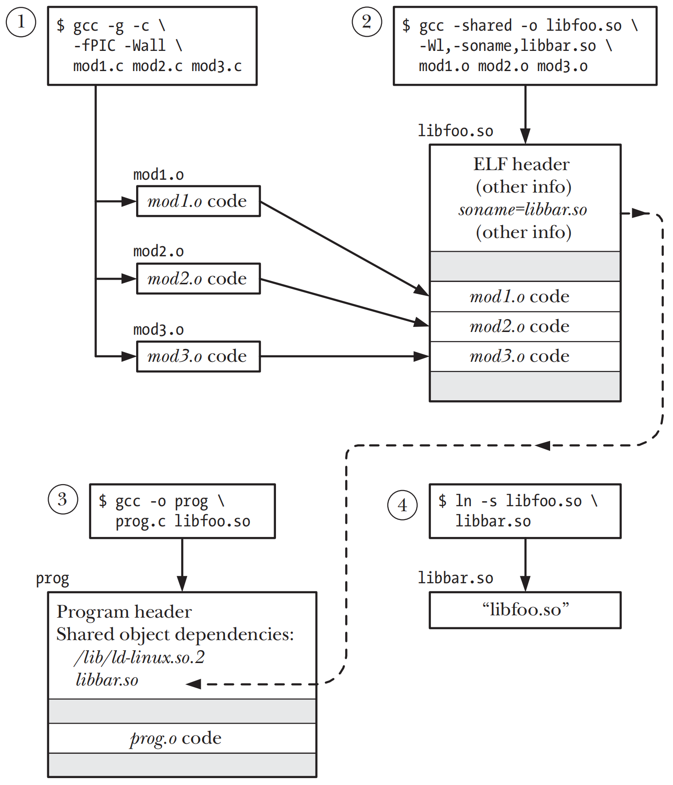
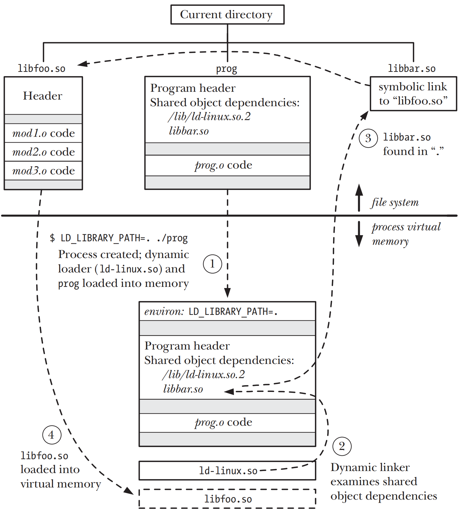
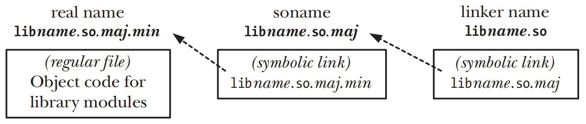

# FUNDAMENTALS OF SHARED LIBRARIES

## Object Libraries

- 链接实际上是由一个单独的链接程序`ld`完成的。当使用`cc`或者`gcc`来链接一个程序时，编译器会在幕后调用`ld`链接器

## Static Libraries

- `static libraries`静态库也被称为`archives`，一个静态库实际上就是一个保存了所有被添加的object files副本的一个文件
- 静态库的默认命名规范为lib*name*.a
- 一个静态库的创建和维护通过`ar(1)`命令来完成，命令形式为

```shell
$ ar options archive object-file...
```

- 程序和静态库链接起来的两种方式
	- 把静态库的全名作为链接命令的一部分
	  ```shell
	  $ gcc -g -c prog.c
	  $ gcc -g -o prog prog.o libdemo.a
	  ```
	- 将静态库放在链接程序可以搜索到的标准目录中，比如`/usr/lib`，然后使用`–l`选项来指定静态库名，也就是`libname.a`里**name**的部分
	  ```shell
	  $ gcc -g -o prog prog.o -ldemo
	  ```
	- 如果静态库文件不在标准目录内，可以使用`-L`选项来指定静态库文件所处在的目录
	  ```shell
	  $ gcc -g -o prog prog.o -Lmylibdir -ldemo
	  ```

## Overview of Shared Libraries

- `static library` 当程序是以链接静态库的方式来构建的时，构建出的可执行文件会包含所有被链接的object files的副本。不同的程序链接同样的静态库，每个程序都会拥有这个单独的object files的副本
- `shared library` 共享库的核心思想就是object modules的单个副本会被所有需要这个modules的程序共享，当第一个需要这个shared
  library的程序启动的时候，库的单个副本就会被加载进内存，当后面使用同一个shared library的程序启动时，程序会使用已经被加载进入内存的库的副本

## Creating and Using Shared Libraries—A First Pass

- 现代版本的Linux以及很多Unix的实现的可执行文件和共享库都使用了ELF`(Executable and Linking Format)`格式

### Creating a Shared Library

```shell
#编译为position-independent code
$ gcc -g -c -fPIC -Wall mod1.c mod2.c mod3.c

#创建包含指定object files的shared object 
$ gcc -g -shared -o libfoo.so mod1.o mod2.o mod3.o
```

- `-Wall`为`warn all`的缩写，会打开所用警告信息
- 共享库的默认命名规范为lib*name*.so`(shared object)`

```shell
#单条命令完成编译和创建shared object的工作
$ gcc -g -fPIC -Wall mod1.c mod2.c mod3.c -shared -o libfoo.so
```

### Position-Independent Code

- `gcc –fPIC`选项应当生成`position-independent code`，编译器会生成不依赖于特定地址才能工作的machine code，包括访问`global` `static`
  和`external variables`，访问字符串常量，以及获取函数的地址

### Using a Shared Library

- `dynamic linker`动态链接器会检查程序所需要的shared libraries，之后使用一组预定好的规则来文件系统里找到相关的库文件，比如规则会指定一些标准目录`/lib`和`/usr/lib`等
- 通知动态链接器一个共享库在一个非标准目录下的方法之一，是将非标准目录加入到以**分号**为分隔的环境变量`LD_LIBRARY_PATH`中

```shell
$ export LD_LIBRARY_PATH=/non-standard-directory:$LD_LIBRARY_PATH
```

### The Shared Library Soname

- `soname` `(shared object name)`是为共享库创建一个alias，目的是不使用共享库的real name

```shell
$ gcc -g -c -fPIC -Wall mod1.c mod2.c mod3.c

$ gcc -g -shared -Wl,-soname,libbar.so -o libfoo.so mod1.o mod2.o mod3.o
```

- 创建共享库时指定soname为`libbar.so`，real name为`libfoo.so`

```shell
$ gcc -g -Wall -o prog prog.c libfoo.so
```

- 使用创建了soname的共享库来创建可执行文件，此时链接器会检查到`libfoo.so`包含soname`libbar.so`，会将soname嵌入到可执行程序中，此时即便real
  name的版本号发生了变化，也不会影响可执行程序内的soname

```shell
$ ln -s libfoo.so libbar.so
```

- 创建一个symbolic link来将soname链接到real name上





## Useful Tools for Working with Shared Libraries

- `ldd(1)` `(list dynamic dependencies)`命令显示了一个程序运行所需的共享库，`ldd`命令会接续出每个库的引用
- `objdump` 命令从一个可执行文件、编译过的对象或共享库中获取包括反汇编的二进制机器码
- `readelf` 命令从一个可执行文件、编译过的对象或共享库中显示各个ELF的头部信息
- `nm` 命令会列出目标库或者可执行程序中定义的一组符号

## Shared Library Versions and Naming Conventions

- 共享库的real name的格式规范为`libname.so.major-id.minor-id`
	- `major version identifier`即为`major-id`，由一个数字构成，并且这个数字随着库的每个不兼容版本的发布而顺序递增
	- `minor version identifier`即为`minor-id`，用来区分major版本中兼容的minor版本，`minor-id`可以为任意字符串，但是根据惯例`minor-id`
	  应是一个数字或者两个由小数点分隔的数字，其中第一个数字指定了`minor version`，第二个数字表示`minor version`的`patch level`或`revision number`
- 共享库的soname应该只包含`major-id`并排除`minor-id`，因此soname的格式规范应该为`libname.so.major-id`

| Name        | Format             | Description                                                                                                                                                                                                  |
|-------------|--------------------|--------------------------------------------------------------------------------------------------------------------------------------------------------------------------------------------------------------|
| real name   | libname.so.maj.min | File holding library code; one instance per major plus-minor version of the library.                                                                                                                         |
| soname      | libname.so.maj     | One instance per major version of library; embedded in executable at link time; used at run time to find library via a symbolic link with same name that points to corresponding (most up-todate) real name. |
| linker name | libname.so         | Symbolic link to latest real name or (more usually) latest soname; single instance; allows construction of version-independent link commands.                                                                |



## Installing Shared Libraries

- `ldconfig(8)`会搜索一组标准目录，之后会创建或者更新缓存文件`/etc/ld.so.cache`
  ，使之包含标准目录中的major库的版本列表，如果一个库包含多个major版本，那么这个库的每个major版本对应的最新minor版本文件都会被包含，动态连接器在会在运行时通过这个文件来解析库名
- `ldconfig(8)`会检查每个库的各个major版本下的最新的minor版本以找出内嵌的`soname`，并且在同一目录为每个soname创建或者更新相应的`symbolic link`
- 每当安装了一个新的库，或者更新活删除现有库，或者`/etc/ld.so.conf`中的目录列表被修改之后，都应该运行`ldconfig`

## Compatible Versus Incompatible Libraries

- 如果共享库的新版本对兼容之前的版本，则只需要修改minor版本来修改real name
- 如果共享库的新版本对不兼容之前的版本，则必须重新定义一个新的major版本的库

## Upgrading Shared Libraries

## Specifying Library Search Directories in an Object File

- `–rpath` 当一个库属于一个固定的位置，但这个位置不属于动态链接器搜寻的标准目录时，可以通过`–rpath`选项来在可执行文件内插入一个搜索的目录列表

```shell
$ gcc -g -Wall -Wl,-rpath,/home/mtk/pdir -o prog prog.c libdemo.so
```

## Finding Shared Libraries at Run Time

## Run-Time Symbol Resolution

## Using a Static Library Instead of a Shared Library
