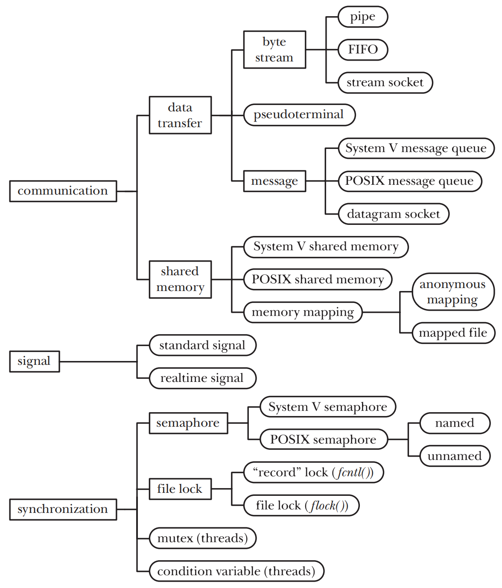
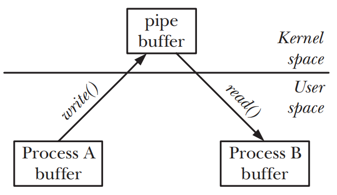

# INTERPROCESS COMMUNICATION OVERVIEW

## A Taxonomy of IPC Facilities
- `communication` 关注process之间数据的交换
- `synchronization` 关注process或thread操作之间的同步
- `signals` 在某种情况下可作为一种同步技术，也可以通过在realtime signal上绑定数据来作为通信技术

## Communication Facilities
- `data-transfer facilities` 一个process将数据写入到IPC的facility当中，而另一个process则会从中读取数据。这些facility会要求在user memory和kernel memory中进行两次数据传输
	- 第一次是写入process将数据从user memory写入到kernel memory中
	- 第二次是读取process将数据从kernel memory读取到user memory中
	

- `shared memory` process通过将数据放到一片可以和其他process共享的内存区域当中，从而完成信息的交换
	- kernel通过将每个process的page-table条目指向同一个RAM的分页来实现共享内存
	- 一个process可以将数据放入到共享内存区域中，从而使得数据对其他process可用
	- 由于通信无需system calls以及user memory和kernel memory间的数据传输，因此共享内存是一种非常快速的通信机制

### Data transfer
- `byte stream` 通过pipes、FIFOs和datagram sockets交换的数据是一个无界的字节流。每次的读取操作都会从facility中读取任意数量的字节，而不管写入方写入的block的大小是多少
- `message` 通过System V消息队列、POSIX消息队列以及datagram sockets交换的数据是一种有界的消息。每次读取操作都会读取写入process写入的一整条消息，无法只读取部分消息，也无法读取多条消息
- `pseudoterminals` 是一众特殊情况下使用的通讯facility

- `data-transfer facilities`和`shared memory`之间的区别
	- data-transfer可以有多个数据读取者，但是读取操作是有副作用的。一个读取操作会消耗数据，且读取之后数据会对其他读取者不可用
	- 读取和写入的操作是同步且原子性的，如果一个读取者试图从一个当前不包含数据的data-transfer facility中读取数据，读取操作会被阻塞，直到一些process向facility中写入数据

### Shared memory
- 大多数现代的Unix系统提供了三种形式的共享内存:`System V shared memory`、`POSIX shared memory`和`memory mappings`
- 共享内存需要考虑在内存上的同步操作，在共享内存中，`semaphore`通常被用作同步方法  
- 放入共享内存中的数据对所有共享这块内存的process可见

## Synchronization Facilities
- `semaphores`
- `file locks`
- `mutexes and condition variables` 通常搭配POSIX threads一起使用

## Comparing IPC Facilities