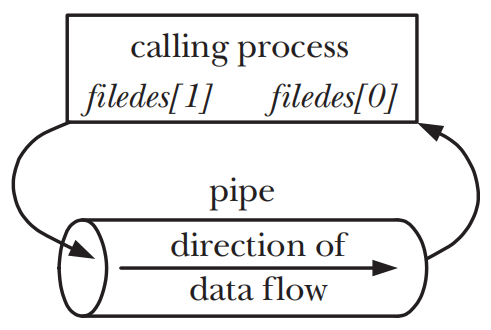

# PIPES AND FIFOS

## Overview

### A pipe is a byte stream
- 在使用pipe时候是不存在消息或者消息边界概念的，从pipe中读取数据的process可以读取任意大小的数据块，不用关心写入process的数据块的大小
- 通过pipe传递的数据是顺序的，从pipe中读取出来的字节顺序和他们被写入pipe的顺序是完全一致的，因此如法在pipe中使用`lseek()`来随机访问数据

### Reading from a pipe
- 尝试从一个当前为空的pipe中读取数据将会被阻塞，直至至少有一个字节被写入到pipe中为止
- 一旦pipe的的最后一个写入端被关闭，消费端的process将会在读取完pipe剩余数据之后得到文件的结尾，即`read()`返回0

### Pipes are unidirectional
- pipe中的数据传输是单向的，一段用于写入，另外一段则用于读取

### Writes of up to PIPE_BUF bytes are guaranteed to be atomic
- 如果多个process同时写入一个pipe，在同一时刻写入的数据量不超过`PIPE_BUF`字节，则可以确保写入的数据不会发生混合的情况
- 当写入pipe的数据块大小超过了`PIPE_BUF`，那么kernel可能会将数据分割成几个较小的片段来传输，`write()`调用会阻塞直到所有数据被写入到pipe为止
- 如果只有一个process对pipe进行写入，`PIPE_BUF`的取值在这种情况下则不会有任何的影响。如果有多个process进行写入，大数据块有可能会被kernel分解成为小的数据段，并且出现写入process数据交叉的现象
- 当写入的数据大小到达`PIPE_BUF`字节时，`write()`会在有必要时阻塞，直到pipe中的可用空间足以原子性的完成操作

### Pipes have a limited capacity
- pipe简单来说就是kernel内存中维护的一个buffer，且buffer拥有最大值，一旦pipe被填满之后，后续对于pipe的写入将会被block，直到读取方从pipe中消费了一些数据为止

## Creating and Using Pipes
```c
#include <unistd.h>

int pipe(int filedes[2]);
```
- `pipe()`会在数组`filedes`中返回两个open file descriptors
    - `filedes[0]`为pipe的读取端的fd，`0`对应着stdin
    - `filedes[1]`为pipe的写入端的fd， `1`对应着stdout

- 调用了`pipe()`之后生成的`filedes[2]`对应了pipe的两端的fd

  

- parent process和child process通过pipe传输信息
- parent关闭`filedes[0]`读取fd，child关闭`filedes[1]`写入fd
- pipe方向 parent process -> child process

  

### Pipes allow communication between related processes
- 使用pipe通信通常的使用场景是，这个也是shell在构建pipe的实践
    - parent process通过`pipe()`来创建一个pipe
    - parent process创建两个child processes，两个child process来进行通信

### Closing unused pipe file descriptors
- 只有pipe上的全部writer的fd都被关闭之后，reader才能看见文件的结尾，否则`read()`方法就会一直阻塞
- process如果往一个没有打开的read fd的pipe中写入数据时，kernel会发送一个`SIGPIPE`signal给write process，该signal默认会kill掉write process
- 如果write process选择ignore掉`SIGPIPE`signal时，写入方调用`write()`方法就会失败并收到`EPIPE(broken pipe)`的errorno

## Pipes as a Method of Process Synchronization

## Using Pipes to Connect Filters
- 可以使用`dup2()`的调用来取代对于`close()`和`dup()`的调用
```c
dup2(pfd[1], STDOUT_FILENO);
colse(pfd[1]);
```

## Talking to a Shell Command via a Pipe: popen()
```c
#include <stdio.h>

FILE *popen(const char *command, const char *mode);
int pclose(FILE *stream);
```
- `popen()`函数会创建一个pipe，之后会`fork()`一个child process来执行shell，而shell又会创建一个child process来执行`command`字符串
- 因为pipe是单向的，因此无法在执行`command`中进行双向通信


## Pipes and stdio Buffering
- 当`mode`为`w`时来调用`popen()`
	- 默认情况下只有与stdio的buffer被填满或者调用了`pclose()`关闭pipe之后，输出才会被发送给pipe另外一端的child process，
	- 如果需要child process可以立刻接收到数据，则需要周期性的调用`fflush()`或者通过`setbuf(fp, NULL)`来禁用stdio的缓冲
- 当`mode`为`r`时来调用`popen()`
	- 如果另一端的child process使用stdio库，除非显示的调用`fflush()`或者`setbuf(fp, NULL)`，否则只有在child process填满stdio buff或者调用了`pclose()`关闭pipe之后才会数据才会可用

## FIFOs
- 语义上来讲，`FIFO`和`pipe`类似，主要差别在于`FIFO`在文件系统中拥有一个名称且其打开方式和普通文件打开方式一致
- 当所有的引用`FIFO`的fd都被关闭之后，所有未被读取的数据将会被丢弃

```c
#include <sys/stat.h>

int mkfifo(const char *pathname, mode_t mode);
```
- `mkfifo()`会创建一个名称为`pathname`的新的`FIFO`，且一旦`FIFO`被创建，任何process都可以打开他，只要能购过常规的文件权限检测

## A Client-Server Application Using FIFOs
- `pipe`和`FIFO`中的数据都是字节流，也就是消息之间是没有边界的，因此多条消息被发送到一个process中时，必须约定某种规则来分割消息
	- `delimiter character` 每条消息使用约定好的`delimiter character`（比如换行符）来分割消息
	- `fixed-size header with a length field` 每条消息包含一个固定的头，头中包含了一个数字来表示剩余消息的长度
	- `fixed-length messages` 使用固定长度的消息并让服务器总是读取这个大小的固定消息


## Nonblocking I/O

## Semantics of read() and write() on Pipes and FIFOs