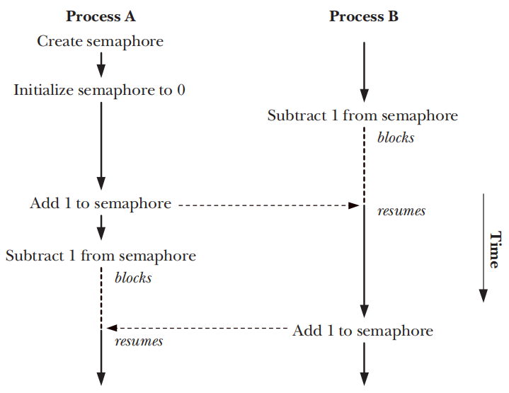

# SYSTEM V SEMAPHORES

- System V的信号量不是用来process之间传输数据的，而是用来同步process之间的动作
- 信号量是由kernel维护的整数，其值被限制为大于或等于0，在一个信号量上可以执行如下的操作，且最后两个操作会导致calling process被阻塞
	- 将信号量设置成为一个绝对值
	- 给信号量当前的值加上一个数值
	- 给信号量当前的值减去一个数值
	- 等待一个信号量的值等于0，

- 当减少一个信号量的值时，kernel会把所有试图将信号量值减少到0之下的操作阻塞
- 如果一个信号量的值当前不等于0, 那么一个正在等待信号量的值等于0的calling process将会一直被kernel阻塞



## Overview

- 使用System V的信号量的通常步骤如下
	- 使用`semget()`创建或者打开一个信号量集
	- 使用`semctl()`的`SETVAL`或`SETALL`操作初始化集合中的信号量，这个操作应该只有一个process来操作
	- 使用`semop()`操作信号量的值，process通常会使用信号量来获取或者释放一种共享资源
	- 当所有process都不需要信号量集之后，使用`semctl()`的`IPC_RMID`操作来删除这个集合

## Creating or Opening a Semaphore Set

```c
#include <sys/types.h> /* For portability */
#include <sys/sem.h>

int semget(key_t key, int nsems, int semflg);
```

- `semget()` 系统调用创建一个新的信号量或者获取一个已存在信号量集合的标识符
- `nsems`参数在创建信号量场景下，会指定集合中信号量的个数，其值必须大于0; 在获取信号量场景下，其值必须小于等于集合数量的大小，无法修改一个已存在信号量的数量
- `semflg`是一个bit mask，用来指定新创建的信号量或者检查既有信号量的权限
	- `IPC_CREAT` 如果没有与指定`key`相对应的信号量集合，则会创建一个新的信号量集合
	- `IPC_EXCL` 如果同时指定了`IPC_CREAT`和`IPC_EXCL`，如果对于指定`key`相应的信号量集合已经存在，那么会调用失败并返回`EEXIST`错误

## Semaphore Control Operations

```c
#include <sys/types.h> /* For portability */
#include <sys/sem.h>

int semctl(int semid, int semnum, int cmd, ... /* union semun arg */);
```

- `semctl()`系统调用在一个信号量集合或者集合中单个信号量上执行操作
- `semid` 参数是需要操作的信号量集的标识符
- `semnum` 参数标识出了信号量集中的具体的信号量，对于其他操作，可以忽略这个参数并且将其设置为0
- `cmd` 参数指定了可以执行的操作

### Generic control operations

- `IPC_RMID` 立即删除信号量以及关联的数据结构，任何在`semop()`调用中因为等待信号量而阻塞的process都会被立刻唤醒，`semop()`会返回`EIDRM`错误，且这个操作无需`arg`参数
- `IPC_STAT` 将与此信号量集关联的`semid_ds`数据结构的副本放入`arg.buf`指向的缓冲区中
- `IPC_SET` 使用`arg.buf`指向的缓冲区中的值更新与此信号量集关联的`semid_ds`数据结构中的所选定的字段

### Retrieving and initializing semaphore values

- `GETVAL` 返回由`semid`指定的信号量集中的第`semnum`个信号量的值，这个操作`arg`参数不是必需的
- `SETVAL` `semid`引用的集合中的第`semnum`信号量的值被初始化为`arg.val`中指定的值
- `GETALL` 检索`semid`引用的集合中所有信号量的值，将它们放置在`arg.array`指向的数组中
- `SETALL` 使用`arg.array`指向的数组中提供的值，初始化`semid`引用的集合中的所有信号量。

### Retrieving per-semaphore information

- `GETPID` 返回上一个在该信号量上执行`semop()`的process的pid，这个值被称为`sempid`值，如果还没有进程对该信号量执行`semop()`，那么就返回0
- `GETNCNT` 返回当前等待此信号量值增加的process数，称为`semncnt`值
- `GETZCNT` 返回当前等待该信号量值变为0的process数；这称为`semzcnt`值

## Semaphore Associated Data Structure

```c
struct semid_ds {   
    struct ipc_perm sem_perm; 	/* Ownership and permissions */   
    time_t sem_otime; 			/* Time of last semop() */
    time_t sem_ctime;			/* Time of last change */
    unsigned long sem_nsems; 	/* Number of semaphores in set */
};
```

- 每一个信号量都有一个关联`semid_ds`数据结构
- `semid_ds`结构的字段由各种信号量系统调用隐式更新，使用`semctl()`的`IPC_SET`操作显式更新`sem_perm`中的特定字段

## Semaphore Initialization

- SUSv3要求，无需为由`semget()`创建出的信号量集合的值提供初始化的实现，必须使用`semctl()`系统调用来显示的初始化信号量

## Semaphore Operations

```c
#include <sys/types.h> /* For portability */
#include <sys/sem.h>

int semop(int semid, struct sembuf *sops, size_t nsops);
```

- `semop()`系统调用在`semid`标识的信号量集合中的信号量上执行一个或者多个操作
- `sops`参数是一个指向数组的指针，数组中包含了需要执行的操作
- `nsops`参数给出了数组的大小，数组至少要包含一个元素

```c
struct sembuf {
	unsigned short sem_num; 	/* Semaphore number */	
    short sem_op; 				/* Operation to be performed */
    short sem_flg; 				/* Operation flags (IPC_NOWAIT and SEM_UNDO) */
};
```

- `sem_num`字段标识出了在信号量集合中需要在哪个信号量上执行操作
- `sem_op`字段指定了需要执行的操作
	- 如果`sem_op`大于0，那么就将`sem_op`的值加到信号量的值上，其他等待减少信号量值的process可能会被唤醒并执行他们的操作
	- 如果`sem_op`等于0，那么就会对信号量的值检查以确定当前是否等于0，如果等于0,`semop()`会立即结束，否则`semop()`会一直阻塞直到他检查的信号量变为0为止
	- 如果`sem_op`小于0，那么就将信号量的值减去`sem_op`的绝对值，如果信号量的值大于等于`sem_op`的绝对值，`semop()`会立刻结束，否则`semop()`会一直阻塞直到执行直到操作不会导致出现负值的情况为止

- `semop()`调用阻塞时，process会保持阻塞直到发生了下面的情况为止
	- 另一个process修改了信号量的值，使得之前被阻塞待执行的操作能够继续
	- 一个signal中断了`semop()`调用，此时会返回`EINTR`错误
	- 另一个process删除了`semid`引用的信号量，此时会返回`EIDRM`错误

- 为`sem_flg`字段指定`IPC_NOWAIT`标识符，可以防止`semop()`调用阻塞
- `semop()`也可以在集合中的多个信号量上执行操作，且这组操作是原子性的，即`semop()`要么执行所有操作，要么阻塞直到能够同时执行所有操作为止

```c
#define _GNU_SOURCE
#include <sys/types.h> /* For portability */
#include <sys/sem.h>

int semtimedop(int semid, struct sembuf *sops, size_t nsops, struct timespec *timeout);
```

- `semtimedop()`系统调用和`semop()`一样，但多了一个`timeout`参数来制定调用所阻塞时间的上限
- `timeout`参数是一个指向`timespec`结构的指针，可以将时间表示为秒数和纳秒数，如果阻塞超时，`semtimedop()`会返回`EAGAIN`错误
- 如果指定`timeout`为NULL，那么`semtimedop()`和`semop()`则完全一致

## Handling of Multiple Blocked Semaphore Operations

## Semaphore Undo Values

## Implementing a Binary Semaphores Protocol

## Semaphore Limits

## Disadvantages of System V Semaphores