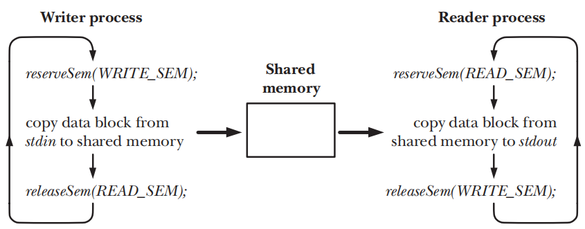
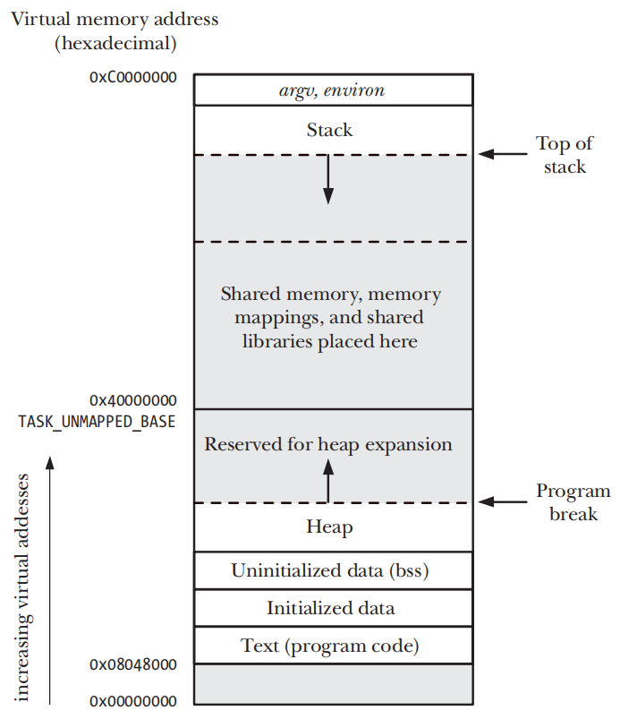
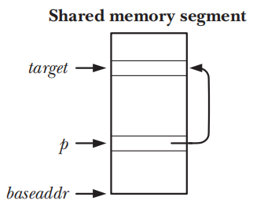

# SYSTEM V SHARED MEMORY

- System V的共享内存允许两个或者多个process共享物理内存的同一块segment，由于一个共享内存segment会成为process的user-space内存一部分，因此这种IPC机制无需kernel的介入
- 一个process将数据写入到共享内存中，这些数据会对其他共享同一内存segment的process立刻可用
- 共享内存这种IPC机制由于不受kernel控制，通常需要某些同步方法确保多个process不会同时访问共享内存

## Overview

- 使用System V的共享内存的通常步骤如下
	- 调用`shmget()`创建一个新的或者取得一个已存在的共享内存segment的标识符
	- 使用`shmat()`附加共享内segment，即使segment成为calling process的虚拟内存的一部分。
	- 此时可以将共享内存segment视为程序可用的内存，程序需要使用`shmat()`来引用共享内存，并返回指向进程虚拟地址空间中共享内存segment的起始指针`addr`
	- 调用`shmdt()`分离共享内存segment，调用之后process就不能再引用共享内存，此步骤是可选的，并且会在process终止时自动发生
	- 调用`shmctl()`删除共享内存segment，只有在所有当前附加的process都将其分离后，segment才会被销毁，只有一个process需要执行此步骤

## Creating or Opening a Shared Memory Segment

```c
#include <sys/types.h> /* For portability */
#include <sys/shm.h>

int shmget(key_t key, size_t size, int shmflg);
```

- `shmget()`系统调用创建一个新的共享内存segment或者获取一个已存在的segment标识符，新创建的segment中的内容会被初始化为0
- `key`参数通常是值`IPC_PRIVATE`或者`ftok()`的返回的key
- `size`参数在`shmget()`创建和获取场景下有不同的含义
	- 创建场景下，`size`是一个正整数，用来表示segment需要被分配的字节数量，且kernel以系统页面大小的倍数分配共享内存，因此`size`会向上舍入为系统页面大小的下一个倍数
	- 在获取场景下，`size`不会产生任何效果，但是必须要小于或者等于segment的大小
- `shmflg` 是一个bit mask，用来指定新创建的信号量或者检查既有信号量的权限，还可以通过下述一个或多个标记取OR来控制操作
	- `IPC_CREAT` 如果没有与指定`key`相对应的segment，则会创建一个新的segment
	- `IPC_EXCL` 如果同时指定了`IPC_CREAT`和`IPC_EXCL`，如果对于指定`key`相应的segment已经存在，那么会调用失败并返回`EEXIST`错误
	- `SHM_HUGETLB` Linux下特有的flag，一个特权process`CAP_IPC_LOCK`可以通过这个flag创建一个使用`huge pages`的共享内存segment
	- `SHM_NORESERVE` Linux下特有的flag， 作用和`mmap()`中使用`MAP_NORESERVE`flag的作用相同

## Using Shared Memory

```c
#include <sys/types.h> /* For portability */
#include <sys/shm.h>

void *shmat(int shmid, const void *shmaddr, int shmflg);
```

- `shmat`系统调用将`shmid`标识的segment附加到calling process的虚拟地址空间中
- `shmaddr`参数和`shmflg`bit mask中的`SHM_RND`控制segment如何被附加到虚拟地址空间中
	- 如果`shmaddr`为`NULL`，则将segment会被附加到kernel选择的合适地址处，这是附加segment的首选方法，也是最推荐的做法
	- 如果`shmaddr`不为`NULL`且`shmflg`没有设置`SHM_RND`，segment会被附加到由`shmaddr`指定的地址处，必须是系统分页大小的倍数，否则会发生`EINVAL`错误
	- 如果`shmaddr`不为`NULL`且`shmflg`设置了`SHM_RND`，segment会被映射到由`shmaddr`指定的的地址处，且向下舍入为常数`SHMLBA`(shared memory low boundary
	  address)的最接近的倍数
- `shmat()`的返回值是附加共享内存segment的地址，和普通C的指针用法相同，

| Value      | Description                                    |
|------------|------------------------------------------------|
| SHM_RDONLY | Attach segment read-only                       |
| SHM_REMAP  | Replace any existing mapping at shmaddr        |
| SHM_RND    | Round shmaddr down to multiple of SHMLBA bytes |

- 为`shmflg`指定`SHM_RDONLY`可以使得一个共享内存segment以只读方式访问，只读模式下试图更新segment中的内容会导致一个segmentation fault，即`SIGSEGV`signal
- 为`shmflg`指定`SHM_REMAP`，可以使得`shmat()`调用替换从`shmaddr`开始且长度为segment长度的任何既有的共享segment或者内存映射，此时`shmaddr`必须不为`NULL`

```c
#include <sys/types.h> /* For portability */
#include <sys/shm.h>

int shmdt(const void *shmaddr);
```

- 当一个process不再需要访问一个共享内存segment时，可以调用`shmdt()`来讲该segment分离出calling process的虚拟地址空间
- `shmaddr`参数标识了需要分离的segment，`shmaddr`应该是之前`shmat()`调用产生的返回值
- 通过`fork()`创建的child process会继承parent process附加的共享内存segment，共享内存为parent process和child process提供了一种简单的IPC方式
- 在`exec()`中所有的附加的共享内存segment都会被分离，此外在process终止之后segment也会被自动分离

## Example: Transferring Data via Shared Memory



## Location of Shared Memory in Virtual Memory



- 如果使用推荐方法`shmat(shmid, NULL, 0)`，允许kernel在任意处附加共享内存segment，segment就会被分配到向上增长的堆和向下增长的栈之间未被分配的空间中
- 为了给堆和栈的增长预留空间，附加共享内存segment的虚拟地址从`0x40000000`开始，同时内存映射和共享库也是被分配在这个区域中的
- 通过Linux特有的`/proc/PID/maps`文件可以看到一个process映射的共享内存segment和共享库的位置

## Storing Pointers in Shared Memory

- 如果我们使用推荐做法附加segment，则该segment可能会附加到每个进程中的不同地址中。因此segment中存储指向segment内其他地址的引用时，应该使用（相对）偏移量，而不是（绝对）指针。



```c
*p = (target - baseaddr); 	/* Place offset in *p */
target = baseaddr + *p; 	/* Interpret offset */
```

## Shared Memory Control Operations

```c
#include <sys/types.h> /* For portability */
#include <sys/shm.h>

int shmctl(int shmid, int cmd, struct shmid_ds *buf);
```

- `shmctl()`系统调用在`shmid`标识的共享内存segment上执行一系列控制操作
- `cmd` 参数指定了会被执行的操作
- `buf` 参数在执行`IPC_STAT`和`IPC_SET`操作时是被需要的，且对于其他操作应该被指定为`NULL`

### Generic control operations

- `IPC_RMID` 
- `IPC_STAT`
- `IPC_SET`

### Locking and unlocking shared memory

- `SHM_LOCK`
- `SHM_UNLOCK`

## Shared Memory Associated Data Structure

```c
struct shmid_ds {
    struct ipc_perm shm_perm; 	/* Ownership and permissions */
    size_t shm_segsz; 			/* Size of segment in bytes */
    time_t shm_atime; 			/* Time of last shmat() */
    time_t shm_dtime; 			/* Time of last shmdt() */
    time_t shm_ctime; 			/* Time of last change */
    pid_t shm_cpid; 			/* PID of creator */
    pid_t shm_lpid; 			/* PID of last shmat() / shmdt() */
    shmatt_t shm_nattch; 		/* Number of currently attached processes */
};
```

- 每一个共享内存segment都有一个关联`shmid_ds`数据结构
- `shmid_ds`结构的字段由各种共享内存segment系统调用隐式更新，使用`shmctl()`的`IPC_SET`操作显式更新`shm_perm`字段中的特定字段

## Shared Memory Limits

- `SHMMNI`
- `SHMMIN`
- `SHMMAX`
- `SHMALL`
- `SHMSEG`

```shell
cd /proc/sys/kernel

cat shmmni
```

```c
struct shminfo buf;

shmctl(0, IPC_INFO, (struct shmid_ds *) &buf);
```