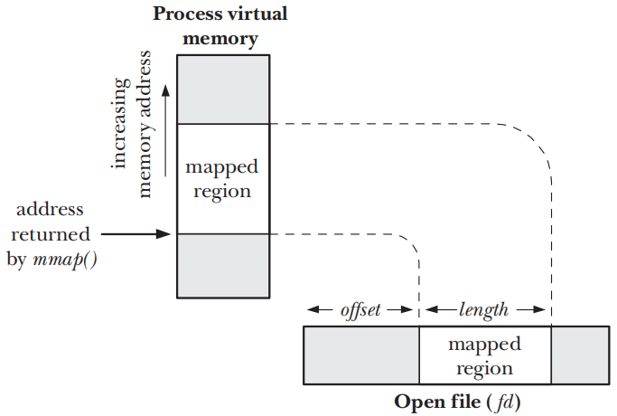
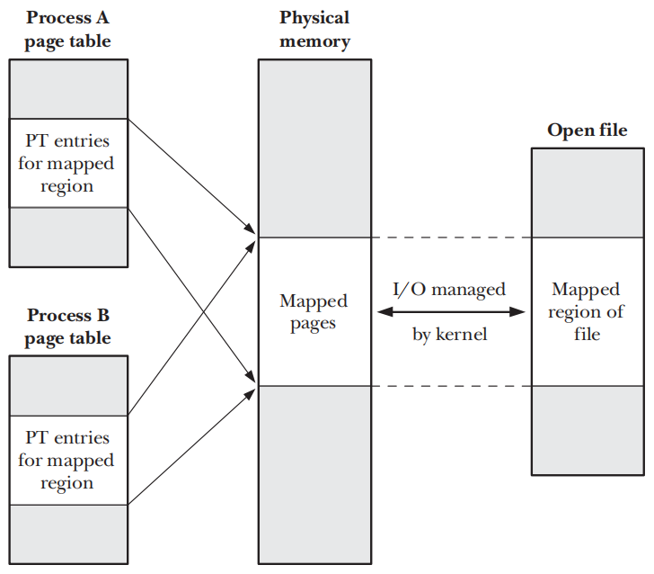

# MEMORY MAPPINGS

## Overview

- `mmap()`syscall在calling process的虚拟地址空间中创建一个新的内存mapping
	- `file mapping` 将文件的一个区域直接mapping到calling
	  process的虚拟内存中。一旦一个文件被mapping，其内容就可以通过对相应内存区域中的字节的操作来访问，mapping页会按需的从文件中自动加载
	- `anonymous mapping` 不会有具体相对应的文件，则会mapping一个内容被初始化为0的虚拟文件
- 一个process mapping的内存可以与其他process的mapping共享，即每个process的页表项指向相同的RAM页
	- 如果两个process mapping文件的同一区域，则它们会共享相同的物理内存页
	- 由`fork()`创建的child process会继承parent process mapping的副本，child中的mapping与parent中的相应mapping会引用相同的物理内存页
- 当两个或多个process共享相同的页时，每个process都可能看到其他process对页内容所做的更改，具体取决于mapping是私有的还是共享
	- `private mapping (MAP_PRIVATE)` mapping的内容中发生的修改对其他process不可见，对于文件mapping来说，变更不会发生在底层文件上
	- `shared mapping (MAP_SHARED)` mapping的内容中发生的修改对所有共享同一个mapping的process都可见，对于文件mapping来说，变更会发生在底层的文件上

| Visibility of modifications | File mapping                                               | Anonymous mapping                      |
|-----------------------------|------------------------------------------------------------|----------------------------------------|
| Private                     | Initializing memory from contents of file                  | Memory allocation                      |
| Shared                      | Memory-mapped I/O; sharing memory between processes (IPC)  | Sharing memory between processes (IPC) |

- `private file mapping` mapping的内容会用文件区域中的内容来初始化，映射同一个文件的多个process最初共享相同的内存物理页，但采用了`copy-on-write`
  技术，因此一个process对映射的更改对其他process是不可见的
- `private anonymous mapping` 每次调用`mmap()`都会产生一个新mapping，且该mapping与同一或不同process创建的匿名mapping不同，即不会共享物理页
- `shared file mapping` mapping文件同一区域的所有process会共享相同的内存物理页，且物理页是用文件区域的内容来初始化的
- `shared anonymous mapping` 每次调用`mmap()`都会产生一个新的和不同的mapping，且该mapping不与任何其他mapping共享页面

- 当process执行`exec()`时，mapping会丢失，但通过`fork()`创建的child process则会继承mapping，同时mapping的类型`MAP_PRIVATE`或`MAP_SHARED`也会被继承

## Creating a Mapping: mmap()

```c
#include <sys/mman.h>

void *mmap(void *addr, size_t length, int prot, int flags, int fd, off_t offset);
```

- `mmap()`syscall会在calling process的虚拟地址空间中创建一个新的mapping，并返回新的mapping的起始地址
- `addr`参数指定了mapping所在的虚拟地址，如果指定为`NULL`，那么kernel会为mapping选择一个合适的地址，这个是创建mapping的首选方式
- `length`参数指定了mapping的以字节为单位的大小，且无需是系统页`sysconf(_SC_PAGESIZE)`的倍数，kernel会根据`length`的值自动向上舍入为系统页面大小的下一个倍数
- `prot`参数是一个bit mask，用来指定作用于mapping上的保护标记，取值要么为` PROT_NONE`，要么为其他三个标记取OR的组合

| Value      | Description                                |
|------------|--------------------------------------------|
| PROT_NONE  | The region may not be accessed             |
| PROT_READ  | The contents of the region can be read     |
| PROT_WRITE | The contents of the region can be modified |
| PROT_EXEC  | The contents of the region can be executed |

- `flags`参数是控制mapping操作的bit mask，且必须包含`MAP_PRIVATE`或`MAP_SHARED`
	- `MAP_PRIVATE` 创建私有mapping，区域内容的修改对使用相同mapping的其他process不可见，对于`file mapping`，发生的变更不会发应到底层文件
	- `MAP_SHARED` 创建一个共享mapping，区域内容的变更对使用`MAP_SHARED`属性来mapping同一片区域的其他process是可见的，对于`file mapping`，发生的变更将直接发应到底层文件
- `fd`参数只应用于`file mapping`，标识被mapping的文件的file descriptor
- `offset`参数只应用于`file mapping`，指定了mapping在文件中的起点，且必须是一个系统页的倍数，要指定整个文件就需要将`offset`指定为0且`length`指定为文件大小

### Memory protection in more detail

- 标记为`PROT_NONE`的内存页的一种用途是在process已分配的内存区域的开始或结束处作为保护页。如果process意外的访问了标记为`PROT_NONE`的页面，kernel会通过生成`SIGSEGV`signal来通知
- 内存保护驻留在process专用的虚拟内存表中。因此不同的process可能会使用不同保护标记来mapping相同内存区域
- 使用`mprotect()`syscall可以修改内存的保护标记

### Alignment restrictions specified in standards for offset and addr

- SUSv3规定`mmap()`的`offset`参数必须是页面对齐的，如果指定了`MAP_FIXED`，则`addr`参数也必须是页面对齐的

## Unmapping a Mapped Region: munmap()

```c
#include <sys/mman.h>

int munmap(void *addr, size_t length);
```

- `munmap()`syscall从calling process的虚拟地址空间中删除一个mapping
- `addr`参数是要取消mapping的地址范围的起始地址，它必须与页面边界对齐
- `length`参数是一个非负的整数，指定了需要解除mapping区域的字节数大小
- 在unmapping期间，kernel会删除process持有的在指定地址范围内的所有内存锁
- 当一个process终止或者执行了`exec()`之后process中所有的mapping会被自动解除
- 为确保将`shared file mapping`的内容写入底层文件，在使用`munmap()`取消mapping之前应当调用`msync()`

## File Mappings

- 创建一个`file mapping`需要执行下面的步骤
	- 获取一个文件描述符，通常通过`open()`syscall来完成
	- 将文件描符作为fd参数传入`mmap()`syscall
- `mmap()`会将打开的文件的内容mapping到calling process的地址空间中，一旦`mmap()`被调用，就可以关闭fd且不会影响mapping



- `offset`参数指定了从文件区域的mapping的起始字节，并且必须是系统页大小的倍数，指定为`0`将会从文件起始位置开始mapping
- `length`参数指定了需要mapping的字节数，他和`offsite`一起确定了文件的哪个区域会被mapping进内存

### Private File Mappings

- `private file mapping`有如下最常用的两个用途
	- 允许多个process执行同一个程序或使用同一个共享库来共享相同的只读text segment，该text segment是从底层可执行文件或库文件的相应部分映射的
	- mapping一个可执行文件或共享库的初始化数据segment，使得mapping对segment内容的变更不会发生在底层文件上

### Shared File Mappings

- 多个process创建了同一个文件区域的`shared file mappings`时，他们会共享相同的内存物理页，对mapping的内容的变更将会反映到文件上



#### Memory-mapped I/O

- 由于`share file mapping`的内容是从文件中初始化的，并且对mapping内容的任何修改都会自动传递到文件中，可以通过访问内存字节来执行文件I/O，依靠kernel来确保对内存的更改传播到文件
	- 通过将`read()`和`write()`syscall替换为内存访问，可以简化一些应用程序的逻辑
	- 在某些情况下，它比传统I/O syscall操作的文件提供更好的性能

- `memory-mapped I/O`带来的性能优势
	- 正常的`read()`或`write()`涉及两次传输，一次在`file`和`kernel buffer cache`之间传输，另一次在`buffer cache`和`user-space buffer`
	  之间传输，使用`mmap()`就无需第二次传输。
		- 对于输入来说，一旦kernel将相应的文件块mapping到内存中，user process就可以使用这些数据
		- 对于输出来说，user process只需要修改内存中的内容，然后可以依靠kernel内存管理器自动更新底层文件
	- `mmap()`还可以通过降低内存要求来提高性能，当使用`read()`或`write()`时，数据保存在两个buffer中：一个在user space，另一个在kernel space。当使用`mmap()`时，kernel
	  space和user space之间共享一个buffer。此外，如果多个process对同一个文件执行I/O，那么使用`mmap()`，它们都可以共享同一个`kernel buffer`，从而节省额外的内存

#### IPC using a shared file mapping

- 由于具有相同文件区域的`shared mapping`的所有process共享相同的内存物理页，因此`share file mapping`也可以作为一种快速IPC的方法
- `share file mapping`和System V的共享内存对象之间的区别在于区域中内容上的变更会反映到底层的mapping文件上

### Boundary Cases

### Memory Protection and File Access Mode Interactions

## Synchronizing a Mapped Region: msync()

```c
#include <sys/mman.h>

int msync(void *addr, size_t length, int flags);
```

## Additional mmap() Flags

## Anonymous Mappings

## Remapping a Mapped Region: mremap()

```c
#define _GNU_SOURCE
#include <sys/mman.h>

void *mremap(void *old_address, size_t old_size, size_t new_size, int flags, ...);
```

## MAP_NORESERVE and Swap Space Overcommitting

## The MAP_FIXED Flag

## Nonlinear Mappings: remap_file_pages()

```c
#define _GNU_SOURCE
#include <sys/mman.h>

int remap_file_pages(void *addr, size_t size, int prot, size_t pgoff, int flags);
```
