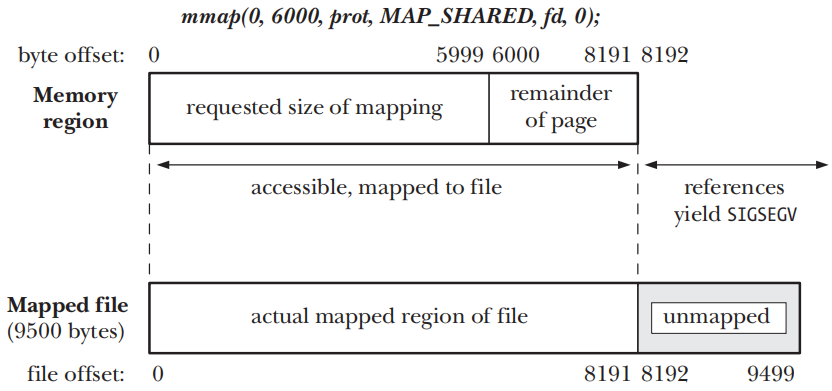
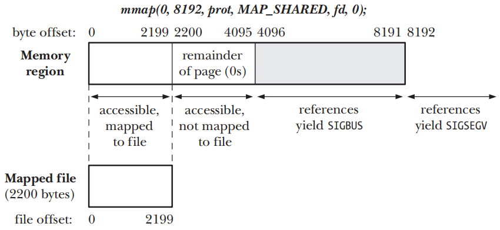

# MEMORY MAPPINGS

## Overview

- `mmap()`syscall在calling process的虚拟地址空间中创建一个新的内存mapping
	- `file mapping` 将文件的一个区域直接mapping到calling
	  process的虚拟内存中。一旦一个文件被mapping，其内容就可以通过对相应内存区域中的字节的操作来访问，mapping分页会按需的从文件中自动加载
	- `anonymous mapping` 不会有具体相对应的文件，则会mapping一个内容被初始化为0的虚拟文件
- 一个process mapping的内存可以与其他process的mapping共享，即每个process的分页表项指向相同的RAM分页
	- 如果两个process mapping文件的同一区域，则它们会共享相同的物理内存分页
	- 由`fork()`创建的child process会继承parent process mapping的副本，child中的mapping与parent中的相应mapping会引用相同的物理内存分页
- 当两个或多个process共享相同的分页时，每个process都可能看到其他process对分页内容所做的更改，具体取决于mapping是私有的还是共享
	- `private mapping (MAP_PRIVATE)` mapping的内容中发生的修改对其他process不可见，对于文件mapping来说，变更不会发生在底层文件上
	- `shared mapping (MAP_SHARED)` mapping的内容中发生的修改对所有共享同一个mapping的process都可见，对于文件mapping来说，变更会发生在底层的文件上

| Visibility of modifications | File mapping                                               | Anonymous mapping                      |
|-----------------------------|------------------------------------------------------------|----------------------------------------|
| Private                     | Initializing memory from contents of file                  | Memory allocation                      |
| Shared                      | Memory-mapped I/O; sharing memory between processes (IPC)  | Sharing memory between processes (IPC) |

- `private file mapping` mapping的内容会用文件区域中的内容来初始化，映射同一个文件的多个process最初共享相同的内存物理分页，但采用了`copy-on-write`
  技术，因此一个process对映射的更改对其他process是不可见的
- `private anonymous mapping` 每次调用`mmap()`都会产生一个新mapping，且该mapping与同一或不同process创建的匿名mapping不同，即不会共享物理分页
- `shared file mapping` mapping文件同一区域的所有process会共享相同的内存物理分页，且物理分页是用文件区域的内容来初始化的
- `shared anonymous mapping` 每次调用`mmap()`都会产生一个新的和不同的mapping，且该mapping不与任何其他mapping共享分页面

- 当process执行`exec()`时，mapping会丢失，但通过`fork()`创建的child process则会继承mapping，同时mapping的类型`MAP_PRIVATE`或`MAP_SHARED`也会被继承

## Creating a Mapping: mmap()

```c
#include <sys/mman.h>

void *mmap(void *addr, size_t length, int prot, int flags, int fd, off_t offset);
```

- `mmap()`syscall会在calling process的虚拟地址空间中创建一个新的mapping，并返回新的mapping的起始地址
- `addr`参数指定了mapping所在的虚拟地址，如果指定为`NULL`，那么kernel会为mapping选择一个合适的地址，这个是创建mapping的首选方式
- `length`参数指定了mapping的以字节为单位的大小，且无需是系统分页`sysconf(_SC_PAGESIZE)`的倍数，kernel会根据`length`的值自动向上舍入为系统分页面大小的下一个倍数
- `prot`参数是一个bit mask，用来指定作用于mapping上的保护标记，取值要么为` PROT_NONE`，要么为其他三个标记取OR的组合

| Value      | Description                                |
|------------|--------------------------------------------|
| PROT_NONE  | The region may not be accessed             |
| PROT_READ  | The contents of the region can be read     |
| PROT_WRITE | The contents of the region can be modified |
| PROT_EXEC  | The contents of the region can be executed |

- `flags`参数是控制mapping操作的bit mask，且必须包含`MAP_PRIVATE`或`MAP_SHARED`
	- `MAP_PRIVATE` 创建私有mapping，区域内容的修改对使用相同mapping的其他process不可见，对于`file mapping`，发生的变更不会发应到底层文件
	- `MAP_SHARED` 创建一个共享mapping，区域内容的变更对使用`MAP_SHARED`属性来mapping同一片区域的其他process是可见的，对于`file mapping`，发生的变更将直接发应到底层文件
- `fd`参数只应用于`file mapping`，标识被mapping的文件的file descriptor
- `offset`参数只应用于`file mapping`，指定了mapping在文件中的起点，且必须是一个系统分页的倍数，要指定整个文件就需要将`offset`指定为0且`length`指定为文件大小

### Memory protection in more detail

- 标记为`PROT_NONE`的内存分页的一种用途是在process已分配的内存区域的开始或结束处作为保护分页。如果process意外的访问了标记为`PROT_NONE`的分页面，kernel会通过生成`SIGSEGV`signal来通知
- 内存保护驻留在process专用的虚拟内存表中。因此不同的process可能会使用不同保护标记来mapping相同内存区域
- 使用`mprotect()`syscall可以修改内存的保护标记

### Alignment restrictions specified in standards for offset and addr

- SUSv3规定`mmap()`的`offset`参数必须是分页面对齐的，如果指定了`MAP_FIXED`，则`addr`参数也必须是分页面对齐的

## Unmapping a Mapped Region: munmap()

```c
#include <sys/mman.h>

int munmap(void *addr, size_t length);
```

- `munmap()`syscall从calling process的虚拟地址空间中删除一个mapping
- `addr`参数是要取消mapping的地址范围的起始地址，它必须与分页面边界对齐
- `length`参数是一个非负的整数，指定了需要解除mapping区域的字节数大小
- 在unmapping期间，kernel会删除process持有的在指定地址范围内的所有内存锁
- 当一个process终止或者执行了`exec()`之后process中所有的mapping会被自动解除
- 为确保将`shared file mapping`的内容写入底层文件，在使用`munmap()`取消mapping之前应当调用`msync()`

## File Mappings

- 创建一个`file mapping`需要执行下面的步骤
	- 获取一个文件描述符，通常通过`open()`syscall来完成
	- 将文件描符作为fd参数传入`mmap()`syscall
- `mmap()`会将打开的文件的内容mapping到calling process的地址空间中，一旦`mmap()`被调用，就可以关闭fd且不会影响mapping


- `offset`参数指定了从文件区域的mapping的起始字节，并且必须是系统分页大小的倍数，指定为`0`将会从文件起始位置开始mapping
- `length`参数指定了需要mapping的字节数，他和`offsite`一起确定了文件的哪个区域会被mapping进内存

### Private File Mappings

- `private file mapping`有如下最常用的两个用途
	- 允许多个process执行同一个程序或使用同一个共享库来共享相同的只读text segment，该text segment是从底层可执行文件或库文件的相应部分映射的
	- mapping一个可执行文件或共享库的初始化数据segment，使得mapping对segment内容的变更不会发生在底层文件上

### Shared File Mappings

- 多个process创建了同一个文件区域的`shared file mappings`时，他们会共享相同的内存物理分页，对mapping的内容的变更将会反映到文件上


#### Memory-mapped I/O

- 由于`share file mapping`的内容是从文件中初始化的，并且对mapping内容的任何修改都会自动传递到文件中，可以通过访问内存字节来执行文件I/O，依靠kernel来确保对内存的更改传播到文件
	- 通过将`read()`和`write()`syscall替换为内存访问，可以简化一些应用程序的逻辑
	- 在某些情况下，它比传统I/O syscall操作的文件提供更好的性能

- `memory-mapped I/O`带来的性能优势
	- 正常的`read()`或`write()`涉及两次传输，一次在`file`和`kernel buffer cache`之间传输，另一次在`buffer cache`和`user-space buffer`
	  之间传输，使用`mmap()`就无需第二次传输。
		- 对于输入来说，一旦kernel将相应的文件块mapping到内存中，user process就可以使用这些数据
		- 对于输出来说，user process只需要修改内存中的内容，然后可以依靠kernel内存管理器自动更新底层文件
	- `mmap()`还可以通过降低内存要求来提高性能，当使用`read()`或`write()`时，数据保存在两个buffer中：一个在user space，另一个在kernel space。当使用`mmap()`时，kernel
	  space和user space之间共享一个buffer。此外，如果多个process对同一个文件执行I/O，那么使用`mmap()`，它们都可以共享同一个`kernel buffer`，从而节省额外的内存

#### IPC using a shared file mapping

- 由于具有相同文件区域的`shared mapping`的所有process共享相同的内存物理分页，因此`share file mapping`也可以作为一种快速IPC的方法
- `share file mapping`和System V的共享内存对象之间的区别在于区域中内容上的变更会反映到底层的mapping文件上

### Boundary Cases



- 如果mapping完全落在文件的范围内，但区域的大小不是系统分页面大小的倍数，由于mapping的大小不是系统分页面大小的倍数，因此必须向上舍入到系统分页面大小的下一个倍数



- 如果mapping超过文件的末尾时，由于mapping的大小不是系统分页面大小的倍数，因此会被向上舍入到系统分页面大小的下一个倍数，虽然向上舍入的区域是可访问的，但是他们不会被mapping到底层文件上，并且会被初始化为0

### Memory Protection and File Access Mode Interactions

- `mmap()`的`prot`参数用来指定内存保护与mapping文件被打开的模式之间的交互
	- `PROT_READ`和`PROT_EXEC`保护要求mapping的文件使用`O_RDONLY`或`O_RDWR`打开
	- `PROT_WRITE`保护要求mapping的文件使用`O_WRONLY`或`O_RDWR`打开

## Synchronizing a Mapped Region: msync()

- kernel自动将`MAP_SHARED` mapping内容的修改传递到底层文件，但在默认情况下，kernel不会保证何时会发生这种同步

```c
#include <sys/mman.h>

int msync(void *addr, size_t length, int flags);
```

- `msync()`syscall可以显示的控制合适完成一个share mapping与映射文件之间的同步，调用`msync()`还允许应用程序确保在可写mapping的更新对在该文件上执行`read()`的其他process可见。
- `addr`参数指定了需要同步的内存区域的起始地址，`addr`指定的地址必须是分页对其的
- `length`参数指定了需要同步的内存区域的大小，`addr`会被向上舍入到系统分页大小的下一个整数倍
- `flags`参数包括了下面值中的一个
	- `MS_SYNC` 执行一个同步的文件写入，内存区域会与磁盘同步，且这个调用会阻塞到内存区域中所有被修改过的page被写入到从磁盘为止
	- `MS_ASYNC` 执行一个异步文件写入，内存区域中被修改过的page会与`kernel buffer cache`同步，并在后面的某个时刻被写入到磁盘，其他process在相应文件区域执行`read()`操作对改变立即可见
	- `MS_INVALIDATE` 这是一个可以附加的参数，使映射数据的缓存副本无效，无效的的page会在下一次引用时从文件的相应位置重新复制内容，使得其他process对于文件作出的所有修改会在内存区域里可见

## Additional mmap() Flags

- 除了`MAP_PRIVATE`和`MAP_SHARED`之外，Linux还允许`mmap()`的`flags`参数通过取OR的方式包含其他值

| Value             | Description                                                                                                             | SUSv3 |
|-------------------|-------------------------------------------------------------------------------------------------------------------------|-------|
| MAP_ANONYMOUS     | Create an anonymous mapping                                                                                             |   •   |
| MAP_FIXED         | Interpret addr argument exactly (Section 49.10)                                                                         |       |
| MAP_LOCKED        | Lock mapped pages into memory (since Linux 2.6)                                                                         |       |
| MAP_HUGETLB       | Create a mapping that uses huge pages (since Linux 2.6.32)                                                              |       |
| MAP_NORESERVE     | Control reservation of swap space (Section 49.9)                                                                        |       |
| MAP_PRIVATE       | Modifications to mapped data are private                                                                                |   •   |
| MAP_POPULATE      | Populate the pages of a mapping (since Linux 2.6)                                                                       |       |
| MAP_SHARED        | Modifications to mapped data are visible to other processes and propagated to underlying file (converse of MAP_PRIVATE) |   •   |
| MAP_UNINITIALIZED | Don’t clear an anonymous mapping (since Linux 2.6.33)                                                                   |       |

## Anonymous Mappings

### MAP_ANONYMOUS and /dev/zero

- 在`Linux`上，有两种不同的等效方法可以使用`mmap()`创建`anonymous mapping`
	- 把`flags`设置为`MAP_ANONYMOUS`并且把`fd`设置为`-1`
	- 打开`/dev/zero`设备文件并将返回的file descriptor传递给`mmap()`

### MAP_PRIVATE anonymous mappings

```c
fd = open("/dev/zero", O_RDWR);
if (fd == -1)
    errExit("open");
addr = mmap(NULL, length, PROT_READ | PROT_WRITE, MAP_PRIVATE, fd, 0);
if (addr == MAP_FAILED)
    errExit("mmap");
```

### MAP_SHARED anonymous mappings

```c
addr = mmap(NULL, length, PROT_READ | PROT_WRITE, MAP_SHARED | MAP_ANONYMOUS, -1, 0);
if (addr == MAP_FAILED)
    errExit("mmap");
```

## Remapping a Mapped Region: mremap()

```c
#define _GNU_SOURCE
#include <sys/mman.h>

void *mremap(void *old_address, size_t old_size, size_t new_size, int flags, ...);
```

- `mremap()` Linux下提供的特有的syscall来修改mapping的位置和大小，调用成功时候会返回mapping的起始地址
- `old_address` 参数指定了需要扩展或缩小的现有mapping的位置，指定的地址必须是分页对齐的，并且通常是之前`mmap()`调用的返回值
- `old_size` 参数指定了需要扩展或缩小的现有mapping的大小，会向上舍入到系统分页大小的下一个整数倍数
- `new_size` 参数指定所需要的新mapping的大小，会向上舍入到系统分页大小的下一个整数倍数
- `flags`是一个bit mask，来控制重新mapping时kernel是否会为process的虚拟地址空间中重新指定一个位置
	- `MREMAP_MAYMOVE` kernel可能会在process的虚拟地址空间内为mapping重新指定一个位置，如果没有指定这个标记并且当前位置没有足够的空间来扩展mapping，则会返回ENOMEM错误
	- `MREMAP_FIXED` 这个标记只能和`MREMAP_MAYMOVE`一起使用，指定了这个标记之后，`mremap()`会接收一个额外的参数`void *new_address`
	  用来指定一个新的分页对齐地址，并且将mapping迁移到新地址处，所有之前由`new_address`和`new_size`指定的地址范围内的mapping都会被解除

## MAP_NORESERVE and Swap Space Overcommitting

- `kernel`如何处理交换空间的预留是由调用`mmap()`时`MAP_NORESERVE`标志控制，并通过影响系统范围内swap空间过度使用操作的`/proc`接口控制

| overcommit_memory value | No MAP_NORESERVE specified in mmap() | AP_NORESERVE specified in mmap() |
|-------------------------|--------------------------------------|----------------------------------|
| 0                       | Deny obvious overcommits             | Allow overcommits                |
| 1                       | Allow overcommits                    | Allow overcommits                |
| 2 (since Linux 2.6)     | Deny obvious overcommits             | Strict overcommitting            |

- Linux特有的`/proc/sys/vm/overcommit_memory`文件包含了一个整数值，控制着kernel对swap空间的过度使用的处理
- 当一个child process在fork()调用中继承了一个mapping时，他也会继承该mapping的`MAP_NORESERVE`设置

### The OOM killer

- 当使用`lazy swap reservation`时，如果应用程序尝试使用它们的整个映射范围，内存可能会耗尽。在这种情况下，内核通过终止process来缓解内存耗尽
- `out-of-memory (OOM) killer` kernel用来在内存被耗尽时选择杀死那个process的代码叫做OOM killer
- Linux特定的`/proc/PID/oom_score`文件，显示了kernel在需要调用OOM killer时赋予process的权重，此文件中的值越大，在必要时被OOM killer选择中的可能性就越大
- Linux特定的`/proc/PID/oom_adj`文件，可用于影响process的`oom_score`，该文件可以设置为–16到+15范围内的任何值，负值会降低`oom_score`
  ，正值会增加它,特殊值–17将process从OOM killer候选者目标完全删除

## The MAP_FIXED Flag

- 在`mmap()`的flag参数中指定`MAP_FIXED`会强制kernel准确解释`addr`中的地址，而不是将其作为提示，如果我们指定`MAP_FIXED`，则`addr`必须是分页面对齐的
- 一般来说，一个可移植的应用程序应当避免使用`MAP_FIXED`，并且需要将`addr`指定为NULL，这样就能允许系统选择将mapping放置在何处了

## Nonlinear Mappings: remap_file_pages()

```c
#define _GNU_SOURCE
#include <sys/mman.h>

int remap_file_pages(void *addr, size_t size, int prot, size_t pgoff, int flags);
```

- `remap_file_pages()`syscall已经被弃用