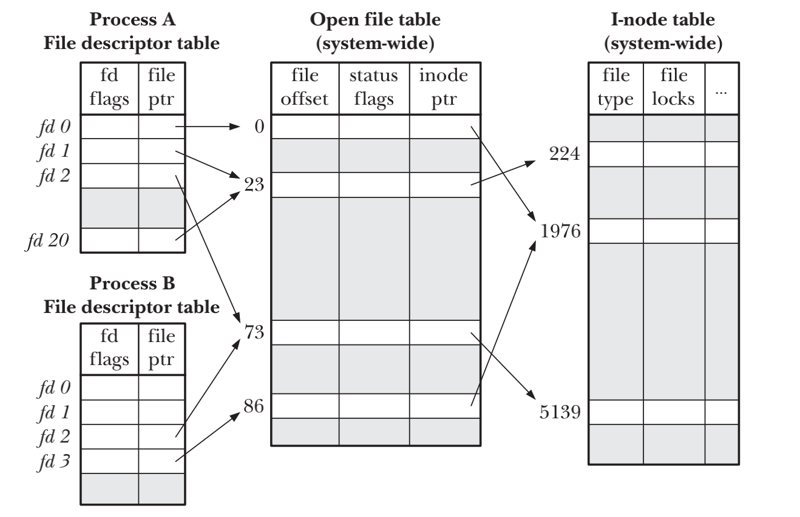

## Atomicity and Race Conditions
- 使用open()方法打开并创建文件时，可以通过同时传入O_CREATE和O_EXCL标志来保证open()操作原子性
- 可以通过传入O_APPEND标志来保证数据写入操作和偏移量移动操作为同一原子操作

##  Open File Status Flags
- 可以通过fcntl()方法来获取和改变访问模式和状态标志

## File Descriptors and Open File  

1. 进程级别的文件表述表
2. 系统级别的打开文件表
3. 文件系统的i-node表

- 同一进程内可以通过dup(),dup()2和fcntl()，实现同进程内两个不同的文件描述符(file descriptor)指向一个文件句柄(open file description)
- 不同进程可以通过fork()，实现不同进程内的file descriptor指向同一个open file description
- 不同进程内各自对同一文件调用open()或者同一进程内多次调用open(), 实现进程内不同的file descriptor指向不同的open file description但是指向同一i-node表中的条目

