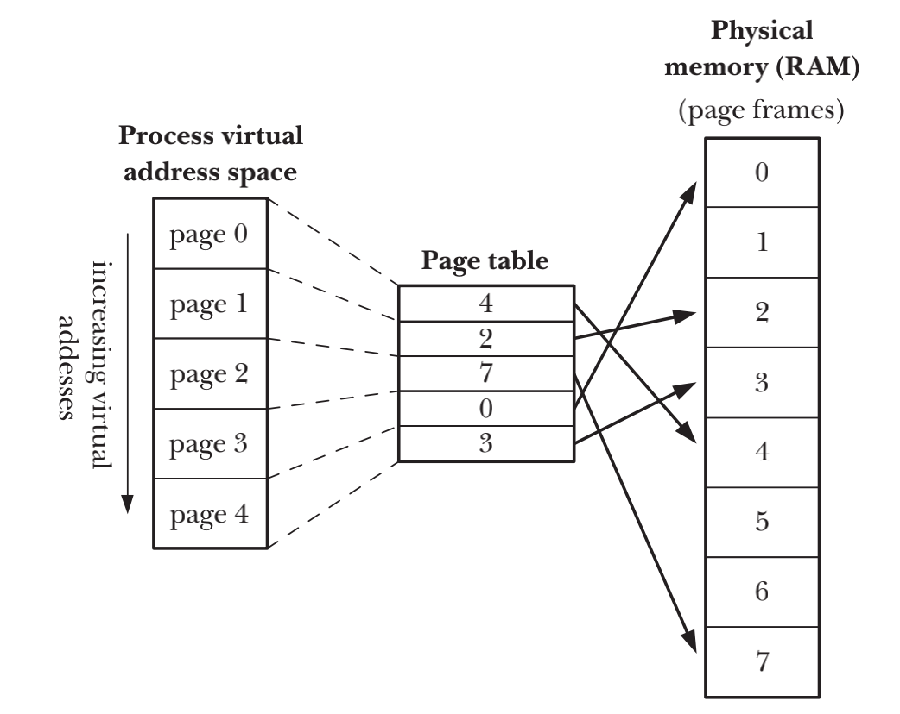

# PROCESSES

## Processes and Programs
- 进程是由内核定义的抽象的实体，该实体负责分配程序运行的各项系统资源，从内核角度看，进程是用内存空间和一系列内核数据结构组成，其中用户内存空间包含了程序代码以及代码所使用的变量，而内核数据结构则用于维护进程状态信息

## Process ID and Parent Process ID
- pid_t getpid(void);  获取当前process id
- pid_t getppid(void);  获取当前parent process id

## Memory Layout of a Process
- Text Segment: 文本段包含了进程运行的程序机器语言指令
- Initialized Data Segment: 初始化数据段包含显示初始化的全局变量和静态变量
- Uninitialized Data Segment: 未初始化数据段包含了未进行显示初始化的全局变量和静态变量
- Stack: 一个动态增长的收缩的段，由栈帧组成
- Heap: 在运行时(为变量)动态进行内存分配的一块区域

## Virtual Memory Management
- Spatial locality: 空间局部性是指程序倾向于访问最近访问过的内存地址附近的内存，由于指令是顺序执行的，且有时会按顺序处理数据结构
- Temporal locality: 是指程序倾向于在不久的将来再次访问最近刚方位过的内存地址，由于循环
- 虚拟内存的规划之一是将每个程序使用的内存切割成小型、固定大小的"页"单元，相应的也会将物理RAM划分成为与虚拟页尺寸大小的页帧
- 内核需要为每个进程维护一张页表，页表中每个条目要么指出一个虚拟页面在RAM中的所在位置，要么标明其当前驻留在磁盘上
