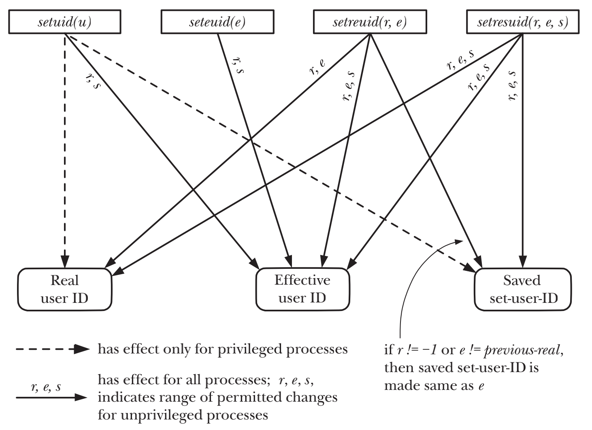

# PROCESS CREDENTIALS

## Real User ID and Real Group ID
- Real User ID and Real Group ID确定了process所属的用户和组
- login shell在登录过程中从/etc/passwd读取第三和第四字段来设置Real User ID and Real Group ID

## Effective User ID and Effective Group ID
- 当process试图执行一些操作的时候, 会结合Effective User ID and Effective Group ID加supplementary group IDs来确定process被授予什么样的权限
- The effective user and group IDs通常情况下和real IDs相等. system call和执行set-user-ID and set-group-ID可以使二者不相等

## Set-User-ID and Set-Group-ID Programs
- Set-user-ID program会将用户的Effective User ID置为可执行文件的拥有者的user ID
- Set-Group-ID program会将用户的Effective Group ID置为可执行文件的拥有者的group ID
```c
//Set-user-ID program
Effective User ID = user ID (owner) of the executable file

//Set-Group-ID program
Effective Group ID = group ID (owner) of the executable file
```

## Saved Set-User-ID and Saved Set-Group-ID
- Saved Set-User-ID and Saved Set-Group-ID的值是由相应的Effective User ID and Effective Group ID
```c
//set Saved Set-User-ID
Saved Set-User-ID = Effective User ID

//set Saved Set-Group-ID
Saved Set-Group-ID = Effective Group ID
```

## File-System User ID and File-System Group ID
- File-System User ID and File-System Group ID通常都和相对应的effective IDs相同
- Linux下两个特有的system call(setfsuid() 和 setfsgid())可以使得File-System IDs不等同于effective IDs

## Supplementary Group IDs
- Supplementary Group IDs可以标识process属于哪些额外的groups。
- 新的process从parent继承而来，登录的Shell从system group file获得Supplementary Group IDs

## Retrieving and Modifying Process Credentials
- CAP_SETUID允许进程任意修改其user IDs
- CAP_SETGID允许进程任意修改其group IDs

### setuid() and setgid()
> 1. unprivileged process调用setuid()时只允许修改effective user ID，且修改的值只能是其real user ID or saved set-user-ID。相当于在执行set-use-ID program的时，setuid()才会起作用，因为在执行普通program时，进程的real user ID, effective user ID, and saved set-user-ID总是相等的
> 2. privileged process调用setuid()且参数非0时，process的the real user ID, effective user ID, and saved set-user-ID都被设置成为了参数指定的值。privileged process调用setuid()是一个单向操作，调用后会丢失所有privileges

### seteuid() and setegid()
> 1. unprivileged process调用seteuid()时只允许修改effective user ID，且修改的值只能是其real user ID or saved set-user-ID。在unprivileged process下调用seteuid()等效于setuid()
> 2. privileged process调用seteuid()可以修改effective ID为任意值。privileged process调用seteuid()且参数为非0时，调用后会丢失所有privileges，但是可以通过rule 1来还原




